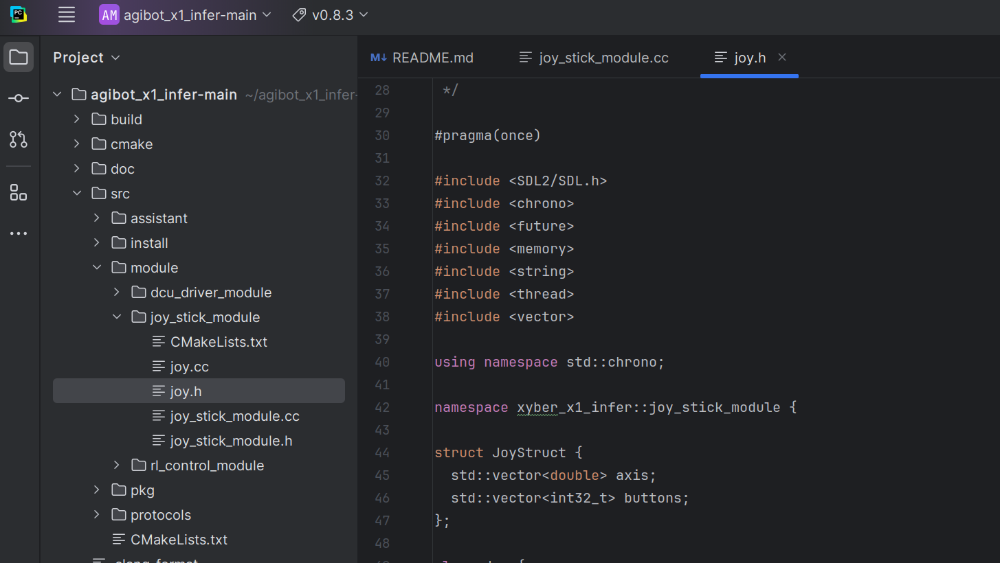
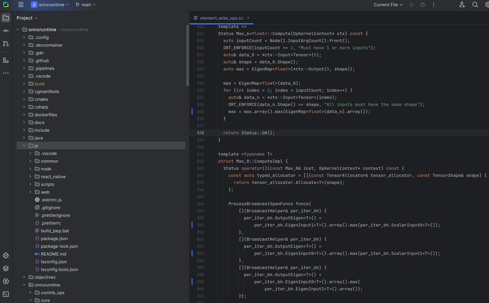
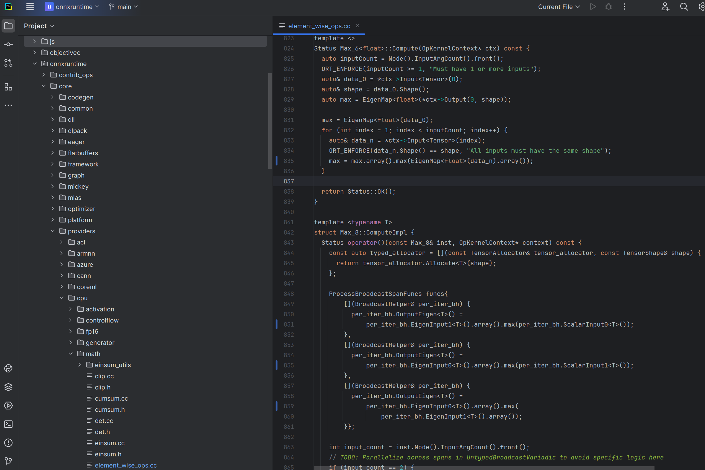

## agibot
e/joy_stick_module/joy.cc:30:
/home/arthur/agibot_x1_infer-main/src/module/joy_stick_module/joy.h:44:8: error: ‘vector’ in namespace ‘std’ does not name a template type
   44 |   std::vector<double> axis;
      |        ^~~~~~
/home/arthur/agibot_x1_infer-main/src/module/joy_stick_module/joy.h:38:1: note: ‘std::vector’ is defined in header ‘<vector>’; did you forget to ‘#include <vector>’?
   37 | #include <thread>
  +++ |+#include <vector>
   38 | 
/home/arthur/agibot_x1_infer-main/src/module/joy_stick_module/joy.h:45:8: error: ‘vector’ in namespace ‘std’ does not name a template type
   45 |   std::vector<int32_t> buttons;
      |        ^~~~~~
/home/arthur/agibot_x1_infer-main/src/module/joy_stick_module/joy.h:45:3: note: ‘std::vector’ is defined in header ‘<vector>’; did you forget to ‘#include <vector>’?
   45 |   std::vector<int32_t> buttons;
      |   ^~~
/home/arthur/agibot_x1_infer-main/src/module/joy_stick_module/joy.cc: In member function ‘bool xyber_x1_infer::joy_stick_module::Joy::handleJoyAxis(const SDL_Event&)’:
/home/arthur/agibot_x1_infer-main/src/module/joy_stick_module/joy.cc:145:32: error: ‘struct xyber_x1_infer::joy_stick_module::JoyStruct’ has no member named ‘axis’
  145 |   if (e.jaxis.axis >= joy_msg_.axis.size()) {
      |                                ^~~~
/home/arthur/agibot_x1_infer-main/src/module/joy_stick_module/joy.cc:149:36: error: ‘struct xyber_x1_infer::joy_stick_module::JoyStruct’ has no member named ‘axis’
  149 |   float last_axis_value = joy_msg_.axis.at(e.jaxis.axis);
      |                                    ^~~~
/home/arthur/agibot_x1_infer-main/src/module/joy_stick_module/joy.cc:150:12: error: ‘struct xyber_x1_infer::joy_stick_module::JoyStruct’ has no member named ‘axis’
  150 |   joy_msg_.axis.at(e.jaxis.axis) = convertRawAxisValueToROS(e.jaxis.value);
      |            ^~~~
/home/arthur/agibot_x1_infer-main/src/module/joy_stick_module/joy.cc:151:35: error: ‘struct xyber_x1_infer::joy_stick_module::JoyStruct’ has no member named ‘axis’
  151 |   if (last_axis_value != joy_msg_.axis.at(e.jaxis.axis)) {
      |                                   ^~~~
/home/arthur/agibot_x1_infer-main/src/module/joy_stick_module/joy.cc: In member function ‘bool xyber_x1_infer::joy_stick_module::Joy::handleJoyButtonDown(const SDL_Event&)’:
/home/arthur/agibot_x1_infer-main/src/module/joy_stick_module/joy.cc:172:36: error: ‘struct xyber_x1_infer::joy_stick_module::JoyStruct’ has no member named ‘buttons’
  172 |   if (e.jbutton.button >= joy_msg_.buttons.size()) {
      |                                    ^~~~~~~
/home/arthur/agibot_x1_infer-main/src/module/joy_stick_module/joy.cc:178:14: error: ‘struct xyber_x1_infer::joy_stick_module::JoyStruct’ has no member named ‘buttons’
  178 |     joy_msg_.buttons.at(e.jbutton.button) = 1 - joy_msg_.buttons.at(e.jbutton.button);
      |              ^~~~~~~
/home/arthur/agibot_x1_infer-main/src/module/joy_stick_module/joy.cc:178:58: error: ‘struct xyber_x1_infer::joy_stick_module::JoyStruct’ has no member named ‘buttons’
  178 |     joy_msg_.buttons.at(e.jbutton.button) = 1 - joy_msg_.buttons.at(e.jbutton.button);
      |                                                          ^~~~~~~
/home/arthur/agibot_x1_infer-main/src/module/joy_stick_module/joy.cc:180:14: error: ‘struct xyber_x1_infer::joy_stick_module::JoyStruct’ has no member named ‘buttons’
  180 |     joy_msg_.buttons.at(e.jbutton.button) = 1;
      |              ^~~~~~~
/home/arthur/agibot_x1_infer-main/src/module/joy_stick_module/joy.cc: In member function ‘bool xyber_x1_infer::joy_stick_module::Joy::handleJoyButtonUp(const SDL_Event&)’:
/home/arthur/agibot_x1_infer-main/src/module/joy_stick_module/joy.cc:191:36: error: ‘struct xyber_x1_infer::joy_stick_module::JoyStruct’ has no member named ‘buttons’
  191 |   if (e.jbutton.button >= joy_msg_.buttons.size()) {
      |                                    ^~~~~~~
/home/arthur/agibot_x1_infer-main/src/module/joy_stick_module/joy.cc:196:14: error: ‘struct xyber_x1_infer::joy_stick_module::JoyStruct’ has no member named ‘buttons’
  196 |     joy_msg_.buttons.at(e.jbutton.button) = 0;
      |              ^~~~~~~
/home/arthur/agibot_x1_infer-main/src/module/joy_stick_module/joy.cc: In member function ‘bool xyber_x1_infer::joy_stick_module::Joy::handleJoyHatMotion(const SDL_Event&)’:
/home/arthur/agibot_x1_infer-main/src/module/joy_stick_module/joy.cc:223:42: error: ‘struct xyber_x1_infer::joy_stick_module::JoyStruct’ has no member named ‘axis’
  223 |   if ((axes_start_index + 1) >= joy_msg_.axis.size()) {
      |                                          ^~~~
/home/arthur/agibot_x1_infer-main/src/module/joy_stick_module/joy.cc:229:14: error: ‘struct xyber_x1_infer::joy_stick_module::JoyStruct’ has no member named ‘axis’
  229 |     joy_msg_.axis.at(axes_start_index) = 1.0;
      |              ^~~~
/home/arthur/agibot_x1_infer-main/src/module/joy_stick_module/joy.cc:232:14: error: ‘struct xyber_x1_infer::joy_stick_module::JoyStruct’ has no member named ‘axis’
  232 |     joy_msg_.axis.at(axes_start_index) = -1.0;
      |              ^~~~
/home/arthur/agibot_x1_infer-main/src/module/joy_stick_module/joy.cc:235:14: error: ‘struct xyber_x1_infer::joy_stick_module::JoyStruct’ has no member named ‘axis’
  235 |     joy_msg_.axis.at(axes_start_index + 1) = 1.0;
      |              ^~~~
/home/arthur/agibot_x1_infer-main/src/module/joy_stick_module/joy.cc:238:14: error: ‘struct xyber_x1_infer::joy_stick_module::JoyStruct’ has no member named ‘axis’
  238 |     joy_msg_.axis.at(axes_start_index + 1) = -1.0;
      |              ^~~~
/home/arthur/agibot_x1_infer-main/src/module/joy_stick_module/joy.cc:241:14: error: ‘struct xyber_x1_infer::joy_stick_module::JoyStruct’ has no member named ‘axis’
  241 |     joy_msg_.axis.at(axes_start_index) = 0.0;
      |              ^~~~
/home/arthur/agibot_x1_infer-main/src/module/joy_stick_module/joy.cc:242:14: error: ‘struct xyber_x1_infer::joy_stick_module::JoyStruct’ has no member named ‘axis’
  242 |     joy_msg_.axis.at(axes_start_index + 1) = 0.0;
      |              ^~~~
/home/arthur/agibot_x1_infer-main/src/module/joy_stick_module/joy.cc: In member function ‘void xyber_x1_infer::joy_stick_module::Joy::handleJoyDeviceAdded(const SDL_Event&)’:
/home/arthur/agibot_x1_infer-main/src/module/joy_stick_module/joy.cc:304:12: error: ‘struct xyber_x1_infer::joy_stick_module::JoyStruct’ has no member named ‘buttons’
  304 |   joy_msg_.buttons.resize(num_buttons);
      |            ^~~~~~~
/home/arthur/agibot_x1_infer-main/src/module/joy_stick_module/joy.cc:320:12: error: ‘struct xyber_x1_infer::joy_stick_module::JoyStruct’ has no member named ‘axis’
  320 |   joy_msg_.axis.resize(num_axes + num_hats * 2);
      |            ^~~~
/home/arthur/agibot_x1_infer-main/src/module/joy_stick_module/joy.cc:326:16: error: ‘struct xyber_x1_infer::joy_stick_module::JoyStruct’ has no member named ‘axis’
  326 |       joy_msg_.axis.at(i) = convertRawAxisValueToROS(state);
      |                ^~~~
/home/arthur/agibot_x1_infer-main/src/module/joy_stick_module/joy.cc: In member function ‘void xyber_x1_infer::joy_stick_module::Joy::handleJoyDeviceRemoved(const SDL_Event&)’:
/home/arthur/agibot_x1_infer-main/src/module/joy_stick_module/joy.cc:349:12: error: ‘struct xyber_x1_infer::joy_stick_module::JoyStruct’ has no member named ‘buttons’
  349 |   joy_msg_.buttons.resize(0);
      |            ^~~~~~~
/home/arthur/agibot_x1_infer-main/src/module/joy_stick_module/joy.cc:350:12: error: ‘struct xyber_x1_infer::joy_stick_module::JoyStruct’ has no member named ‘axis’
  350 |   joy_msg_.axis.resize(0);
      |            ^~~~

