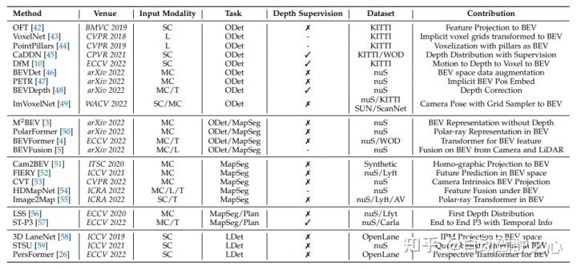
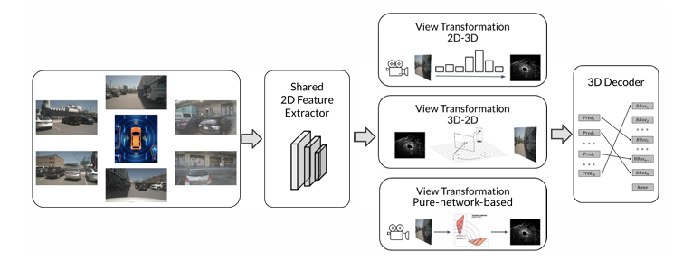
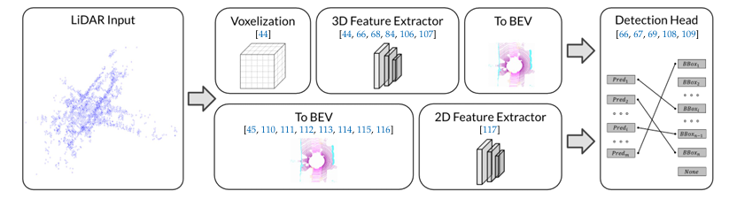
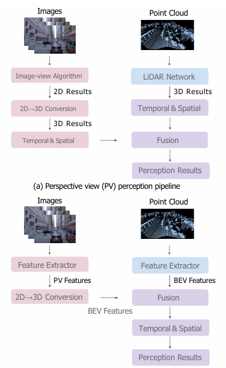
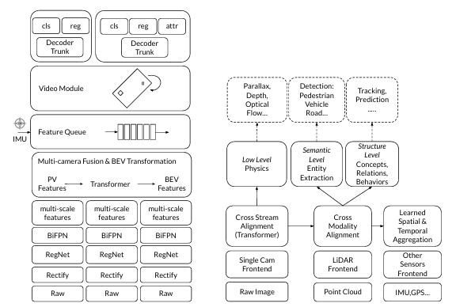

BEV（Bird's-eye-view）是一种从鸟瞰视角对场景进行感知和理解的方法。在自动驾驶领域，BEV感知技术旨在通过整合来自多个传感器（如相机、激光雷达LiDAR、雷达等）的数据，提供一个统一的、无遮挡的全局视角，以便于进行更准确的环境理解和决策制定。

### BEV是什么：

BEV感知的核心思想是从传统的透视图（Perspective View）转换到一个类似于从上方俯瞰的二维平面图，这个平面图能够直观地表示车辆周围的三维空间信息。在BEV中，场景中的物体和道路元素被投影到一个与地面平行的平面上，从而简化了对复杂三维世界的理解和处理。

### BEV解决的问题：

1. **多传感器数据融合**：自动驾驶车辆通常配备多种传感器，每种传感器都有其优势和局限性。BEV感知通过将不同传感器的数据融合在一个统一的二维平面上，可以充分利用各传感器的互补信息，提高感知的准确性和鲁棒性。
    
2. **遮挡问题**：在传统的透视图中，近处的物体可能会遮挡远处的物体，导致感知系统无法检测到被遮挡的物体。BEV通过提供一个无遮挡的视角，可以更好地处理遮挡问题。
    
3. **尺度和距离估计**：在二维图像中，物体的大小会随着距离的变化而变化，这使得从单目相机图像中直接估计物体的三维尺寸变得困难。BEV通过将物体投影到一个统一的平面上，简化了尺度和距离的估计问题。
    
4. **规划和控制**：BEV提供了一个直观的、与车辆运动规划和控制直接相关的视角。在这个视角下，车辆周围的环境信息可以更容易地被用于路径规划和避障等任务。
    
5. **跨场景泛化**：自动驾驶系统需要在不同的场景和条件下都能稳定工作。BEV感知技术通过提供一个与具体场景无关的统一表示，有助于提高系统的泛化能力。
    
6. **传感器配置的适应性**：不同的自动驾驶系统可能会采用不同的传感器配置。BEV感知技术需要能够适应不同的传感器配置，并能够从这些配置中有效地提取和融合信息。
### BEV的输入输出
#### 输入

BEV感知系统的输入通常包括来自多个相机的图像数据，这些相机被布置在车辆的不同位置，以覆盖360°的视野范围。这些图像数据提供了丰富的色彩和纹理信息，但缺乏深度信息。此外，系统还可能接收来自激光雷达（LiDAR）的点云数据、雷达信号、IMU/GPS数据以及高精地图信息，这些数据为系统提供了精确的深度信息、速度和定位信息，以及环境的几何结构。

#### 输出

BEV感知系统的输出是在BEV坐标系下的感知结果，这些结果包括但不限于：

- 物体的三维位置和形状：系统能够检测并定位车辆周围的物体，如其他车辆、行人、自行车等，并提供它们在BEV坐标系中的位置、尺寸和方向。
- 车道线的位置：系统能够识别车道线、交叉路口、停车区域等道路结构，这对于车辆的导航和路径规划至关重要。
- 语义栅格：系统可以将BEV空间中的每个像素分配到一个语义类别，如车道、人行道、建筑物等，这有助于理解车辆所处的环境。
- 占据栅格：用于表示自由空间和被占用空间的栅格地图，这对于路径规划和避障非常有用。

从广义上讲，任何系统只要其输出是在BEV坐标而不是图像坐标下的，都可以被认为是BEV感知系统。BEV感知算法通常包含一个从透视视图到BEV视图的转换过程，这个过程可以是显式的，生成稠密的BEV视图下的特征，支持各种下游任务，如BEVDet和BEVFormer；也可以是针对具体任务的，直接生成稀疏的BEV视图下的感知结果，如DETR3D和PETR。

### BEV感知
bev感知主要包括其三个主要研究方向：BEV相机、BEV LiDAR和BEV融合

如下表所示，近年来BEV感知文献汇总。在输入模式下，“L”表示激光雷达，“SC”表示单相机，“MC”表示多相机，“T”表示时间信息。在任务下，“ODet”用于3D对象检测，“LDet”用于三维车道检测，“MapSeg”用于地图分割，“Plan”用于运动规划，“MOT”用于多对象跟踪。深度监督意味着仅camera模型使用稀疏/密集深度图来监督模型。在数据集下，“nuS”代表nuScenes数据集，“WOD”代表Waymo开放数据集，“KITTI”代表KITTI数据集，“Lyft”代表Lyft 5级数据集，“OpenLane”代表OpenLane数据集，“AV”代表Argosse数据集，“Carla”代表Carla模拟器，“SUN”代表SUN RGB-D数据集，“ScanNet”代表ScanNet室内场景数据集。

#### BEV相机
##### 基本流程
- **2D特征提取器**：使用预训练的网络（如ResNet、EfficientNet等）从每个摄像头捕获的2D图像中提取特征。
- **视角转换模块**：将2D特征转换为3D特征，这可能涉及到深度估计或其他几何变换技术。
- **3D解码器**：利用转换后的3D特征来预测3D边界框、语义分割或其他与3D相关的任务。

**视角转换模块的分类**
- **2D-3D方法**：首先在2D特征图上预测深度信息，然后将2D特征“提升”到3D空间（例如，通过网格采样或深度分布网络）。
- **3D-2D方法**：通过逆透视映射（IPM）或其他几何变换将3D空间的特征投影到2D图像平面上。
- **纯网络基方法**：不依赖于显式的几何变换，而是使用神经网络（如多层感知机或Transformer）隐式地学习从3D到2D的投影关系。
##### 优势

1. **无遮挡视角**：BEV相机提供的是从上方俯瞰的视角，有效避免了前景物体对背景物体的遮挡，使得感知系统能够更全面地理解场景。
    
2. **简化的3D信息提取**：BEV相机通过将2D图像信息转换到3D空间，简化了从单个或多个相机图像中提取3D信息的过程。
    
3. **多传感器融合**：BEV相机可以与LiDAR、雷达等其他传感器的数据融合，提高感知的准确性和鲁棒性。
    
4. **适用于规划和控制**：BEV提供的全局视角对于车辆的路径规划和运动控制非常有用，因为它提供了关于车辆周围环境的直观理解。
    
5. **提高安全性**：通过提供更准确的3D感知，BEV相机有助于提高自动驾驶系统的安全性，尤其是在复杂的交通场景中。
    

##### 缺陷和问题

1. **深度估计挑战**：从2D图像中准确估计深度信息是非常困难的，因为单目或双目相机缺乏直接的深度测量能力。
    
2. **视角转换复杂性**：将2D图像特征转换到3D BEV空间需要复杂的几何变换和可能的深度预测，这些过程增加了系统的复杂性和计算负担。
    
3. **泛化能力**：BEV相机系统可能在不同的环境和不同的传感器配置下表现不一致，这要求系统具有良好的泛化能力。
    
4. **数据标注和训练成本**：为了训练BEV相机系统，需要大量的标注数据，这些数据的获取和处理可能非常昂贵和耗时。
    
5. **实时性挑战**：在保证高准确性的同时实现实时处理是一个挑战，尤其是在资源受限的嵌入式系统中。
    
6. **传感器融合的复杂性**：虽然多传感器融合可以提高感知性能，但如何有效地融合来自不同传感器的数据，处理它们之间的时间同步和空间对齐问题，仍然是一个技术挑战。
    
7. **对动态场景的适应性**：BEV相机系统需要能够适应动态变化的场景，如车辆和行人的快速移动，这要求系统具有快速的响应能力和准确的运动预测。
    
8. **对异常情况的鲁棒性**：在面对极端天气条件、光照变化或不寻常的道路布局时，BEV相机系统可能需要额外的策略来保持其性能。

#### BEVlidar

##### 基本流程
1. **点云预处理**：包括去噪、地面分割和点云下采样等，以减少计算量并提高处理速度。
    
2. **特征提取**：使用3D卷积网络或稀疏卷积网络从点云中提取特征。
    
3. **体素化（Voxelization）**：将点云转换为体素表示，这有助于简化计算并提高特征提取的效率。
    
4. **BEV映射**：将体素化的数据映射到BEV平面上，这通常涉及到将点云投影到与地面平行的平面上。
    
5. **对象检测和分割**：在BEV空间中进行3D对象检测和语义分割，以识别和定位车辆、行人、道路标志等。

在特征提取部分，主要有两个分支将点云数据转换为BEV表示。根据pipilines顺序，将这两个选项分别称为前BEV和后BEV，指示主干网络的输入是来自3D表示还是来自BEV表示。如下图所示，BEV激光雷达感知的一般流程。主要有两个分支将点云数据转换为BEV表示。上分支提取3D空间中的点云特征，提供更准确的检测结果。下分支提取2D空间中的BEV特征（原始点云转换），提供更高效的网络。

##### BEV前特征提取

除了对原始点云进行基于点的方法处理之外，基于体素的方法将点体素化为离散网格，这通过离散化连续三维坐标提供了更有效的表示。基于离散体素表示、3D卷积或3D稀疏卷积可用于提取点云特征。VoxelNet堆叠多个体素特征编码（VFE）层以编码体素中的点云分布作为体素特征，

PV-RCNN将点和体素分支结合起来，以学习更具辨别力的点云特征。具体而言，高质量的3D提案由体素分支生成，而点分支为提案细化提供额外信息。SA-SSD设计了一个辅助网络，将主干网络中的体素特征转换回点级表示，以明确利用3D点云的结构信息，并减少下采样中的损失。Voxel R-CNN采用3D卷积主干提取点云特征。然后在BEV上应用2D网络以提供目标proposal，这些proposal通过提取的特征进行细化。它实现了与基于点的方法相当的性能。object DGCNN将3D目标检测任务建模为BEV中动态图上的消息传递。在将点云转换为BEV特征图之后，预测查询点迭代地从关键点收集BEV特征。VoTr引入了局部注意力、扩展注意力和快速体素查询，以使大量体素上的注意力机制能够用于大上下文信息。SST将提取的体素特征视为标记，然后在非重叠区域中应用稀疏区域注意和区域移位，以避免对基于体素的网络进行下采样。AFDetV2通过引入关键点辅助监控和多任务头，形成了单级无锚网络。

##### BEV后特征提取

由于三维空间中的体素稀疏且不规则，应用三维卷积是低效的。对于工业应用，可能不支持3D卷积等算子，期望合适和有效的3D检测网络。MV3D是将点云数据转换为BEV表示的第一种方法。在将点离散到BEV网格中之后，根据网格中的点获得高度、强度和密度的特征，以表示网格特征。由于BEV网格中有许多点，因此在此过程中，信息损失相当大使用BEV网格中的统计数据表示点云，例如最大高度和强度平均值。PointPillars首先介绍了柱的概念，这是一种具有无限高度的特殊类型的体素。它利用PointNet的简化版本来学习柱中点的表示。然后，编码特征可以由标准2D卷积网络和检测头处理。尽管点柱的性能不如其他3D主干网令人满意，但其及其变体具有高效率，因此适合于工业应用。

##### 优势

1. **精确的3D信息**：LiDAR传感器能够提供精确的三维空间信息，包括物体的距离、高度和形状，这对于BEV感知至关重要。
    
2. **无遮挡**：与相机不同，LiDAR传感器不受遮挡问题的影响，因为激光雷达的点云数据是从所有方向收集的，而不是单一视角。
    
3. **鲁棒性**：LiDAR数据在各种光照和天气条件下都能保持较高的性能，这使得基于LiDAR的BEV感知系统在不同环境下都能稳定工作。
    
4. **直接的3D空间表示**：LiDAR数据天然就是三维的，因此可以直接在BEV空间中表示，无需从2D图像中恢复3D信息。
    
5. **适用于动态和静态物体**：LiDAR传感器能够检测到静态和动态物体，这对于自动驾驶系统中的物体检测和跟踪非常重要。

##### 缺陷与问题

1. **数据稀疏性**：LiDAR数据在远处可能变得稀疏，这可能影响远处物体的检测精度。
    
2. **计算资源**：处理LiDAR点云数据通常需要较高的计算资源，这可能限制了系统在资源受限的平台上的应用。
    
3. **数据融合**：虽然LiDAR提供了丰富的3D信息，但在某些情况下，可能需要与相机等其他传感器的数据融合，以提供更全面的环境理解。
    
4. **成本和尺寸**：LiDAR传感器通常成本较高，且可能占用较大的空间，这限制了它们在某些应用中的使用。
    
5. **对动态物体的跟踪**：虽然LiDAR擅长检测静态物体，但对动态物体的跟踪可能需要更复杂的算法。

#### BEV fusion
##### 基本流程

1. **数据采集**
**相机图像**：从车辆周围的相机获取图像数据。
**LiDAR点云**：从LiDAR传感器获取360度的3D点云数据。
其他传感器数据：如雷达、IMU、GPS等，提供车辆的速度、加速度、姿态和位置信息。
2. **数据预处理**
**点云预处理**：对LiDAR点云进行去噪、地面分割等处理。
**图像预处理**：对相机图像进行标准化、归一化等操作。
**时间同步**：确保不同传感器数据在时间上的一致性。
3. **特征提取**
**从LiDAR数据中提取3D特征**：使用3D卷积网络或稀疏卷积网络从点云中提取特征。
**从图像中提取2D特征**：使用2D卷积网络（如CNN）从图像中提取特征。
4. **视角转换**
相机到BEV：将2D图像特征通过深度估计或几何变换转换到BEV空间。
LiDAR到BEV：将LiDAR点云直接投影到与地面平行的BEV平面上。
5. **特征融合**
**特征层面融合**：在BEV空间中，将来自相机和LiDAR的特征进行融合。
**多模态融合**：整合不同传感器的特征，增强环境理解。
6. **3D对象检测与分割**
**3D对象检测**：在BEV空间中识别和定位车辆、行人、自行车等物体。
**语义分割**：对BEV空间进行像素级别的分类，识别不同的道路元素，如车道线、人行道等。
7. **时空融合**
**时间融合**：利用历史帧的信息，通过时间序列分析，提高对动态物体的跟踪能力。
**空间融合**：结合不同时间点的空间信息，增强对场景的理解。
8. **后处理**
**非极大值抑制（NMS）**：去除重叠的检测框，保留最佳的检测结果。
**校准与优化**：对检测结果进行校准，提高准确性和鲁棒性。
9. **输出**
**感知结果**：输出包括物体的3D边界框、语义分割图、车道线位置等信息。

### 工业上的BEV
在工业界，BEV（Bird's-eye-view）感知技术正变得越来越流行，它通过整合来自多个传感器的数据，如相机、LiDAR、雷达、IMU和GPS，来提高自动驾驶系统的环境感知能力。BEV感知的基本流程包括：

1. **输入数据**：系统接收来自不同传感器的数据，包括图像、点云、雷达信号等。
2. **特征提取**：利用主干网络和颈部网络从原始数据中提取特征。
3. **视角转换**：将透视图（PV）特征转换到BEV空间，方法包括固定或自适应的逆透视映射（IPM）、基于Transformer的转换，以及ViDAR技术。
4. **特征融合**：在BEV空间中融合来自相机和LiDAR的特征，以获得更全面的环境信息。
5. **时空处理**：通过构建特征队列，结合时间和空间信息，提高对动态场景的感知能力。
6. **预测输出**：最后，系统输出包括3D对象检测、语义分割和动态物体跟踪等结果。

这种设计减少了手工设计的需要，提高了系统的鲁棒性，并能够处理更复杂的交通场景。BEV感知技术的发展，使得自动驾驶系统能够更准确地理解和预测车辆周围的环境，从而做出更安全的驾驶决策。

