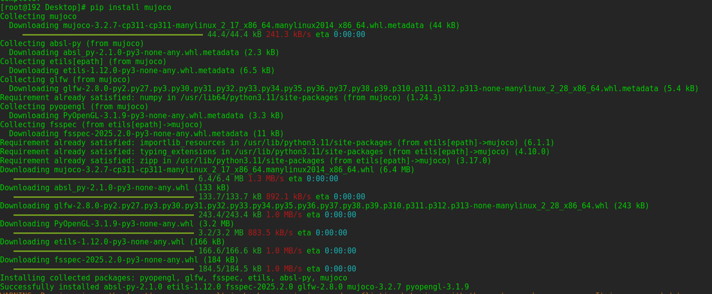
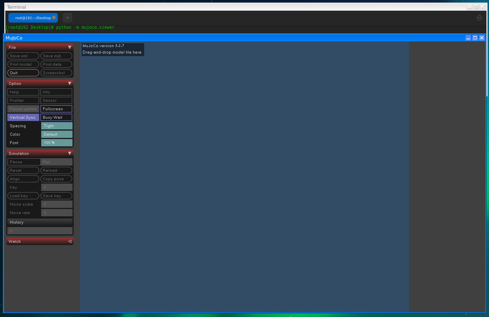
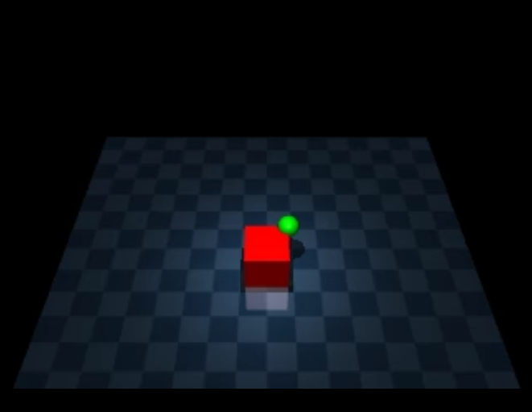
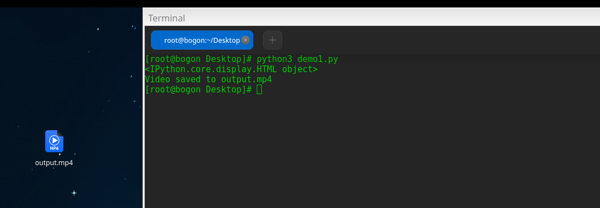
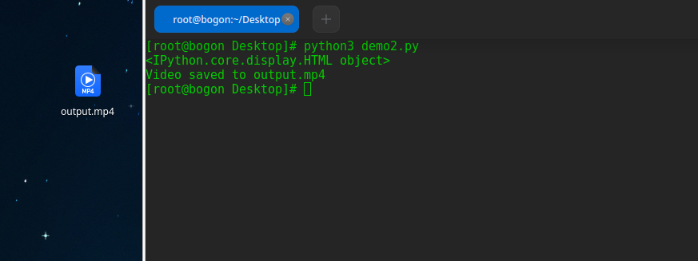
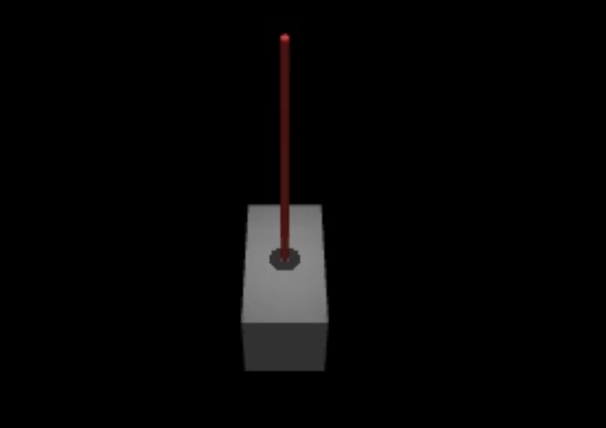

# Mujoco 仿真器
MuJoCo（Multi-Joint dynamics with Contact）是一个高性能的物理仿真引擎，广泛用于机器人学、生物力学、动画和机器学习等领域。MuJoCo 使用一种基于 XML 的建模语言（MJCF）来定义物理模型。
## 安装mujoco
可以通过`pip`直接安装,也可以通过源码编译
```bash
pip install mujoco
```
安装成功后如下所示


## 查看GUI界面
主要有三种查看方式，分别是通过独立的python程序，通过`viewer.launch`函数,被动展示
### 使用python查看
`python -m mujoco.viewer` 启动一个空的可视化会话，可以通过拖放加载模型


`python -m mujoco.viewer --mjcf=/path/to/some/mjcf.xml` 启动一个针对指定模型文件的可视化会话


### 使用函数查看
从 Python 程序/脚本中调用，通过 `viewer.launch` 函数 此函数会阻塞用户代码以支持物理循环的精确计时。如果用户代码作为引擎插件或物理回调实现，并由 MuJoCo 在 mj_step 中调用，则应使用此模式。
`viewer.launch()` 启动一个空的可视化会话，可以通过拖放加载模型
`viewer.launch(model)` 启动一个针对给定 `mjModel` 的可视化会话，查看器内部会创建自己的 `mjData` 实例
`viewer.launch(model, data)` 与上述相同，但查看器直接操作给定的 `mjData` 实例——退出时，`data` 对象将被修改

### 被动查看
通过调用`viewer.launch_passive(model, data)` 此函数不会阻塞，允许用户代码继续执行。在这种模式下，用户脚本负责计时和推进物理状态

## 基本使用

安装完成后，可以通过 `import mujoco` 导入该包。结构体、函数、常量和枚举直接从顶层 mujoco 模块提供

### 定义模型

MJCF 文件是一个 XML 文件，用于描述物理模型的结构和属性。一个典型的 MJCF 文件包含以下主要部分：

**<mujoco> 标签**

这是 MJCF 文件的根标签，表示整个模型的开始和结束
```
<mujoco>
    ...
</mujoco>
```
**<worldbody> 标签**

<worldbody> 是模型的顶级主体，包含所有物理对象（如几何体、关节和主体）。所有物理元素都必须位于 <worldbody> 内

```
<worldbody>
    <geom name="floor" type="plane" size="1 1 0.1" rgba="0.5 0.5 0.5 1"/>
    <body name="object" pos="0 0 1">
        <geom name="box" type="box" size="0.1 0.1 0.1" rgba="1 0 0 1"/>
    </body>
</worldbody>
```

**<asset> 标签**
<asset> 用于定义模型中使用的资源，如纹理、材质和网格。这些资源可以被 <worldbody> 中的元素引用

```
<asset>
    <texture name="grid" type="2d" builtin="checker" rgb1="0.1 0.2 0.3" rgb2="0.2 0.3 0.4" width="300" height="300"/>
    <material name="grid_material" texture="grid" texrepeat="8 8" reflectance="0.2"/>
</asset>
```

**<option> 标签（可选）**
<option> 用于设置全局仿真选项，如时间步长、重力和积分器类型

```
<option timestep="0.001" gravity="0 0 -9.81" integrator="Euler"/>
```

**<sensor> 标签**

<sensor> 用于定义传感器，用于测量模型中的物理量，如加速度、力和位置

```
<sensor>
    <accelerometer name="accel" site="sensor_site"/>
</sensor>
```

### 定义物理元素

**几何体（<geom>）**

几何体是模型中的静态或动态对象，用于表示物理形状。常见的几何体类型包括盒子（box）、球体（sphere）和平面（plane）

```
<geom name="floor" type="plane" size="1 1 0.1" rgba="0.5 0.5 0.5 1"/>
<geom name="box" type="box" size="0.1 0.1 0.1" rgba="1 0 0 1" pos="0 0 1"/>
```

name：几何体的名称（可选，但推荐使用）
type：几何体类型（如 box、sphere、plane）
size：几何体的尺寸（具体含义取决于几何体类型）
rgba：几何体的颜色（红、绿、蓝、透明度）
pos：几何体的位置（默认为 (0, 0, 0)）

**主体（<body>）**

主体是模型中的动态对象，可以包含几何体、关节和其他主体。主体可以有自由度（通过关节定义）。

```
<body name="object" pos="0 0 1">
    <geom name="box" type="box" size="0.1 0.1 0.1" rgba="1 0 0 1"/>
    <joint name="hinge" type="hinge" axis="0 0 1" pos="0 0 0"/>
</body>
```

name：主体的名称（可选，但推荐使用）
pos：主体的位置（默认为 (0, 0, 0)）
euler：主体的欧拉旋转角度（默认为 (0, 0, 0)）

**关节（<joint>）**

关节用于定义主体的自由度，允许主体相对于其父主体运动。

```
<joint name="hinge" type="hinge" axis="0 0 1" pos="0 0 0"/>
```

name：关节的名称（可选，但推荐使用）
type：关节类型（如 hinge、slide）
axis：关节的运动轴（默认为 (1, 0, 0)）
pos：关节的位置（默认为 (0, 0, 0)）

### demo
```
<mujoco>
    <option timestep="0.001" gravity="0 0 -9.81"/>
    <asset>
        <texture name="grid" type="2d" builtin="checker" rgb1="0.1 0.2 0.3" rgb2="0.2 0.3 0.4" width="300" height="300"/>
        <material name="grid_material" texture="grid" texrepeat="8 8" reflectance="0.2"/>
    </asset>
    <worldbody>
        <light name="top" pos="0 0 1"/>
        <geom name="floor" type="plane" size="1 1 0.1" rgba="0.5 0.5 0.5 1" material="grid_material"/>
        <body name="box_and_sphere" pos="0 0 1">
            <freejoint/>
            <geom name="box" type="box" size="0.1 0.1 0.1" rgba="1 0 0 1"/>
            <geom name="sphere" type="sphere" size="0.05" rgba="0 1 0 1" pos="0.1 0.1 0.1"/>
        </body>
    </worldbody>
</mujoco>
```
## 渲染
渲染功能通过 Renderer 类实现，支持多种渲染选项和相机控制。

在 MuJoCo 中，渲染器需要与模型和数据对象配合使用。以下是一个简单的渲染示例：
```
import mujoco
import mujoco.viewer
xml = """
<mujoco>
  <worldbody>
    <light name="top" pos="0 0 1"/>
    <geom name="floor" type="plane" size="1 1 0.1" rgba="0.5 0.5 0.5 1"/>
    <body name="box_and_sphere" pos="0 0 0.5">
      <geom name="box" type="box" size="0.1 0.1 0.1" rgba="1 0 0 1"/>
      <geom name="sphere" type="sphere" size="0.1" rgba="0 1 0 1" pos="0.1 0.1 0.1"/>
    </body>
  </worldbody>
</mujoco>
"""

# 加载模型和数据
model = mujoco.MjModel.from_xml_string(xml)
data = mujoco.MjData(model)

# 创建渲染器
with mujoco.Renderer(model) as renderer:
    # 更新场景并渲染
    mujoco.mj_forward(model, data)
    renderer.update_scene(data)
    pixels = renderer.render()
    media.show_image(pixels)
    
```

### 渲染选项
MuJoCo 提供了多种渲染选项，可以通过 MjvOption 类进行配置。例如，可以启用透明效果或显示关节轴：
```
scene_option = mujoco.MjvOption()
scene_option.flags[mujoco.mjtVisFlag.mjVIS_TRANSPARENT] = True  # 启用透明效果
scene_option.flags[mujoco.mjtVisFlag.mjVIS_JOINT] = True  # 显示关节轴

with mujoco.Renderer(model) as renderer:
    renderer.update_scene(data, scene_option=scene_option)
    pixels = renderer.render()
    media.show_image(pixels)
```
### 仿真

MuJoCo 的仿真通过 mj_step 函数实现，每次调用会将仿真状态向前推进一个时间步长。
仿真循环
以下是一个简单的仿真循环示例，模拟一个带有自由关节的模型：

```
# 仿真参数
duration = 5.0  # 仿真时长（秒）
framerate = 60  # 帧率（Hz）

# 初始化模型和数据
model = mujoco.MjModel.from_xml_string(xml)
data = mujoco.MjData(model)

# 重置仿真状态
mujoco.mj_resetData(model, data)

# 仿真循环
frames = []
while data.time < duration:
    mujoco.mj_step(model, data)  # 步进仿真
    if len(frames) < data.time * framerate:
        frames.append(data.time)  # 记录时间点

# 显示仿真结果
print("仿真完成，总帧数：", len(frames))
```

添加控制信号
可以通过设置 data.ctrl 来为模型添加控制信号。例如，为一个关节添加正弦波控制信号：

```
# 控制信号参数
amplitude = 1.0  # 振幅
frequency = 1.0  # 频率（Hz）

while data.time < duration:
    # 设置控制信号
    data.ctrl[0] = amplitude * np.sin(2 * np.pi * frequency * data.time)
    mujoco.mj_step(model, data)
    if len(frames) < data.time * framerate:
        frames.append(data.time)
        
```


### 动画生成
MuJoCo 支持将仿真结果渲染为动画。可以通过 Renderer 类在仿真过程中捕获帧，并使用 media.show_video 显示动画。

生成动画
以下是一个完整的动画生成示例：

```
import mujoco
import mediapy as media

xml = """
<mujoco>
    <option timestep="0.001" gravity="0 0 -9.81"/>
    <worldbody>
        <light name="top" pos="0 0 1"/>
        <geom name="floor" type="plane" size="1 1 0.1" rgba="0.5 0.5 0.5 1"/>
        <body name="box_and_sphere" pos="0 0 1">
            <freejoint/>
            <geom name="box" type="box" size="0.1 0.1 0.1" rgba="1 0 0 1"/>
            <geom name="sphere" type="sphere" size="0.05" rgba="0 1 0 1" pos="0.1 0.1 0.1"/>
        </body>
    </worldbody>
</mujoco>
"""

model = mujoco.MjModel.from_xml_string(xml)
data = mujoco.MjData(model)
renderer = mujoco.Renderer(model)

duration = 5.0  # 仿真时长（秒）
framerate = 60  # 帧率（Hz）
frames = []

try:
    mujoco.mj_resetData(model, data)
    while data.time < duration:
        mujoco.mj_step(model, data)
        if len(frames) < data.time * framerate:
            renderer.update_scene(data)
            pixels = renderer.render()
            frames.append(pixels)
finally:
    renderer.close()

media.write_video("output.mp4", frames, fps=framerate)
print("Video saved to output.mp4")
```


添加相机控制
可以通过动态调整相机参数来实现更复杂的视觉效果。例如，让相机跟踪一个移动的对象：
```
# 定义相机跟踪目标
target_body = model.body("box_and_sphere").id

while data.time < duration:
    mujoco.mj_step(model, data)
    if len(frames) < data.time * framerate:
        # 更新相机位置以跟踪目标
        camera_pos = data.body_xpos[target_body]
        renderer.update_scene(data, camera_pos=camera_pos)
        pixels = renderer.render()
        frames.append(pixels)
```

## 力学参数

力学参数
MuJoCo 允许用户自定义物体的物理属性，如质量、惯性张量、摩擦系数等。这些属性可以通过 XML 文件中的 <geom> 和 <body> 标签进行配置。
质量与惯性：通过 mass 和 inertia 属性定义。
摩擦系数：通过 friction 属性定义。
示例：

```
<body name="object" pos="0 0 1">
    <geom name="box" type="box" size="0.1 0.1 0.1" rgba="1 0 0 1" mass="1.0" friction="0.5 0.05 0.001"/>
</body>
```


关节与自由度
关节（<joint>）是定义物体运动的关键元素。MuJoCo 支持多种关节类型，如铰链关节（hinge）、滑动关节（slide）和自由关节（free）。
示例：

```
<body name="pendulum" pos="0 0 1">
    <joint name="hinge" type="hinge" axis="0 0 1" pos="0 0 0"/>
    <geom name="rod" type="cylinder" size="0.02 0.5" rgba="0 0 1 1"/>
</body>
```

传感器与数据采集
定义传感器
MuJoCo 支持多种传感器，用于测量物体的位置、速度、力、扭矩等数据。传感器可以通过 <sensor> 标签定义。
示例：

```
<sensor>
    <accelerometer name="accel" site="sensor_site"/>
    <gyro name="gyro" site="sensor_site"/>
</sensor>
```

读取传感器数据
传感器数据可以通过 data.sensor 属性读取。


```
accel_data = data.sensor('accel').data
gyro_data = data.sensor('gyro').data
```

动力学与碰撞检测
碰撞检测
MuJoCo 提供了强大的碰撞检测功能，支持多种碰撞几何体和碰撞响应。碰撞属性可以通过 <geom> 标签中的 contype 和 conaffinity 属性定义。


```
<geom name="floor" type="plane" size="1 1 0.1" rgba="0.5 0.5 0.5 1" contype="1" conaffinity="1"/>
<geom name="box" type="box" size="0.1 0.1 0.1" rgba="1 0 0 1" contype="1" conaffinity="1"/>
```

动力学参数
动力学参数（如时间步长、积分器类型、重力等）可以通过 <option> 标签定义。
示例：
```
<option timestep="0.001" gravity="0 0 -9.81" integrator="RK4"/>
```


## 训练一个倒立摆MuJoCo 倒立摆训练教程
倒立摆模型的搭建
定义 MJCF 文件
倒立摆通常由一个底部滑动关节和一个顶部旋转关节组成。以下是一个简单的倒立摆模型的 MJCF 定义：

```
<mujoco>
  <option integrator="RK4" timestep="0.001" gravity="0 0 -9.81"/>
  <worldbody>
    <light name="top" pos="0 0 1"/>
    <body name="cart" pos="0 0 0.1">
      <geom name="cart" type="box" size="0.1 0.2 0.1" rgba="0.5 0.5 0.5 1"/>
      <joint name="slider" type="slide" axis="1 0 0" pos="0 0 0"/>
      <body name="pole" pos="0 0 0.2">
        <geom name="pole" type="capsule" size="0.01 0.5" rgba="0.8 0.2 0.2 1"/>
        <joint name="hinge" type="hinge" axis="0 1 0" pos="0 0 0"/>
      </body>
    </body>
  </worldbody>
</mujoco>
```

模型说明
底部滑动关节：<joint name="slider" type="slide" axis="1 0 0" pos="0 0 0"/> 允许小车沿水平方向移动。
顶部旋转关节：<joint name="hinge" type="hinge" axis="0 1 0" pos="0 0 0"/> 允许摆杆绕水平轴旋转。
几何体：小车和摆杆分别用 <geom> 定义，具有不同的形状和颜色。
 
渲染与仿真
渲染设置
使用 MuJoCo 的渲染功能来可视化倒立摆的运动：

```
import mujoco
import mediapy as media

xml = """
<mujoco>
  <option integrator="RK4" timestep="0.001" gravity="0 0 -9.81"/>
  <worldbody>
    <light name="top" pos="0 0 1"/>
    <body name="cart" pos="0 0 0.1">
      <geom name="cart" type="box" size="0.1 0.2 0.1" rgba="0.5 0.5 0.5 1"/>
      <joint name="slider" type="slide" axis="1 0 0" pos="0 0 0"/>
      <body name="pole" pos="0 0 0.2">
        <geom name="pole" type="capsule" size="0.01 0.5" rgba="0.8 0.2 0.2 1"/>
        <joint name="hinge" type="hinge" axis="0 1 0" pos="0 0 0"/>
      </body>
    </body>
  </worldbody>
</mujoco>
"""

model = mujoco.MjModel.from_xml_string(xml)
data = mujoco.MjData(model)
renderer = mujoco.Renderer(model)
```

仿真循环
进行仿真并记录每一帧：

```
duration = 5.0  # 仿真时长（秒）
framerate = 60  # 帧率（Hz）
frames = []

mujoco.mj_resetData(model, data)
while data.time < duration:
    mujoco.mj_step(model, data)
    if len(frames) < data.time * framerate:
        renderer.update_scene(data)
        pixels = renderer.render()
        frames.append(pixels)

media.show_video(frames, fps=framerate)
```

添加控制器
简单的 PD 控制器
为了控制倒立摆的平衡，可以添加一个简单的 PD 控制器：

```
def pd_controller(model, data):
    # 控制目标：保持摆杆垂直
    target_angle = 0
    kp = 100  # 比例增益
    kd = 10   # 微分增益
    error = data.qpos[1] - target_angle
    error_dot = data.qvel[1]
    control_signal = -kp * error - kd * error_dot
    data.ctrl[0] = control_signal

while data.time < duration:
    pd_controller(model, data)
    mujoco.mj_step(model, data)
    if len(frames) < data.time * framerate:
        renderer.update_scene(data)
        pixels = renderer.render()
        frames.append(pixels)

media.show_video(frames, fps=framerate)
```




```

## 参考
https://mujoco.readthedocs.io/en/stable/python.html#python-bindings
https://colab.research.google.com/github/google-deepmind/mujoco/blob/main/python/tutorial.ipynb