# ROS 2 机器人系统威胁模型
## 作者：[Thomas Moulard](https://github.com/thomas-moulard), [Juan Hortala](https://github.com/juanrh) [Xabi Perez](https://github.com/XabierPB) [Gorka Olalde](https://github.com/olaldiko) [Borja Erice](https://github.com/borkenerice) [Odei Olalde](https://github.com/o-olalde) [David Mayoral](https://github.com/dmayoral)

## 撰写日期：2019-03

## 最后修改：2021-01

>免责声明：
  本文件并不全面。即使减轻了本文件中所有攻击，也不能保证任何机器人产品是安全的。 本文件是一个动态文件。随着我们对参考平台实施和减轻攻击，它将继续发展。

## 文档范围

本文档描述了ROS 2机器人系统的潜在威胁。文档分为两个部分：

1. **机器人系统威胁概述**
2. **TurtleBot 3机器人平台的威胁分析**
3. **MARA机器人平台的威胁分析**

第一部分从理论角度列出并描述了威胁。这一部分的解释应该适用于使用组件化架构构建的任何机器人。第二部分将这些威胁具体化到一个广泛可用的参考平台——TurtleBot 3上。在这个平台上减轻威胁可以让我们展示我们建议的可行性。

## 机器人系统威胁概述
>这一部分故意与ROS无关，因为机器人系统有共同的威胁和潜在漏洞。例如，这一部分描述了“机器人组件”，而下一节将提到“ROS 2节点”。
## 定义机器人系统威胁
我们将机器人系统视为连接到一个或多个执行器或传感器的一个或多个通用计算机。执行器定义为产生物理运动的任何设备。传感器定义为捕获或记录物理属性的任何设备。

## 机器人应用参与者、资产和入口点
本节定义了威胁模型的参与者、资产和入口点。

**参与者**是指与机器人交互的人类或外部系统。考虑哪些参与者与机器人交互有助于确定系统可能如何被破坏。例如，参与者可能能够向机器人发出命令，这可能被滥用来攻击系统。

**资产**代表应抵御攻击者的任何用户、资源（例如磁盘空间）或系统属性（例如用户的物理安全）。资产的属性可能与实现机器人的业务目标相关。例如，传感器数据是系统的资源/资产，数据的隐私是系统属性和业务目标。

**入口点**代表系统如何与世界交互（通信渠道、API、传感器等）

### 参与者分类

参与者根据他们是否在物理上靠近机器人（机器人是否可能伤害他们？）、是否是人类以及是否是“高级用户”来划分为多个类别。高级用户定义为那些知识渊博并执行通常不为最终用户完成的任务的人（构建和调试新软件、部署代码等）

| 参与者         | 同地？ | 人类？ | 高级用户？ | 备注                                    |
| ----------- | --- | --- | ----- | ------------------------------------- |
| 机器人用户       | 是   | 是   | 否     | 与机器人进行物理交互的人类。                        |
| 机器人开发者/高级用户 | 是   | 是   | 是     | 拥有机器人管理权限的用户或开发者。                     |
| 第三方机器人系统    | 是   | 否   | -     | 能够与机器人进行物理交互的另一个机器人或系统。               |
| 远程操作员/远程用户  | 否   | 是   | 否     | 通过客户端应用程序（例如智能手机应用）远程操作机器人或向其发送命令的人类。 |
| 云开发者        | 否   | 是   | 是     | 构建与机器人连接的云服务的开发者或已被授予访问机器人数据权限的分析师。   |
| 云服务         | 否   | 否   | -     | 自动向机器人发送命令的服务（例如云运动规划服务）。             |

### 资产

资产分为隐私（机器人的私有数据不应被攻击者访问）、完整性（机器人的行为不应被攻击修改）和可用性（即使在攻击下，机器人也应继续运行）。

| 资产类别 | 描述 |
| --- | --- |
| **隐私** |
| 传感器数据隐私 | 传感器数据不应被未经授权的行为者访问。 |
| 机器人数据存储隐私 | 机器人的持久数据（日志、软件等）不应被未经授权的行为者访问。 |
| **完整性** |
| 物理安全 | 机器人系统不应伤害其用户或环境。 |
| 机器人完整性 | 机器人系统不应自我损坏。 |
| 机器人执行器命令完整性 | 不允许的行为者不应能够控制机器人执行器。 |
| 机器人行为完整性 | 机器人系统不应允许攻击者干扰其任务。 |
| 机器人数据存储完整性 | 攻击者不应能够修改机器人数据。 |
| **可用性** |
| 计算能力 | 机器人嵌入式和分布式（例如云）计算资源。剥夺机器人的计算资源可以阻止其正确运行。 |
| 机器人可用性 | 机器人系统必须在合理的时间内响应命令。 |
| 传感器可用性 | 传感器数据必须在生成后不久可供允许的行为者使用。 |

### 入口点

入口点描述了系统的攻击面（行为者如何与系统交互？）。

| 名称 | 描述 |
| --- | --- |
| 机器人组件通信通道 | 机器人应用程序通常由多个组件组成，这些组件通过共享总线进行通信。这个总线可能通过机器人的广域网（WAN）链接进行访问。 |
| 机器人管理工具 | 允许本地或远程用户直接连接到机器人计算机的工具（例如SSH、VNC）。 |
| 远程应用程序接口 | 远程应用程序（云、智能手机应用程序等）可以用来读取机器人数据或发送机器人命令（例如云REST API、桌面GUI、智能手机应用程序）。 |
| 机器人代码部署基础设施 | 用于二进制文件或配置文件部署的基础设施被授予对机器人计算机文件系统的读写访问权限。 |
| 传感器 | 传感器捕获的数据通常会被注入到机器人中间件通信通道中。 |
| 嵌入式计算机物理访问 | 外部（HDMI、USB等）和内部（PCI Express、SATA等）端口。 |

## 机器人应用组件和信任边界
系统分为硬件（嵌入式通用计算机、传感器、执行器）、多个组件（通常为进程）在多台计算机上运行（可信或不可信组件）以及数据存储（嵌入式或云中）。

虽然计算机可能运行控制良好、可信的软件（可信组件），但应用程序中也可能包含其他现成的机器人组件（不可信）节点。第三方组件可能是恶意的（提取私有数据、安装根套件等），或者它们的质量保证验证过程可能不如内部软件那样广泛。第三方组件的发布过程可能会增加额外的安全威胁（在分发过程中第三方组件可能被破坏）。

一个可信的机器人组件被定义为由机器人应用所有者或经过审查的合作伙伴开发、构建、测试和部署的节点。由于整个过程由单一组织端到端拥有，我们可以假设该节点将遵守其规格，例如，不会尝试提取并泄露私有信息。虽然严格控制的工程流程可以降低恶意行为（意外或故意）的风险，但它不能完全消除风险。可信节点仍然可能泄露私有数据等。

可信节点不应信任不可信节点。任何给定的机器人应用程序中很可能嵌入了多个不可信组件。重要的是，不可信组件不应相互信任，因为一个恶意的不可信节点可能会试图破坏另一个不可信节点。

一个可信组件的例子可能是内部（或经过仔细审查的）惯性测量单元（IMU）驱动节点。这个组件可能通过不安全的通道与其他驱动节点通信，以减少传感器数据融合的延迟。信任组件从来都不是理想的，但如果软件受到良好控制，可能是可以接受的。

相反，一个不可信节点可以是第三方对象跟踪器。在没有适当沙箱化的情况下部署这个节点可能会影响：

用户隐私：节点未经用户同意就回传用户视频 用户安全：机器人跟踪跟踪器检测到的对象，其速度与对象距离成比例。恶意跟踪器故意将对象位置估计得非常远，以欺骗机器人突然加速并伤害用户。 系统可用性：节点可能试图消耗所有可用的计算资源（CPU、内存、磁盘），并阻止机器人正确执行。 系统完整性：机器人跟踪跟踪器检测到的对象。攻击者可以通过控制跟踪对象的估计位置来远程操作机器人（在左侧检测到一个对象使机器人向左移动，等等）。 节点还可能与本地文件系统、云服务或数据存储通信。这些服务或数据存储可能被破坏，不应自动信任。例如，URDF机器人模型通常存储在机器人文件系统中。该模型存储了机器人关节限制。如果机器人文件系统被破坏，这些限制可能会被移除，这将使攻击者能够破坏机器人。

最后，用户可能会尝试依赖传感器向系统注入恶意数据（Akhtar, Naveed, 和 Ajmal Mian. “Threat of Adversarial Attacks on Deep Learning in Computer Vision: A Survey.”）。

下面的图表展示了一个具有不同信任区域的示例应用程序（信任边界用虚线绿线显示）。信任区域的数量和范围取决于应用程序。

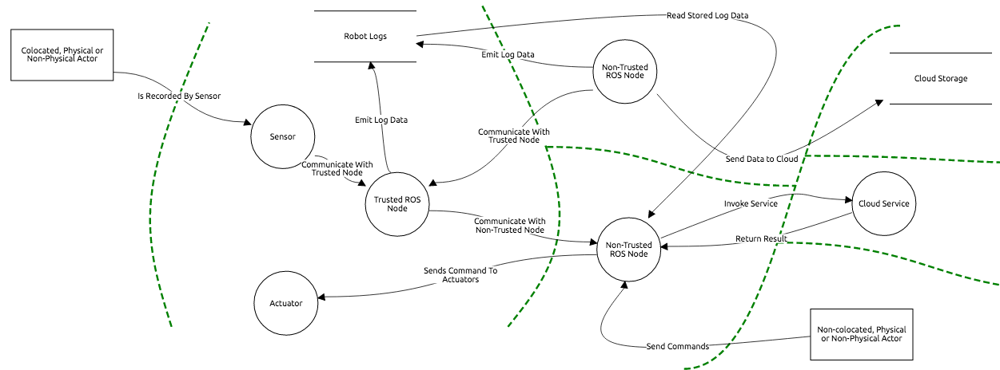

## 威胁分析和建模
下表列出了可能影响机器人应用的所有通用威胁。

威胁分类基于STRIDE（伪装/篡改/否认/完整性/拒绝服务/权限提升）模型。风险评估依赖于DREAD（损害/可复制性/可利用性/受影响用户/可发现性）。

在下表中，“威胁类别（STRIDE）”列指示威胁所属的类别。如果“伪装”列标记有勾号（✓），则表示该威胁可以用来伪装系统的一个组件。如果不能用来伪装组件，则会显示一个叉号（✘）。

“威胁风险评估（DREAD）”列包含一个得分，指示特定威胁被利用的容易程度或可能性。允许的得分值为1（没有风险）、2（可能存在风险）或3（存在风险，需要缓解）。例如，在损害列中，1表示“威胁利用会造成最小损害”，2表示“威胁利用会造成重大损害”，3表示“威胁利用会造成大规模损害”。“总得分”是通过添加每列的得分计算得出的。得分越高，威胁越严重。

受影响的资产、入口点和业务目标列指示给定威胁是否影响资产、入口点或业务目标。勾号（✓）表示受影响，叉号（✘）表示未受影响。三角形（▲）表示“间接受影响或在某些条件下受影响”。例如，破坏机器人内核可能不足以窃取用户数据，但它使得窃取数据变得更加容易。

<table class="table">
    <tr>
      <th rowspan="2" style="width: 20em">Threat Description</th>
      <th colspan="6">Threat Category (STRIDE)</th>
      <th colspan="6">Threat Risk Assessment (DREAD)</th>
      <th colspan="7">Impacted Assets</th>
      <th colspan="5">Impacted Entry Points</th>
      <th rowspan="2" style="width: 30em">Mitigation Strategies</th>
      <th rowspan="2" style="width: 30em">Similar Attacks in the Litterature</th>
    </tr>
    <tr style="height: 13em; white-space: nowrap;">
      <th style="transform: rotate(-90deg) translateX(-5em) translateY(5em)">Spoofing</th>
      <th style="transform: rotate(-90deg) translateX(-5em) translateY(5em)">Tampering</th>
      <th style="transform: rotate(-90deg) translateX(-5em) translateY(5em)">Repudiation</th>
      <th style="transform: rotate(-90deg) translateX(-5em) translateY(5em)">Info. Disclosure</th>
      <th style="transform: rotate(-90deg) translateX(-5em) translateY(5em)">Denial of Service</th>
      <th style="transform: rotate(-90deg) translateX(-5em) translateY(5em)">Elev. of Privileges</th>
      <th style="transform: rotate(-90deg) translateX(-5em) translateY(5em)">Damage</th>
      <th style="transform: rotate(-90deg) translateX(-5em) translateY(5em)">Reproducibility</th>
      <th style="transform: rotate(-90deg) translateX(-5em) translateY(5em)">Exploitability</th>
      <th style="transform: rotate(-90deg) translateX(-5em) translateY(5em)">Affected Users</th>
      <th style="transform: rotate(-90deg) translateX(-5em) translateY(5em)">Discoverability</th>
      <th style="transform: rotate(-90deg) translateX(-5em) translateY(5em)">DREAD Score</th>
      <th style="transform: rotate(-90deg) translateX(-5em) translateY(5em)">Robot Compute Rsc.</th>
      <th style="transform: rotate(-90deg) translateX(-5em) translateY(5em)">Physical Safety</th>
      <th style="transform: rotate(-90deg) translateX(-5em) translateY(5em)">Robot Avail.</th>
      <th style="transform: rotate(-90deg) translateX(-5em) translateY(5em)">Robot Integrity</th>
      <th style="transform: rotate(-90deg) translateX(-5em) translateY(5em)">Data
Integrity</th>
      <th style="transform: rotate(-90deg) translateX(-5em) translateY(5em)">Data
Avail.</th>
      <th style="transform: rotate(-90deg) translateX(-5em) translateY(5em)">Data
Privacy</th>
      <th style="transform: rotate(-90deg) translateX(-5em) translateY(5em)">Embedded H/W</th>
      <th style="transform: rotate(-90deg) translateX(-5em) translateY(5em)">Robot Comm. Channels</th>
      <th style="transform: rotate(-90deg) translateX(-5em) translateY(5em)">Robot Admin. Tools</th>
      <th style="transform: rotate(-90deg) translateX(-5em) translateY(5em)">Remote App. Interface</th>
      <th style="transform: rotate(-90deg) translateX(-5em) translateY(5em)">Deployment Infra.</th>
      <th></th>
    </tr>
    <tr>
      <th colspan="29">Embedded / Software / Communication / Inter-Component
Communication</th>
    </tr>
    <tr>
      <td>An attacker spoofs a component identity.</td>
      <td class="success">✓</td>
      <td class="success">✓</td>
      <td class="danger">✘</td>
      <td class="success">✓</td>
      <td class="danger">✘</td>
      <td class="success">✓</td>
      <td class="danger">3</td>
      <td class="success">1</td>
      <td class="success">1</td>
      <td class="warning">2</td>
      <td class="danger">3</td>
      <td>10</td>
      <td class="success">✓</td>
      <td class="success">✓</td>
      <td class="success">✓</td>
      <td class="success">✓</td>
      <td class="success">✓</td>
      <td class="success">✓</td>
      <td class="success">✓</td>
      <td class="success">✓</td>
      <td class="success">✓</td>
      <td class="danger">✘</td>
      <td class="danger">✘</td>
      <td class="danger">✘</td>
      <td>
        <ul>
          <li>Components should authenticate themselves.</li>
          <li>Components should not be attributed similar identifiers.</li>
          <li>Component identifiers should be chosen carefully.</li>
        </ul>
      </td>
      <td>
        <a href="http://arxiv.org/abs/1504.04339">Bonaci, Tamara, Jeffrey
    Herron, Tariq Yusuf, Junjie Yan, Tadayoshi Kohno, and Howard Jay Chizeck. “To
    Make a Robot Secure: An Experimental Analysis of Cyber Security Threats Against
    Teleoperated Surgical Robots.” ArXiv:1504.04339 [Cs], April 16, 2015.</a>
      </td>
    </tr>
    <tr>
      <td>An attacker intercepts and alters a message.</td>
      <td class="danger">✘</td>
      <td class="success">✓</td>
      <td class="danger">✘</td>
      <td class="danger">✘</td>
      <td class="danger">✘</td>
      <td class="danger">✘</td>
      <td class="danger">3</td>
      <td class="danger">3</td>
      <td class="danger">3</td>
      <td class="danger">3</td>
      <td class="danger">3</td>
      <td>15</td>
      <td class="danger">✘</td>
      <td class="success">✓</td>
      <td class="success">✓</td>
      <td class="success">✓</td>
      <td class="success">✓</td>
      <td class="success">✓</td>
      <td class="warning">▲</td>
      <td class="danger">✘</td>
      <td class="success">✓</td>
      <td class="danger">✘</td>
      <td class="danger">✘</td>
      <td class="danger">✘</td>
      <td>
        <ul>
          <li>Messages should be signed and/or encrypted.</li>
        </ul>
      </td>
      <td>
        <a href="http://arxiv.org/abs/1504.04339">Bonaci, Tamara, Jeffrey
    Herron, Tariq Yusuf, Junjie Yan, Tadayoshi Kohno, and Howard Jay Chizeck. “To
    Make a Robot Secure: An Experimental Analysis of Cyber Security Threats Against
    Teleoperated Surgical Robots.” ArXiv:1504.04339 [Cs], April 16, 2015.</a>
      </td>
    </tr>
    <tr>
      <td>An attacker writes to a communication channel without
    authorization.</td>
      <td class="danger">✘</td>
      <td class="success">✓</td>
      <td class="danger">✘</td>
      <td class="danger">✘</td>
      <td class="danger">✘</td>
      <td class="danger">✘</td>
      <td class="danger">3</td>
      <td class="danger">3</td>
      <td class="danger">3</td>
      <td class="danger">3</td>
      <td class="danger">3</td>
      <td>15</td>
      <td class="danger">✘</td>
      <td class="success">✓</td>
      <td class="success">✓</td>
      <td class="success">✓</td>
      <td class="danger">✘</td>
      <td class="danger">✘</td>
      <td class="success">✓</td>
      <td class="danger">✘</td>
      <td class="success">✓</td>
      <td class="danger">✘</td>
      <td class="danger">✘</td>
      <td class="danger">✘</td>
      <td>
        <ul>
          <li>Components should only communicate on encrypted channels.</li>
          <li>Sensitive inter-process communication should be done through shared
        memory whenever possible.</li>
        </ul>
      </td>
      <td>
        <a href="http://arxiv.org/abs/1504.04339">Bonaci, Tamara, Jeffrey
    Herron, Tariq Yusuf, Junjie Yan, Tadayoshi Kohno, and Howard Jay Chizeck. “To
    Make a Robot Secure: An Experimental Analysis of Cyber Security Threats Against
    Teleoperated Surgical Robots.” ArXiv:1504.04339 [Cs], April 16, 2015.</a>
      </td>
    </tr>
    <tr>
      <td>An attacker listens to a communication channel without
authorization.</td>
      <td class="danger">✘</td>
      <td class="danger">✘</td>
      <td class="danger">✘</td>
      <td class="success">✓</td>
      <td class="danger">✘</td>
      <td class="danger">✘</td>
      <td class="warning">2</td>
      <td class="danger">3</td>
      <td class="danger">3</td>
      <td class="danger">3</td>
      <td class="danger">3</td>
      <td>14</td>
      <td class="danger">✘</td>
      <td class="danger">✘</td>
      <td class="success">✓</td>
      <td class="success">✓</td>
      <td class="success">✓</td>
      <td class="success">✓</td>
      <td class="success">✓</td>
      <td class="danger">✘</td>
      <td class="success">✓</td>
      <td class="danger">✘</td>
      <td class="danger">✘</td>
      <td class="danger">✘</td>
      <td>
        <ul>
          <li>Components should only communicate on encrypted channels.</li>
          <li>Sensitive inter-process communication should be done through shared
memory whenever possible.</li>
        </ul>
      </td>
      <td>
        <a href="http://arxiv.org/abs/1504.04339">Bonaci, Tamara, Jeffrey
    Herron, Tariq Yusuf, Junjie Yan, Tadayoshi Kohno, and Howard Jay Chizeck. “To
    Make a Robot Secure: An Experimental Analysis of Cyber Security Threats Against
    Teleoperated Surgical Robots.” ArXiv:1504.04339 [Cs], April 16, 2015.</a>
      </td>
    </tr>
    <tr>
      <td>An attacker prevents a communication channel from being usable.</td>
      <td class="danger">✘</td>
      <td class="danger">✘</td>
      <td class="danger">✘</td>
      <td class="danger">✘</td>
      <td class="success">✓</td>
      <td class="danger">✘</td>
      <td class="danger">3</td>
      <td class="danger">3</td>
      <td class="danger">3</td>
      <td class="danger">3</td>
      <td class="danger">3</td>
      <td>15</td>
      <td class="success">✓</td>
      <td class="warning">▲</td>
      <td class="success">✓</td>
      <td class="success">✓</td>
      <td class="success">✓</td>
      <td class="success">✓</td>
      <td class="danger">✘</td>
      <td class="danger">✘</td>
      <td class="success">✓</td>
      <td class="danger">✘</td>
      <td class="danger">✘</td>
      <td class="danger">✘</td>
      <td>
        <ul>
          <li>Components should only be allowed to access channels they
require.</li>
          <li>Internet-facing channels and robot-only channels should be
isolated.</li>
          <li>Components behaviors should be tolerant of a loss of communication
(e.g. go to x,y vs set velocity to vx, vy).</li>
        </ul>
      </td>
      <td>
        <a href="http://arxiv.org/abs/1504.04339">Bonaci, Tamara, Jeffrey
Herron, Tariq Yusuf, Junjie Yan, Tadayoshi Kohno, and Howard Jay Chizeck. “To
Make a Robot Secure: An Experimental Analysis of Cyber Security Threats Against
Teleoperated Surgical Robots.” ArXiv:1504.04339 [Cs], April 16, 2015.</a>
      </td>
    </tr>
    <tr>
      <th colspan="29">Embedded / Software / Communication / Long-Range
Communication (e.g. WiFi, Cellular Connection)</th>
    </tr>
    <tr>
      <td>An attacker hijacks robot long-range communication</td>
      <td class="danger">✘</td>
      <td class="success">✓</td>
      <td class="danger">✘</td>
      <td class="danger">✘</td>
      <td class="danger">✘</td>
      <td class="danger">✘</td>
      <td class="danger">3</td>
      <td class="warning">2</td>
      <td class="success">1</td>
      <td class="danger">3</td>
      <td class="success">1</td>
      <td>10</td>
      <td class="danger">✘</td>
      <td class="success">✓</td>
      <td class="warning">▲</td>
      <td class="success">✓</td>
      <td class="success">✓</td>
      <td class="danger">✘</td>
      <td class="success">✓</td>
      <td class="danger">✘</td>
      <td class="success">✓</td>
      <td class="success">✓</td>
      <td class="success">✓</td>
      <td class="success">✓</td>
      <td>
        <ul>
          <li>Long-range communication should always use a secure transport layer
(WPA2 for WiFi for instance)</li>
        </ul>
      </td>
      <td>
        <a href="http://arxiv.org/abs/1504.04339">Bonaci, Tamara, Jeffrey
Herron, Tariq Yusuf, Junjie Yan, Tadayoshi Kohno, and Howard Jay Chizeck. “To
Make a Robot Secure: An Experimental Analysis of Cyber Security Threats Against
Teleoperated Surgical Robots.” ArXiv:1504.04339 [Cs], April 16, 2015.</a>
      </td>
    </tr>
    <tr>
      <td>An attacker intercepts robot long-range communications (e.g. MitM)</td>
      <td class="danger">✘</td>
      <td class="danger">✘</td>
      <td class="danger">✘</td>
      <td class="success">✓</td>
      <td class="danger">✘</td>
      <td class="danger">✘</td>
      <td class="success">1</td>
      <td class="warning">2</td>
      <td class="success">1</td>
      <td class="danger">3</td>
      <td class="success">1</td>
      <td>8</td>
      <td class="danger">✘</td>
      <td class="success">✓</td>
      <td class="success">✓</td>
      <td class="success">✓</td>
      <td class="success">✓</td>
      <td class="success">✓</td>
      <td class="success">✓</td>
      <td class="danger">✘</td>
      <td class="success">✓</td>
      <td class="success">✓</td>
      <td class="success">✓</td>
      <td class="success">✓</td>
      <td>
        <ul>
          <li>Long-range communication should always use a secure transport layer
(WPA2 for WiFi for instance)</li>
        </ul>
      </td>
      <td>
        <a href="http://arxiv.org/abs/1504.04339">Bonaci, Tamara, Jeffrey
Herron, Tariq Yusuf, Junjie Yan, Tadayoshi Kohno, and Howard Jay Chizeck. “To
Make a Robot Secure: An Experimental Analysis of Cyber Security Threats Against
Teleoperated Surgical Robots.” ArXiv:1504.04339 [Cs], April 16, 2015.</a>
      </td>
    </tr>
    <tr>
      <td>An attacker disrupts (e.g. jams) robot long-range communication
channels.</td>
      <td class="danger">✘</td>
      <td class="danger">✘</td>
      <td class="danger">✘</td>
      <td class="danger">✘</td>
      <td class="success">✓</td>
      <td class="danger">✘</td>
      <td class="warning">2</td>
      <td class="warning">2</td>
      <td class="success">1</td>
      <td class="success">1</td>
      <td class="danger">3</td>
      <td>9</td>
      <td class="danger">✘</td>
      <td class="warning">▲</td>
      <td class="success">✓</td>
      <td class="danger">✘</td>
      <td class="danger">✘</td>
      <td class="success">✓</td>
      <td class="danger">✘</td>
      <td class="danger">✘</td>
      <td class="success">✓</td>
      <td class="success">✓</td>
      <td class="success">✓</td>
      <td class="success">✓</td>
      <td>
        <ul>
          <li>Multiple long-range communication transport layers should be used
when possible (e.g. cellular and WiFi)</li>
        </ul>
      </td>
      <td>
        <a href="http://arxiv.org/abs/1504.04339">Bonaci, Tamara, Jeffrey
Herron, Tariq Yusuf, Junjie Yan, Tadayoshi Kohno, and Howard Jay Chizeck. “To
Make a Robot Secure: An Experimental Analysis of Cyber Security Threats Against
Teleoperated Surgical Robots.” ArXiv:1504.04339 [Cs], April 16, 2015.</a>
      </td>
    </tr>
    <tr>
      <th colspan="29">Embedded / Software / Communication / Short-Range
Communication (e.g. Bluetooth)</th>
    </tr>
    <tr>
      <td>An attacker executes arbitrary code using a short-range communication
      protocol vulnerability.</td>
      <td class="danger">✘</td>
      <td class="success">✓</td>
      <td class="success">✓</td>
      <td class="success">✓</td>
      <td class="success">✓</td>
      <td class="success">✓</td>
      <td class="danger">3</td>
      <td class="warning">2</td>
      <td class="success">1</td>
      <td class="success">1</td>
      <td class="danger">3</td>
      <td>10</td>
      <td class="success">✓</td>
      <td class="success">✓</td>
      <td class="success">✓</td>
      <td class="success">✓</td>
      <td class="success">✓</td>
      <td class="success">✓</td>
      <td class="success">✓</td>
      <td class="danger">✘</td>
      <td class="danger">✘</td>
      <td class="danger">✘</td>
      <td class="danger">✘</td>
      <td class="danger">✘</td>
      <td>
        <ul>
          <li>Communications protocols should be disabled if unused (by using e.g.
rfkill).</li>
          <li>Binaries and libraries required to support short-range communications
should be kept up-to-date.</li>
        </ul>
      </td>
      <td>
        <a href="http://dl.acm.org/citation.cfm?id=2028067.2028073">Checkoway,
Stephen, Damon McCoy, Brian Kantor, Danny Anderson, Hovav Shacham, Stefan
Savage, Karl Koscher, Alexei Czeskis, Franziska Roesner, and Tadayoshi Kohno.
“Comprehensive Experimental Analyses of Automotive Attack Surfaces.” In
Proceedings of the 20th USENIX Conference on Security, 6–6. SEC’11.
Berkeley, CA, USA: USENIX Association, 2011.</a></td>
  </tr>

  <tr><th colspan="29">Embedded / Software / Communication / Remote Application Interface</th></tr>

  <tr>
  <td>An attacker gains unauthenticated access to the remote application interface.</td>
  <td class="success">✓</td>
  <td class="success">✓</td>
  <td class="danger">✘</td>
  <td class="success">✓</td>
  <td class="success">✓</td>
  <td class="warning">▲</td>
  <td class="danger">3</td>
  <td class="danger">3</td>
  <td class="success">1</td>
  <td class="success">1</td>
  <td class="danger">3</td>
  <td>11</td>
  <td class="success">✓</td>
  <td class="success">✓</td>
  <td class="success">✓</td>
  <td class="success">✓</td>
  <td class="danger">✘</td>
  <td class="danger">✘</td>
  <td class="danger">✘</td>
  <td class="success">✓</td>
  <td class="danger">✘</td>
  <td class="success">✓</td>
  <td class="success">✓</td>
  <td class="success">✓</td>
  <td>
    <ul>
      <li>Implement authentication and authorization methods.</li>
      <li>Enable RBAC to limit permissions for the users.</li>
    </ul>
  </td>
  <td></td>
  </tr>
  <tr>
  <td>An attacker could eavesdrop communications to the Robot’s remote application interface.</td>
  <td class="danger">✘</td>
  <td class="danger">✘</td>
  <td class="danger">✘</td>
  <td class="success">✓</td>
  <td class="danger">✘</td>
  <td class="danger">✘</td>
  <td class="success">1</td>
  <td class="success">1</td>
  <td class="success">1</td>
  <td class="success">1</td>
  <td class="danger">3</td>
  <td>7</td>
  <td class="danger">✘</td>
  <td class="success">✓</td>
  <td class="danger">✘</td>
  <td class="danger">✘</td>
  <td class="danger">✘</td>
  <td class="danger">✘</td>
  <td class="danger">✘</td>
  <td class="danger">✘</td>
  <td class="danger">✘</td>
  <td class="danger">✘</td>
  <td class="danger">✘</td>
  <td class="danger">✘</td>
  <td>
    <ul>
      <li>Communications with the remote application interface should be done over a secure channel.</li>
    </ul>
  </td>
  <td></td>
  </tr>

  <tr>
  <td>An attacker could alter data sent to the Robot’s remote application interface.</td>
  <td class="success">✓</td>
  <td class="success">✓</td>
  <td class="danger">✘</td>
  <td class="success">✓</td>
  <td class="success">✓</td>
  <td class="warning">▲</td>
  <td class="danger">3</td>
  <td class="danger">3</td>
  <td class="success">1</td>
  <td class="success">1</td>
  <td class="danger">3</td>
  <td>11</td>
  <td class="success">✓</td>
  <td class="success">✓</td>
  <td class="success">✓</td>
  <td class="success">✓</td>
  <td class="danger">✘</td>
  <td class="danger">✘</td>
  <td class="danger">✘</td>
  <td class="success">✓</td>
  <td class="danger">✘</td>
  <td class="success">✓</td>
  <td class="success">✓</td>
  <td class="success">✓</td>
  <td>
    <ul>
      <li>Communications with the remote application interface should be done over a secure channel.</li>
    </ul>
  </td>
  <td></td>
  </tr>

  <tr><th colspan="29">Embedded / Software / OS &amp; Kernel</th></tr>

  <tr>
    <td>An attacker compromises the real-time clock to disrupt the kernel RT
scheduling guarantees.</td>
      <td class="danger">✘</td>
      <td class="danger">✘</td>
      <td class="danger">✘</td>
      <td class="danger">✘</td>
      <td class="success">✓</td>
      <td class="danger">✘</td>
      <td class="danger">3</td>
      <td class="warning">2</td>
      <td class="success">1</td>
      <td class="danger">3</td>
      <td class="warning">2</td>
      <td>11</td>
      <td class="success">✓</td>
      <td class="success">✓</td>
      <td class="success">✓</td>
      <td class="success">✓</td>
      <td class="danger">✘</td>
      <td class="danger">✘</td>
      <td class="danger">✘</td>
      <td class="danger">✘</td>
      <td class="danger">✘</td>
      <td class="danger">✘</td>
      <td class="danger">✘</td>
      <td class="danger">✘</td>
      <td>
        <ul>
          <li>Hardened kernel (prevent dynamic loading of kernel modules)</li>
          <li>Ensure only trustable kernels are used (e.g. Secure Boot)</li>
          <li>/boot should not be accessible by robot processes</li>
          <li>
          [NTP security best practices][ietf_ntp_bcp] should be enforced to ensure no
          attacker can manipulate the robot computer clock.
          See also [RFC 7384][rfc_7384],
          [NTPsec][ntpsec] and
          [Emerging Solutions in Time Synchronization Security][emerging_solutions_time_sync_sec].
          Additionally, [PTP protocol][ieee_1588_2008] can be considered instead of NTP.
          </li>
        </ul>
      </td>
      <td>
        <a href="https://doi.org/10.1109/MSP.2012.104">Dessiatnikoff, Anthony,
Yves Deswarte, Eric Alata, and Vincent Nicomette. “Potential Attacks on
Onboard Aerospace Systems.” IEEE Security &amp; Privacy 10, no. 4 (July
2012): 71–74.</a>
      </td>
    </tr>
    <tr>
      <td>An attacker compromises the OS or kernel to alter robot data.</td>
      <td class="danger">✘</td>
      <td class="success">✓</td>
      <td class="danger">✘</td>
      <td class="danger">✘</td>
      <td class="danger">✘</td>
      <td class="danger">✘</td>
      <td class="danger">3</td>
      <td class="warning">2</td>
      <td class="success">1</td>
      <td class="danger">3</td>
      <td class="warning">2</td>
      <td>11</td>
      <td class="danger">✘</td>
      <td class="danger">✘</td>
      <td class="danger">✘</td>
      <td class="success">✓</td>
      <td class="success">✓</td>
      <td class="danger">✘</td>
      <td class="success">✓</td>
      <td class="danger">✘</td>
      <td class="danger">✘</td>
      <td class="danger">✘</td>
      <td class="danger">✘</td>
      <td class="danger">✘</td>
      <td>
        <ul>
          <li>OS user accounts should be properly secured (randomized password or
e.g. SSH keys)</li>
          <li>Hardened kernel (prevent dynamic loading of kernel modules)</li>
          <li>Ensure only trustable kernels are used (e.g. Secure Boot)</li>
          <li>/boot should not be accessible by robot processes</li>
        </ul>
      </td>
      <td>
        <a href="https://doi.org/10.1109/COGSIMA.2017.7929597">Clark, George
W., Michael V. Doran, and Todd R. Andel. “Cybersecurity Issues in
Robotics.” In 2017 IEEE Conference on Cognitive and Computational Aspects of
Situation Management (CogSIMA), 1–5. Savannah, GA, USA: IEEE, 2017.</a>
      </td>
    </tr>
    <tr>
      <td>An attacker compromises the OS or kernel to eavesdrop on robot
data.</td>
      <td class="danger">✘</td>
      <td class="danger">✘</td>
      <td class="success">✓</td>
      <td class="danger">✘</td>
      <td class="danger">✘</td>
      <td class="danger">✘</td>
      <td class="success">1</td>
      <td class="warning">2</td>
      <td class="success">1</td>
      <td class="danger">3</td>
      <td class="warning">2</td>
      <td>9</td>
      <td class="danger">✘</td>
      <td class="danger">✘</td>
      <td class="danger">✘</td>
      <td class="danger">✘</td>
      <td class="success">✓</td>
      <td class="danger">✘</td>
      <td class="success">✓</td>
      <td class="danger">✘</td>
      <td class="danger">✘</td>
      <td class="danger">✘</td>
      <td class="danger">✘</td>
      <td class="danger">✘</td>
      <td>
        <ul>
          <li>OS user accounts should be properly secured (randomized password or
e.g. SSH keys)</li>
          <li>Hardened kernel (prevent dynamic loading of kernel modules)</li>
          <li>Ensure only trustable kernels are used (e.g. Secure Boot)</li>
          <li>/boot should not be accessible by robot processes</li>
        </ul>
      </td>
      <td>
        <a href="https://doi.org/10.1109/COGSIMA.2017.7929597">Clark, George
W., Michael V. Doran, and Todd R. Andel. “Cybersecurity Issues in
Robotics.” In 2017 IEEE Conference on Cognitive and Computational Aspects of
Situation Management (CogSIMA), 1–5. Savannah, GA, USA: IEEE, 2017.</a>
      </td>
    </tr>
    <tr>
      <td>An attacker gains access to the robot OS through its administration
interface.</td>
      <td class="danger">✘</td>
      <td class="success">✓</td>
      <td class="success">✓</td>
      <td class="success">✓</td>
      <td class="danger">✘</td>
      <td class="danger">✘</td>
      <td class="danger">3</td>
      <td class="danger">3</td>
      <td class="warning">2</td>
      <td class="danger">3</td>
      <td class="danger">3</td>
      <td>14</td>
      <td class="success">✓</td>
      <td class="success">✓</td>
      <td class="success">✓</td>
      <td class="success">✓</td>
      <td class="success">✓</td>
      <td class="success">✓</td>
      <td class="success">✓</td>
      <td class="danger">✘</td>
      <td class="danger">✘</td>
      <td class="danger">✘</td>
      <td class="danger">✘</td>
      <td class="danger">✘</td>
      <td>
        <ul>
          <li>Administrative interface should be properly secured (e.g. no
default/static password).</li>
          <li>Administrative interface should be accessible by a limited number
              of physical machines.
              For instance, one may require the user to be physically co-located with the
              robot (see e.g. ADB for Android)</li>
        </ul>
      </td>
      <td></td>
    </tr>
    <tr>
      <th colspan="29">Embedded / Software / Component-Oriented
Architecture</th>
    </tr>
    <tr>
      <td>A node accidentally writes incorrect data to a communication
channel.</td>
      <td class="danger">✘</td>
      <td class="success">✓</td>
      <td class="danger">✘</td>
      <td class="danger">✘</td>
      <td class="danger">✘</td>
      <td class="danger">✘</td>
      <td class="warning">2</td>
      <td class="danger">3</td>
      <td class="warning">2</td>
      <td class="danger">3</td>
      <td class="danger">3</td>
      <td>13</td>
      <td class="danger">✘</td>
      <td class="warning">▲</td>
      <td class="danger">✘</td>
      <td class="success">✓</td>
      <td class="danger">✘</td>
      <td class="danger">✘</td>
      <td class="danger">✘</td>
      <td class="danger">✘</td>
      <td class="success">✓</td>
      <td class="danger">✘</td>
      <td class="danger">✘</td>
      <td class="danger">✘</td>
      <td>
        <ul>
          <li>Components should always validate received messages.</li>
          <li>Invalid message events should be logged and users should be
notified.</li>
        </ul>
      </td>
      <td>
        <a href="http://sunnyday.mit.edu/nasa-class/Ariane5-report.html">Jacques-Louis
Lions et al. "Ariane S Flight 501 Failure." ESA Press Release 33–96, Paris,
1996.</a>
      </td>
    </tr>
    <tr>
      <td>An attacker deploys a malicious component on the robot.</td>
      <td class="danger">✘</td>
      <td class="success">✓</td>
      <td class="danger">✘</td>
      <td class="success">✓</td>
      <td class="danger">✘</td>
      <td class="danger">✘</td>
      <td class="danger">3</td>
      <td class="danger">3</td>
      <td class="warning">2</td>
      <td class="danger">3</td>
      <td class="danger">3</td>
      <td>14</td>
      <td class="danger">✘</td>
      <td class="warning">▲</td>
      <td class="success">✓</td>
      <td class="success">✓</td>
      <td class="success">✓</td>
      <td class="success">✓</td>
      <td class="success">✓</td>
      <td class="danger">✘</td>
      <td class="success">✓</td>
      <td class="danger">✘</td>
      <td class="danger">✘</td>
      <td class="danger">✘</td>
      <td>
        <ul>
          <li>Components should not trust other components (received messages
needs to be validated, etc.).</li>
          <li>Users should not be able to deploy components directly.</li>
          <li>Components binary should be digitally signed.</li>
          <li>Components source code should be audited.</li>
          <li>Components should run with minimal privileges (CPU and memory
quota, minimal I/O and access to the filesystem)</li>
        </ul>
      </td>
      <td>
        <a href="http://dl.acm.org/citation.cfm?id=2028067.2028073">Checkoway,
Stephen, Damon McCoy, Brian Kantor, Danny Anderson, Hovav Shacham, Stefan
Savage, Karl Koscher, Alexei Czeskis, Franziska Roesner, and Tadayoshi Kohno.
“Comprehensive Experimental Analyses of Automotive Attack Surfaces.” In
Proceedings of the 20th USENIX Conference on Security, 6–6. SEC’11.
Berkeley, CA, USA: USENIX Association, 2011.</a>
      </td>
    </tr>
    <tr>
      <td>An attacker can prevent a component running on the robot from executing
normally.</td>
      <td class="danger">✘</td>
      <td class="danger">✘</td>
      <td class="danger">✘</td>
      <td class="danger">✘</td>
      <td class="success">✓</td>
      <td class="danger">✘</td>
      <td class="warning">2</td>
      <td class="danger">3</td>
      <td class="warning">2</td>
      <td class="danger">3</td>
      <td class="danger">3</td>
      <td>13</td>
      <td class="danger">✘</td>
      <td class="warning">▲</td>
      <td class="success">✓</td>
      <td class="danger">✘</td>
      <td class="danger">✘</td>
      <td class="success">✓</td>
      <td class="danger">✘</td>
      <td class="danger">✘</td>
      <td class="success">✓</td>
      <td class="danger">✘</td>
      <td class="danger">✘</td>
      <td class="danger">✘</td>
      <td>
        <ul>
          <li>Components should not be trusted and be properly isolated (e.g. run
as different users)</li>
          <li>When safe, components should attempt to restart automatically when
a fatal error occurs.</li>
        </ul>
      </td>
      <td>
        <a href="https://doi.org/10.1109/MSP.2012.104">Dessiatnikoff, Anthony,
Yves Deswarte, Eric Alata, and Vincent Nicomette. “Potential Attacks on
Onboard Aerospace Systems.” IEEE Security &amp; Privacy 10, no. 4 (July
2012): 71–74.</a>
      </td>
    </tr>
    <tr>
      <th colspan="29">Embedded / Software / Configuration Management</th>
    </tr>
    <tr>
      <td>An attacker modifies configuration values without authorization.</td>
      <td class="danger">✘</td>
      <td class="success">✓</td>
      <td class="danger">✘</td>
      <td class="danger">✘</td>
      <td class="danger">✘</td>
      <td class="danger">✘</td>
      <td class="danger">3</td>
      <td class="danger">3</td>
      <td class="danger">3</td>
      <td class="danger">3</td>
      <td class="danger">3</td>
      <td>15</td>
      <td class="danger">✘</td>
      <td class="warning">▲</td>
      <td class="success">✓</td>
      <td class="success">✓</td>
      <td class="success">✓</td>
      <td class="warning">▲</td>
      <td class="danger">✘</td>
      <td class="danger">✘</td>
      <td class="danger">✘</td>
      <td class="danger">✘</td>
      <td class="danger">✘</td>
      <td class="danger">✘</td>
      <td>
        <ul>
          <li>Configuration data access control list should be implemented.</li>
          <li>Configuration data modifications should be logged.</li>
          <li>Configuration write-access should be limited to the minimum set of
users and/or components.</li>
        </ul>
      </td>
      <td>
        <a href="https://doi.org/10.3390/s18051643">Ahmad Yousef, Khalil, Anas
AlMajali, Salah Ghalyon, Waleed Dweik, and Bassam Mohd. “Analyzing
Cyber-Physical Threats on Robotic Platforms.” Sensors 18, no. 5 (May 21,
2018): 1643.</a></td>
  </tr>

  <tr>
    <td>An attacker accesses configuration values without authorization.</td>
    <td class="danger">✘</td>
    <td class="danger">✘</td>
    <td class="success">✓</td>
    <td class="danger">✘</td>
    <td class="danger">✘</td>
    <td class="danger">✘</td>
    <td class="success">1</td>
    <td class="danger">3</td>
    <td class="danger">3</td>
    <td class="danger">3</td>
    <td class="danger">3</td>
    <td>13</td>
    <td class="danger">✘</td>
    <td class="success">✓</td>
    <td class="danger">✘</td>
    <td class="danger">✘</td>
    <td class="danger">✘</td>
    <td class="danger">✘</td>
    <td class="danger">✘</td>
    <td class="danger">✘</td>
    <td class="danger">✘</td>
    <td class="danger">✘</td>
    <td class="danger">✘</td>
    <td class="danger">✘</td>
    <td>
      <ul>
        <li>Configuration data should be considered as private.</li>
        <li>Configuration data should accessible by the minimum set of users
and/or components.</li>
        </ul>
      </td>
      <td>
        <a href="https://doi.org/10.3390/s18051643">Ahmad Yousef, Khalil, Anas
AlMajali, Salah Ghalyon, Waleed Dweik, and Bassam Mohd. “Analyzing
Cyber-Physical Threats on Robotic Platforms.” Sensors 18, no. 5 (May 21,
2018): 1643.</a>
      </td>
    </tr>
    <tr>
      <td>A user accidentally misconfigures the robot.</td>
      <td class="danger">✘</td>
      <td class="danger">✘</td>
      <td class="danger">✘</td>
      <td class="danger">✘</td>
      <td class="danger">✘</td>
      <td class="danger">✘</td>
      <td class="danger">3</td>
      <td class="danger">3</td>
      <td class="danger">3</td>
      <td class="danger">3</td>
      <td class="danger">3</td>
      <td>15</td>
      <td class="danger">✘</td>
      <td class="warning">▲</td>
      <td class="success">✓</td>
      <td class="success">✓</td>
      <td class="success">✓</td>
      <td class="warning">▲</td>
      <td class="danger">✘</td>
      <td class="danger">✘</td>
      <td class="danger">✘</td>
      <td class="danger">✘</td>
      <td class="danger">✘</td>
      <td class="danger">✘</td>
      <td>
        <ul>
          <li>Configuration data changes should be reversible.</li>
          <li>Large change should be applied atomically.</li>
          <li>Fault monitoring should be able to automatically reset the
configuration to a safe state if the robot becomes unavailable.</li>
        </ul>
      </td>
      <td></td>
    </tr>
    <tr>
      <th colspan="29">Embedded / Software / Data Storage (File
System)</th>
    </tr>
    <tr>
      <td>An attacker modifies the robot file system by physically accessing
it.</td>
      <td class="danger">✘</td>
      <td class="success">✓</td>
      <td class="danger">✘</td>
      <td class="danger">✘</td>
      <td class="danger">✘</td>
      <td class="danger">✘</td>
      <td class="danger">3</td>
      <td class="danger">3</td>
      <td class="danger">3</td>
      <td class="danger">3</td>
      <td class="danger">3</td>
      <td>15</td>
      <td class="danger">✘</td>
      <td class="success">✓</td>
      <td class="success">✓</td>
      <td class="success">✓</td>
      <td class="success">✓</td>
      <td class="success">✓</td>
      <td class="success">✓</td>
      <td class="danger">✘</td>
      <td class="danger">✘</td>
      <td class="danger">✘</td>
      <td class="danger">✘</td>
      <td class="danger">✘</td>
      <td>
        <ul>
          <li>Robot filesystem must be encrypted.
              The key should be stored in a secure enclave (TPM).</li>
          <li>Robot filesystem should be wiped out if the robot is physically
            compromised.</li>
        </ul>
      </td>
      <td></td>
    </tr>
    <tr>
      <td>An attacker eavesdrops on the robot file system by physically accessing
it.</td>
      <td class="danger">✘</td>
      <td class="danger">✘</td>
      <td class="success">✓</td>
      <td class="danger">✘</td>
      <td class="danger">✘</td>
      <td class="danger">✘</td>
      <td class="success">1</td>
      <td class="danger">3</td>
      <td class="danger">3</td>
      <td class="danger">3</td>
      <td class="danger">3</td>
      <td>13</td>
      <td class="danger">✘</td>
      <td class="danger">✘</td>
      <td class="danger">✘</td>
      <td class="danger">✘</td>
      <td class="danger">✘</td>
      <td class="danger">✘</td>
      <td class="success">✓</td>
      <td class="danger">✘</td>
      <td class="danger">✘</td>
      <td class="danger">✘</td>
      <td class="danger">✘</td>
      <td class="danger">✘</td>
      <td>
        <ul>
          <li>Robot filesystem must be encrypted.
              The key should be stored in a secure enclave (TPM).</li>
          <li>Robot filesystem should be wiped out if the robot perimeter is breached.</li>
        </ul>
      </td>
      <td></td>
    </tr>
    <tr>
      <td>An attacker saturates the robot disk with data.</td>
      <td class="danger">✘</td>
      <td class="danger">✘</td>
      <td class="danger">✘</td>
      <td class="danger">✘</td>
      <td class="success">✓</td>
      <td class="danger">✘</td>
      <td class="danger">3</td>
      <td class="danger">3</td>
      <td class="success">1</td>
      <td class="danger">3</td>
      <td class="danger">3</td>
      <td>13</td>
      <td class="danger">✘</td>
      <td class="success">✓</td>
      <td class="success">✓</td>
      <td class="success">✓</td>
      <td class="success">✓</td>
      <td class="success">✓</td>
      <td class="danger">✘</td>
      <td class="danger">✘</td>
      <td class="danger">✘</td>
      <td class="danger">✘</td>
      <td class="danger">✘</td>
      <td class="success">✓</td>
      <td>
        <ul>
          <li>Robot components disk quota should be bounded.</li>
          <li>Disk usage should be properly monitored, logged and reported.</li>
          <li>Optionally, components may have the option to run w/o any file system access.
              This should be preferred whenever possible.</li>
        </ul>
      </td>
      <td></td>
    </tr>
    <tr>
      <th colspan="29">Embedded / Software / Logs</th>
    </tr>
    <tr>
      <td>An attacker exfiltrates log data to a remote server.</td>
      <td class="danger">✘</td>
      <td class="danger">✘</td>
      <td class="danger">✘</td>
      <td class="success">✓</td>
      <td class="danger">✘</td>
      <td class="danger">✘</td>
      <td class="warning">2</td>
      <td class="warning">2</td>
      <td class="warning">2</td>
      <td class="danger">3</td>
      <td class="danger">3</td>
      <td>12</td>
      <td class="danger">✘</td>
      <td class="danger">✘</td>
      <td class="danger">✘</td>
      <td class="danger">✘</td>
      <td class="danger">✘</td>
      <td class="danger">✘</td>
      <td class="success">✓</td>
      <td class="danger">✘</td>
      <td class="danger">✘</td>
      <td class="danger">✘</td>
      <td class="danger">✘</td>
      <td class="danger">✘</td>
      <td>
        <ul>
          <li>Logs should never contain private data.
              Log data should be anonymized when needed.</li>
          <li>Logs should be rotated and deleted after a pre-determined retention period.</li>
          <li>Logs should be encrypted in-transit and at-rest.</li>
          <li>Logs access should be ACL protected.</li>
          <li>Logs access should be monitored to enable later audits.</li>
        </ul>
      </td>
      <td></td>
    </tr>
    <tr>
      <th colspan="29">Embedded / Hardware / Sensors</th>
    </tr>
    <tr>
      <td>An attacker spoofs a robot sensor (by e.g. replacing the sensor itself
or manipulating the bus).</td>
      <td class="success">✓</td>
      <td class="danger">✘</td>
      <td class="danger">✘</td>
      <td class="danger">✘</td>
      <td class="danger">✘</td>
      <td class="danger">✘</td>
      <td class="danger">3</td>
      <td class="warning">2</td>
      <td class="success">1</td>
      <td class="danger">3</td>
      <td class="danger">3</td>
      <td>12</td>
      <td class="danger">✘</td>
      <td class="danger">✘</td>
      <td class="danger">✘</td>
      <td class="success">✓</td>
      <td class="success">✓</td>
      <td class="danger">✘</td>
      <td class="success">✓</td>
      <td class="success">✓</td>
      <td class="success">✓</td>
      <td class="danger">✘</td>
      <td class="danger">✘</td>
      <td class="danger">✘</td>
      <td>
        <ul>
          <li>Sensors should embed an identifier to detect hardware
            tampering.</li>
          <li>Components should try to explicitly refer to which sensor ID they
            expect data from.</li>
          <li>Sensor data should be signed and ideally encrypted over the
            wire.</li>
        </ul>
      </td>
      <td></td>
    </tr>
    <tr>
      <th colspan="29">Embedded / Hardware / Actuators</th>
    </tr>
    <tr>
      <td>An attacker spoofs a robot actuator.</td>
      <td class="success">✓</td>
      <td class="danger">✘</td>
      <td class="danger">✘</td>
      <td class="danger">✘</td>
      <td class="danger">✘</td>
      <td class="danger">✘</td>
      <td class="success">1</td>
      <td class="warning">2</td>
      <td class="success">1</td>
      <td class="danger">3</td>
      <td class="danger">3</td>
      <td>10</td>
      <td class="danger">✘</td>
      <td class="danger">✘</td>
      <td class="danger">✘</td>
      <td class="danger">✘</td>
      <td class="success">✓</td>
      <td class="danger">✘</td>
      <td class="success">✓</td>
      <td class="success">✓</td>
      <td class="danger">✘</td>
      <td class="danger">✘</td>
      <td class="danger">✘</td>
      <td class="danger">✘</td>
      <td>
        <ul>
          <li>Actuators should embed an identifier.</li>
          <li>Command vector should be signed (ideally encrypted) to prevent
manipulation.</li>
        </ul>
      </td>
      <td></td>
    </tr>
    <tr>
      <td>An attacker modifies the command sent to the robot actuators.
(intercept &amp; retransmit)</td>
    <td class="danger">✘</td>
    <td class="success">✓</td>
    <td class="danger">✘</td>
    <td class="danger">✘</td>
    <td class="danger">✘</td>
    <td class="danger">✘</td>
    <td class="danger">3</td>
    <td class="warning">2</td>
    <td class="success">1</td>
    <td class="danger">3</td>
    <td class="danger">3</td>
    <td>12</td>
    <td class="danger">✘</td>
    <td class="danger">✘</td>
    <td class="danger">✘</td>
    <td class="success">✓</td>
    <td class="danger">✘</td>
    <td class="danger">✘</td>
    <td class="danger">✘</td>
    <td class="danger">✘</td>
    <td class="success">✓</td>
    <td class="danger">✘</td>
    <td class="success">✓</td>
    <td class="danger">✘</td>
    <td>
      <ul>
        <li>Actuators should embed an identifier.</li>
        <li>Command vector should be signed (ideally encrypted) to prevent
manipulation.</li>
        </ul>
      </td>
      <td></td>
    </tr>
    <tr>
      <td>An attacker intercepts the robot actuators command (can recompute localization).</td>
      <td class="danger">✘</td>
      <td class="danger">✘</td>
      <td class="success">✓</td>
      <td class="danger">✘</td>
      <td class="danger">✘</td>
      <td class="danger">✘</td>
      <td class="success">1</td>
      <td class="warning">2</td>
      <td class="success">1</td>
      <td class="danger">3</td>
      <td class="danger">3</td>
      <td>10</td>
      <td class="danger">✘</td>
      <td class="danger">✘</td>
      <td class="danger">✘</td>
      <td class="danger">✘</td>
      <td class="danger">✘</td>
      <td class="danger">✘</td>
      <td class="success">✓</td>
      <td class="success">✓</td>
      <td class="danger">✘</td>
      <td class="danger">✘</td>
      <td class="danger">✘</td>
      <td class="danger">✘</td>
      <td>
        <ul>
          <li>Command vector should be encrypted.</li>
        </ul>
      </td>
      <td></td>
    </tr>
    <tr>
      <td>An attacker sends malicious command to actuators to trigger the
E-Stop</td>
      <td class="danger">✘</td>
      <td class="danger">✘</td>
      <td class="danger">✘</td>
      <td class="danger">✘</td>
      <td class="success">✓</td>
      <td class="danger">✘</td>
      <td class="warning">2</td>
      <td class="warning">2</td>
      <td class="danger">3</td>
      <td class="danger">3</td>
      <td class="success">1</td>
      <td>11</td>
      <td class="danger">✘</td>
      <td class="success">✓</td>
      <td class="success">✓</td>
      <td class="danger">✘</td>
      <td class="danger">✘</td>
      <td class="danger">✘</td>
      <td class="danger">✘</td>
      <td class="danger">✘</td>
      <td class="danger">✘</td>
      <td class="danger">✘</td>
      <td class="danger">✘</td>
      <td class="danger">✘</td>
      <td>
        <ul>
          <li>If a joint command is exceeding the joint limits, a specific code
              path for handling out-of-bounds command should be executed instead of triggering the
              E-Stop.
              Whenever safe, the command could be discarded and the error reported to the user for
              instance.</li>
        </ul>
      </td>
      <td></td>
    </tr>
    <tr>
      <th colspan="29">Embedded / Hardware / Auxilliary Functions</th>
    </tr>
    <tr>
      <td>An attacker compromises the software or sends malicious commands to
drain the robot battery.</td>
      <td class="danger">✘</td>
      <td class="danger">✘</td>
      <td class="danger">✘</td>
      <td class="danger">✘</td>
      <td class="success">✓</td>
      <td class="danger">✘</td>
      <td class="warning">2</td>
      <td class="danger">3</td>
      <td class="danger">3</td>
      <td class="danger">3</td>
      <td class="danger">3</td>
      <td>14</td>
      <td class="danger">✘</td>
      <td class="danger">✘</td>
      <td class="success">✓</td>
      <td class="danger">✘</td>
      <td class="danger">✘</td>
      <td class="success">✓</td>
      <td class="danger">✘</td>
      <td class="danger">✘</td>
      <td class="danger">✘</td>
      <td class="danger">✘</td>
      <td class="danger">✘</td>
      <td class="danger">✘</td>
      <td>
        <ul>
          <li>Per-node CPU quota should be enforced.</li>
          <li>Appropriate protection should be implemented to prevent actuators
from over-heating.</li>
          <li>If the battery level becomes critically low, the robot should be
able to bring itself to a stop.</li>
        </ul>
      </td>
      <td>
        <a href="https://doi.org/10.1109/MSP.2012.104">Dessiatnikoff, Anthony,
Yves Deswarte, Eric Alata, and Vincent Nicomette. “Potential Attacks on
Onboard Aerospace Systems.” IEEE Security &amp; Privacy 10, no. 4 (July
2012): 71–74.</a></td>
  </tr>

  <tr><th colspan="29">Embedded / Hardware / Communications</th></tr>

  <tr>
    <td>An attacker connects to an exposed debug port.</td>
    <td class="success">✓</td>
    <td class="success">✓</td>
    <td class="success">✓</td>
    <td class="success">✓</td>
    <td class="success">✓</td>
    <td class="success">✓</td>
    <td class="danger">3</td>
    <td class="danger">3</td>
    <td class="danger">3</td>
    <td class="danger">3</td>
    <td class="danger">3</td>
    <td>15</td>
    <td class="success">✓</td>
    <td class="success">✓</td>
    <td class="success">✓</td>
    <td class="danger">✘</td>
    <td class="success">✓</td>
    <td class="success">✓</td>
    <td class="success">✓</td>
    <td class="success">✓</td>
    <td class="success">✓</td>
    <td class="success">✓</td>
    <td class="success">✓</td>
    <td class="success">✓</td>
    <td>
      <ul>
        <li>Close the communication port to external communications or disable the service on non-development devices.</li>
      </ul>
    </td>
    <td></td>
  </tr>

  <tr>
    <td>An attacker connects to an internal communication bus.</td>
    <td class="success">✓</td>
    <td class="success">✓</td>
    <td class="danger">✘</td>
    <td class="warning">▲</td>
    <td class="warning">▲</td>
    <td class="warning">▲</td>
    <td class="danger">3</td>
    <td class="danger">3</td>
    <td class="danger">3</td>
    <td class="danger">3</td>
    <td class="danger">3</td>
    <td>15</td>
    <td class="warning">▲</td>
    <td class="warning">▲</td>
    <td class="warning">▲</td>
    <td class="danger">✘</td>
    <td class="warning">▲</td>
    <td class="warning">▲</td>
    <td class="warning">▲</td>
    <td class="warning">▲</td>
    <td class="warning">▲</td>
    <td class="warning">▲</td>
    <td class="warning">▲</td>
    <td class="warning">▲</td>
    <td>
      <ul>Limit access to internal communications and buses.
      </ul>
    </td>
    <td></td>
  </tr>

  <tr><th colspan="29">Remote / Client Application</th></tr>

  <tr>
  <td>An attacker intercepts the user credentials on their desktop machine.</td>
  <td class="danger">✘</td>
  <td class="danger">✘</td>
  <td class="danger">✘</td>
  <td class="danger">✘</td>
  <td class="danger">✘</td>
  <td class="success">✓</td>
  <td class="warning">2</td>
  <td class="warning">2</td>
  <td class="warning">2</td>
  <td class="danger">3</td>
  <td class="success">1</td>
  <td>10</td>
  <td class="danger">✘</td>
  <td class="danger">✘</td>
  <td class="danger">✘</td>
  <td class="danger">✘</td>
  <td class="danger">✘</td>
  <td class="danger">✘</td>
  <td class="success">✓</td>
  <td class="danger">✘</td>
  <td class="warning">▲</td>
  <td class="danger">✘</td>
  <td class="success">✓</td>
  <td class="danger">✘</td>
  <td>
    <ul>
      <li>Remote users should be granted minimum privileges</li>
      <li>Credentials on desktop machines should be stored securely
          (secure enclave, TPM, etc.)</li>
          <li>User credentials should be revokable or expire automatically</li>
          <li>User credentials should be tied to the user identity for audit
          purposes</li>
        </ul>
      </td>
      <td></td>
    </tr>
    <tr>
      <th colspan="29">Remote / Cloud Integration</th>
    </tr>
    <tr>
      <td>An attacker intercepts cloud service credentials deployed on the
robot.</td>
      <td class="danger">✘</td>
      <td class="danger">✘</td>
      <td class="danger">✘</td>
      <td class="danger">✘</td>
      <td class="danger">✘</td>
      <td class="success">✓</td>
      <td class="warning">2</td>
      <td class="warning">2</td>
      <td class="success">1</td>
      <td class="danger">3</td>
      <td class="success">1</td>
      <td>9</td>
      <td class="danger">✘</td>
      <td class="warning">▲</td>
      <td class="danger">✘</td>
      <td class="success">✓</td>
      <td class="danger">✘</td>
      <td class="warning">▲</td>
      <td class="success">✓</td>
      <td class="danger">✘</td>
      <td class="danger">✘</td>
      <td class="danger">✘</td>
      <td class="success">✓</td>
      <td class="danger">✘</td>
      <td>
        <ul>
          <li>Cloud services should be granted minimal privileges.</li>
          <li>Cloud services credentials should be revokable.</li>
          <li>Cloud services should be audited for abuse / unauthorized
access.</li>
        </ul>
      </td>
      <td></td>
    </tr>
    <tr>
      <td>An attacker gains read access to robot cloud data.</td>
      <td class="danger">✘</td>
      <td class="danger">✘</td>
      <td class="danger">✘</td>
      <td class="danger">✘</td>
      <td class="danger">✘</td>
      <td class="success">✓</td>
      <td class="warning">2</td>
      <td class="warning">2</td>
      <td class="success">1</td>
      <td class="danger">3</td>
      <td class="success">1</td>
      <td>9</td>
      <td class="danger">✘</td>
      <td class="danger">✘</td>
      <td class="danger">✘</td>
      <td class="success">✓</td>
      <td class="danger">✘</td>
      <td class="warning">▲</td>
      <td class="success">✓</td>
      <td class="danger">✘</td>
      <td class="danger">✘</td>
      <td class="danger">✘</td>
      <td class="success">✓</td>
      <td class="danger">✘</td>
      <td>
        <ul>
          <li>Cloud data stores should encrypt data at rest</li>
        </ul>
      </td>
      <td></td>
    </tr>
    <tr>
      <td>An attacker alters or deletes robot cloud data.</td>
      <td class="danger">✘</td>
      <td class="success">✓</td>
      <td class="danger">✘</td>
      <td class="danger">✘</td>
      <td class="danger">✘</td>
      <td class="danger">✘</td>
      <td class="warning">2</td>
      <td class="warning">2</td>
      <td class="success">1</td>
      <td class="danger">3</td>
      <td class="success">1</td>
      <td>9</td>
      <td class="danger">✘</td>
      <td class="warning">▲</td>
      <td class="danger">✘</td>
      <td class="success">✓</td>
      <td class="danger">✘</td>
      <td class="warning">▲</td>
      <td class="success">✓</td>
      <td class="danger">✘</td>
      <td class="danger">✘</td>
      <td class="danger">✘</td>
      <td class="success">✓</td>
      <td class="danger">✘</td>
      <td>
        <ul>
          <li>Cloud data should have proper backup mechanisms.</li>
          <li>Cloud data access should be audited.
              If an intrusion is detected, a process to restore the system back to a previous
              "uncompromised" state should be available.</li>
        </ul>
      </td>
      <td></td>
    </tr>
    <tr>
      <th colspan="29">Remote / Software Deployment</th>
    </tr>
    <tr>
      <td>An attacker spoofs the deployment service.</td>
      <td class="success">✓</td>
      <td class="danger">✘</td>
      <td class="danger">✘</td>
      <td class="danger">✘</td>
      <td class="danger">✘</td>
      <td class="danger">✘</td>
      <td class="danger">3</td>
      <td class="danger">3</td>
      <td class="warning">2</td>
      <td class="danger">3</td>
      <td class="danger">3</td>
      <td>14</td>
      <td class="danger">✘</td>
      <td class="success">✓</td>
      <td class="warning">▲</td>
      <td class="success">✓</td>
      <td class="success">✓</td>
      <td class="warning">▲</td>
      <td class="warning">▲</td>
      <td class="danger">✘</td>
      <td class="danger">✘</td>
      <td class="danger">✘</td>
      <td class="danger">✘</td>
      <td class="success">✓</td>
      <td>
        <ul>
          <li>Deployment service should be authenticated• Communication with
the deployment service should be done over a secure channel.</li>
        </ul>
      </td>
      <td></td>
    </tr>
    <tr>
      <td>An attacker modifies the binaries sent by the deployment service.</td>
      <td class="danger">✘</td>
      <td class="success">✓</td>
      <td class="danger">✘</td>
      <td class="danger">✘</td>
      <td class="danger">✘</td>
      <td class="danger">✘</td>
      <td class="danger">3</td>
      <td class="danger">3</td>
      <td class="warning">2</td>
      <td class="danger">3</td>
      <td class="danger">3</td>
      <td>14</td>
      <td class="danger">✘</td>
      <td class="success">✓</td>
      <td class="warning">▲</td>
      <td class="success">✓</td>
      <td class="success">✓</td>
      <td class="warning">▲</td>
      <td class="warning">▲</td>
      <td class="danger">✘</td>
      <td class="danger">✘</td>
      <td class="danger">✘</td>
      <td class="danger">✘</td>
      <td class="success">✓</td>
      <td>
        <ul>
          <li>Deployment service should be authenticated• Communication with
the deployment service should be done over a secure channel.</li>
        </ul>
      </td>
      <td></td>
    </tr>
    <tr>
      <td>An attacker intercepts the binaries sent by the deployment service.</td>
      <td class="danger">✘</td>
      <td class="danger">✘</td>
      <td class="success">✓</td>
      <td class="danger">✘</td>
      <td class="danger">✘</td>
      <td class="danger">✘</td>
      <td class="success">1</td>
      <td class="danger">3</td>
      <td class="warning">2</td>
      <td class="danger">3</td>
      <td class="danger">3</td>
      <td>12</td>
      <td class="danger">✘</td>
      <td class="danger">✘</td>
      <td class="danger">✘</td>
      <td class="danger">✘</td>
      <td class="danger">✘</td>
      <td class="danger">✘</td>
      <td class="success">✓</td>
      <td class="danger">✘</td>
      <td class="danger">✘</td>
      <td class="danger">✘</td>
      <td class="danger">✘</td>
      <td class="success">✓</td>
      <td>
        <ul>
          <li>Deployment service should be authenticated• Communication with
the deployment service should be done over a secure channel.</li>
        </ul>
      </td>
      <td></td>
    </tr>
    <tr>
      <td>An attacker prevents the robot and the deployment service from
communicating.</td>
      <td class="danger">✘</td>
      <td class="danger">✘</td>
      <td class="danger">✘</td>
      <td class="danger">✘</td>
      <td class="success">✓</td>
      <td class="danger">✘</td>
      <td class="success">1</td>
      <td class="danger">3</td>
      <td class="warning">2</td>
      <td class="danger">3</td>
      <td class="danger">3</td>
      <td>12</td>
      <td class="danger">✘</td>
      <td class="danger">✘</td>
      <td class="danger">✘</td>
      <td class="danger">✘</td>
      <td class="danger">✘</td>
      <td class="danger">✘</td>
      <td class="danger">✘</td>
      <td class="danger">✘</td>
      <td class="danger">✘</td>
      <td class="danger">✘</td>
      <td class="danger">✘</td>
      <td class="success">✓</td>
      <td></td>
      <td></td>
    </tr>
    <tr>
      <th colspan="29">Cross-Cutting Concerns / Credentials, PKI and
Secrets</th>
    </tr>
    <tr>
      <td>An attacker compromises a Certificate Authority trusted by the
robot.</td>
      <td class="success">✓</td>
      <td class="success">✓</td>
      <td class="danger">✘</td>
      <td class="success">✓</td>
      <td class="danger">✘</td>
      <td class="success">✓</td>
      <td class="danger">3</td>
      <td class="success">1</td>
      <td class="success">1</td>
      <td class="warning">2</td>
      <td class="danger">3</td>
      <td>10</td>
      <td class="success">✓</td>
      <td class="success">✓</td>
      <td class="success">✓</td>
      <td class="success">✓</td>
      <td class="success">✓</td>
      <td class="success">✓</td>
      <td class="success">✓</td>
      <td class="success">✓</td>
      <td class="success">✓</td>
      <td class="danger">✘</td>
      <td class="danger">✘</td>
      <td class="danger">✘</td>
      <td></td>
      <td></td>
    </tr>
  </table>

## 包含新机器人进入威胁模型的步骤
为了扩展本文档并增加额外的威胁模型，建议按照以下步骤操作：

1. 确定机器人评估场景。这将包括：
   - 系统描述和规格
   - 数据资产
2. 定义机器人环境：
   - 外部参与者
   - 入口点
3. 设计机器人应用的安全边界和架构图。
4. 评估并优先考虑入口点
   - 使用RSFrsf查找机器人上的适用弱点。
   - 利用现有文档作为寻找适用入口点的帮助。
5. 根据通用威胁表评估现有威胁，并在特定威胁表中添加新威胁。
   - 使用DREAD和STRIDE方法评估新威胁。
6. 为每个入口点设计假设的攻击树，详细说明受影响的资源。
7. 创建拉取请求，将更改提交至ros2/design仓库。

## 针对TurtleBot 3机器人平台的威胁分析
### 系统描述 
本节考虑的应用是使用 Xbox 控制器远程操作一个 Turtlebot 3 机器人。

本节考虑的机器人是 TurtleBot 3 Burger。它是一个小型教育机器人，内置了惯性测量单元（IMU）和激光雷达（Lidar），两个电机/轮子，以及一个底盘，底盘上装有电池、一个 Raspberry Pi 3 Model B+ 单板计算机，以及一个与 Arduino 兼容的 OpenCR 1.0 控制板，用于与传感器交互。机器人计算机运行两个节点：

- turtlebot3_node 转发传感器数据和执行器控制命令，
- raspicam2_node 转发相机数据。

我们还假设机器人正在运行一个 ROS 2 版本的 AWS CloudWatch 示例应用程序。这个组件的 ROS 2 版本尚未可用，但它将帮助我们展示将机器人连接到云服务相关的威胁。

为了演示将 ROS 图分布在多个主机上所带来的威胁，一个 Xbox 控制器连接到一个辅助计算机（“远程主机”）。辅助计算机运行两个额外的节点：

- joy_node 将操纵杆输入转发为 ROS 2 消息，
- teleop_twist_joy 将 ROS 2 操纵杆消息转换为控制命令。

最后，测试工程师通过一个“现场测试”计算机访问机器人数据。
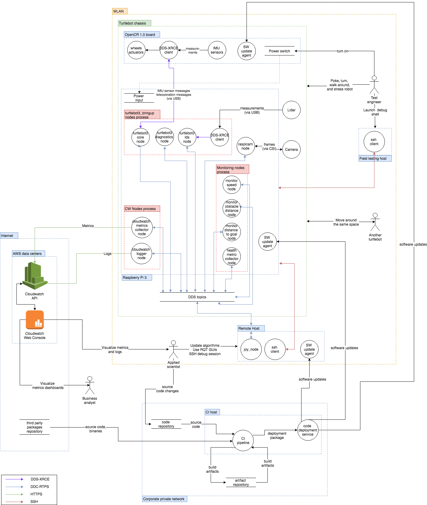
### 资产

#### 硬件

TurtleBot 3 Burger 是一个小型的、支持 ROS 的教育用机器人。

#### 计算资源

- **Raspberry PI 3 主机**：操作系统为 Raspbian Stretch，原生运行 ROS 2 Crystal（不使用 Docker），以 root 用户身份运行。
    
- **OpenCR 板**：使用 TurtleBot3 ROS 2 设置说明中描述的 ROS 2 固件。
    
- **硬件组件** 包括：
    
    - 激光雷达通过 USB 连接到 Raspberry PI。
    - Raspberry PI 相机模块通过其相机串行接口（CSI）连接到 Raspberry PI 3。
- **现场测试主机**：常规笔记本电脑，运行操作系统 Ubuntu 18.04，未安装 ROS。以 sudoer 用户身份运行。
    
- **远程主机**：任何运行操作系统 Ubuntu 18.04 的常规服务器，安装有 ROS 2 Crystal。
    
- **CI 主机**：任何运行操作系统 Ubuntu 18.04 的常规服务器。
    
- **无线局域网**：一个未启用安全设置的 Wi-Fi 局域网，对任何人开放连接。
    
- **公司私有网络**：一个安全的公司广域网，覆盖多个城市。只有经过身份验证并拥有适当凭证的用户才能连接到网络，并且实施了良好的安全实践，如密码轮换。
    

#### 进程

- **TurtleBot3 Raspberry Pi 上的进程**：
    - `turtlebot3_node`
    - 假设的 `CloudWatch` 节点（尚未移植到 ROS 2）
        - `cloudwatch_metrics_collector`：订阅 `/metrics` 主题，其他节点在此主题上发布指定 CloudWatch 指标数据的 `MetricList` 消息，并使用 PutMetricsData API 将相应的指标数据发送到 CloudWatch 指标。
        - `cloudwatch_logger`：订阅配置好的一系列主题，并将该主题中找到的所有消息发布到配置好的日志组和日志流，使用 CloudWatch 日志 API。
- **监控节点**：
    - `monitor_speed`：订阅 `/odom` 主题，对于每个接收到的里程计消息，提取线性和角速度，构建包含这些值的 `MetricList` 消息，并将其发布到 `/metrics` 主题。
    - `health_metric_collector`：收集系统指标（空闲 RAM、总 RAM、总 CPU 使用率、每个核心的 CPU 使用率、正常运行时间、进程数量）并以 `MetricList` 消息的形式发布到 `/metrics` 主题。
    - `raspicam2_node`：一个节点，将 Raspberry Pi 相机模块数据发布到 ROS 2。
- **XRCE 代理** 在 Raspberry 上运行，并被 OpenCR 1.0 板上运行的 DDS-XRCE 客户端使用，该客户端将 IMU 传感器数据发布到 ROS 主题，并根据作为 ROS 主题发布的远程操作消息控制 TurtleBot 的轮子。此通道使用串行通信。
- **激光雷达驱动程序进程** 在 Raspberry 上运行，与激光雷达接口，并使用 DDS-XRCE 客户端通过 UDP 将数据发布到也在 Raspberry Pi 上运行的 XRCE 代理。代理将传感器数据发送到多个 ROS 主题。
- **SSH 客户端进程** 在现场测试主机上运行，连接到 Raspberry PI 进行诊断和调试。
- **软件更新代理进程** 在 Raspberry PI、OpenCR 板和导航主机上运行。代理轮询 CI 主机上运行的代码部署服务进程，该进程响应包含包和版本的列表，以及在需要更新时每个包的新版本。
- **CI 主机上的 CI 管道进程** 是一个 Jenkins 实例，它轮询代码仓库以获取多个 ROS 包的新修订版。每次检测到新修订版时，它都会重建所有受影响的包，将二进制工件打包到几个部署包中，并在轮询时将包更新发送给更新代理。

#### 软件依赖

- **操作系统 / 内核**：Ubuntu 18.04
- **软件**：
    - ROS 2 核心库
    - ROS 2 节点：joy_node、turtlebot3_node、rospicam2_node、teleop_twist_joy
    - 由 rosdep 定义的 ROS 2 系统依赖
    - RMW 实现：假设 RMW 实现是 rmw_fastrtps。

#### 外部参与者

- 测试工程师正在测试机器人。
- 用户使用操纵杆操作机器人。
- 商业分析师定期检查 AWS Cloudwatch Web 控制台中的性能信息仪表板。

#### 机器人数据资产

- **主题消息**：私有数据
    - 相机图像消息
    - 日志消息（可能描述相机数据）
    - CloudWatch 指标和日志消息（可能包含知识产权，例如特定节点实现的算法）。
- **受限数据**：
    - 机器人速度和方向。从这些消息中可以重建对当前机器人任务的一些理解。
    - AWS CloudWatch 数据
        - 指标、日志和聚合仪表板都是私有数据，因为它们是相应主题的不同序列化。

#### 机器人计算资产

- AWS CloudWatch API 和所有其他可从所有主机上的 AWS 凭证访问的 AWS 资源。

#### 机器人主题

- `/cmd_vel` 可能被滥用来损坏机器人或伤害用户。

#### 入口点

- **通信通道**：
    - DDS / ROS 主题
        - 主题可以被任何参与者监听或写入：
            - 连接到 DDS 数据包被路由的网络，
            - 如果启用了 SROS，则具有必要的权限（读/写）。
        - 当启用 SROS 时，攻击者可能会尝试破坏 CA 权限或私钥，以生成或拦截私钥以及发出恶意证书，允许欺骗。
    - USB 连接用于 Raspberry Pi 和 OpenCR 板以及激光雷达传感器之间的通信。
    - SSH
        - SSH 访问对于同一局域网或广域网（如果启用了端口转发）上的任何人都是可能的。许多镜像都设置了默认用户名和密码，具有管理能力（例如 sudoer）。
        - SSH 访问可能通过修改机器人被破坏。

#### 部署软件

- ROS 节点可以由第三方（OSRF 构建场）或应用程序开发人员编译。可以直接在机器人上编译，也可以使用 scp 或 rsync 从开发人员工作站复制。

#### 数据存储（本地文件系统）

- **机器人数据**：
    - 系统和 ROS 日志存储在 Raspberry Pi 文件系统上。
    - 机器人系统容易受到物理攻击（物理移除机器人上的磁盘以读取其数据）。
- **远程主机数据**：
    - 运行额外 ROS 节点的机器也将包含日志文件。
    - 远程主机容易受到物理攻击。此外，此主机可能没有机器人主机那么安全。
- **云数据**：
    - AWS CloudWatch 数据可通过公共 AWS API 端点访问，如果凭证可用于相应的 AWS 账户。
    - AWS CloudWatch 凭证可以允许攻击者访问其他云资源，具体取决于账户的配置方式。

#### 秘密管理

- **DDS / ROS 主题**：
    - 如果启用了 SROS，则私钥存储在本地文件系统上。
- **SSH**：
    - SSH 凭证存储在机器人文件系统上。
    - 私有 SSH 密钥存储在任何允许登录到机器人的计算机上，这些计算机依赖于公钥/私钥进行身份验证。
- **AWS 凭证**：
    - AWS 凭证存储在机器人文件系统上。

#### 使用案例场景

- **开发、测试和验证**：
    - 工程师在机器人上开发代码或运行测试。他们可能会：
        - 重启机器人
        - 重启 ROS 图
        - 与机器人物理交互
        - 使用 SSH 登录机器人
        - 在 AWS 控制台中检查指标和日志
- **最终用户**：
    - 用户远程操作机器人。他们可能会：
        - 启动机器人。
        - 控制操纵杆。
    - 商业分析师可能会访问 AWS CloudWatch 控制台中的数据，以评估机器人性能。
## 威胁模型
前一节中描述的每种通用威胁都可以在 TurtleBot 3 上具体化。

下表指出了每种威胁影响的 TurtleBot 特定资产和入口点。勾选符号（✓）表示受影响，而叉号符号（✘）表示未受影响。“SROS 启用？”列明确指出使用 SROS 是否会减轻威胁。勾选符号（✓）表示即使在启用 SROS 的情况下也可能被利用，而叉号符号（✘）表示该威胁需要 SROS 被禁用才适用。

<table class="table">
  <tr>
    <th rowspan="2" style="width: 20em">Threat</th>
    <th colspan="2" style="width: 6em">MARA Assets</th>
    <th colspan="6" style="width: 15em">Entry Points</th>
    <th rowspan="2" style="width: 3.25em; transform: rotate(-90deg) translateX(-2.5em) translateY(5.5em)">SROS Enabled?</th>
    <th rowspan="2" style="width: 30em">Attack</th>
    <th rowspan="2" style="width: 30em">Mitigation</th>
    <th rowspan="2" style="width: 30em">Mitigation Result (redesign / transfer / avoid / accept)</th>
    <th rowspan="2" style="width: 30em">Additional Notes / Open Questions</th>
  </tr>

  <tr style="height: 10em; white-space: nowrap;">
    <th style="transform: rotate(-90deg) translateX(-3.5em)
translateY(3em)">Human Assets</th>
    <th style="transform: rotate(-90deg) translateX(-3.5em)
translateY(3em)">Robot App.</th>
    <th style="transform: rotate(-90deg) translateX(-4em) translateY(4em)">ROS 2 API (DDS)</th>
    <th style="transform: rotate(-90deg) translateX(-4em) translateY(4em)">Manufacturer CI/CD</th>
    <th style="transform: rotate(-90deg) translateX(-4em) translateY(4em)">End-user CI/CD</th>
    <th style="transform: rotate(-90deg) translateX(-4em)translateY(4em)">H-ROS API</th>
    <th style="transform: rotate(-90deg) translateX(-4em)translateY(4em)">OTA</th>
    <th style="transform: rotate(-90deg) translateX(-4em)translateY(4em)">Physical</th>
  </tr>

  <tr><th colspan="13">Embedded / Software / Communication / Inter-Component
  Communication</th></tr>

  <tr>
    <td rowspan="3">An attacker spoofs a software component identity.</td>
    <td class="danger">✓</td>
    <td class="danger">✓</td>
    <td class="danger">✓</td>
    <td class="success">✘</td>
    <td class="success">✘</td>
    <td class="success">✘</td>
    <td class="success">✘</td>
    <td class="success">✘</td>
    <td class="success">✘</td>
    <td>Without SROS any node may have any name so spoofing is trivial.</td>
    <td class="success">
      <ul>
        <li>Enable SROS / DDS Security Extension to authenticate and encrypt DDS communications.</li>
      </ul>
    </td>
    <td>Mitigating risk requires implementation of SROS on MARA.</td>
    <td>No verification of components.
        An attacker could connect a fake joint directly.
        Direct access to the system is granted (No NAC).</td>
  </tr>

  <tr>
    <td class="danger">✓</td>
    <td class="danger">✓</td>
    <td class="danger">✓</td>
    <td class="success">✘</td>
    <td class="success">✘</td>
    <td class="success">✘</td>
    <td class="danger">✓</td>
    <td class="success">✘</td>
    <td class="warning">✘/✓</td>
    <td>An attacker deploys a malicious node which is not enabling DDS Security Extension and spoofs the `joy_node` forcing the robot to stop.</td>
    <td>
      <ul>
        <li>DDS Security Governance document must set `allow_unauthenticated_participants` to
            False to avoid non-authenticated participants to be allowed to communicate with
            authenticated nodes.</li>
        <li>DDS Security Governance document must set `enable_join_access_control` to True to
            explicitly whitelist node-to-node-communication.
            permissions.xml should be as restricted as possible.</li>
      </ul>
    </td>
    <td class="success">Risk is mitigated</td>
    <td></td>
  </tr>

  <tr>
    <td class="danger">✓</td>
    <td class="danger">✓</td>
    <td class="danger">✓</td>
    <td class="success">✘</td>
    <td class="success">✘</td>
    <td class="success">✘</td>
    <td class="danger">✓</td>
    <td class="success">✘</td>
    <td class="danger">✓</td>
    <td>An attacker steals node credentials and spoofs the joint node forcing the robot to stop.
    </td>
    <td>
      <ul>
        <li>Store node credentials in a secure location (secure enclave, RoT) to reduce the
            probability of having a private key leaked.</li>
        <li>Run nodes in isolated sandboxes to ensure one node cannot access another node
            data (including credentials)</li>
        <li>Permissions CA should digitally sign nodes binaries to prevent running tampered
            binaries.</li>
        <li>Permissions CA should be able to revoke certificates in case credentials get
            stolen.</li>
      </ul>
    </td>
    <td class="danger">Mitigation risk requires additional work.</td>
    <td>
      <ul>
        <li>AWS Robotics and Automation is currently evaluating the feasibility of storing
            DDS-Security credentials in a TPM.</li>
        <li>Complete mitigation would require isolation using e.g. Snap or Docker.</li>
        <li>Deploying an application with proper isolation would require us to
            revive discussions around [ROS 2 launch system][ros2_launch_design_pr]</li>
        <li>Yocto / OpenEmbedded / Snap support should be considered</li>
      </ul>
    </td>
  </tr>

  <tr>
    <td>An attacker intercepts and alters a message.</td>
    <td class="danger">✓</td>
    <td class="danger">✓</td>
    <td class="danger">✓</td>
    <td class="success">✘</td>
    <td class="success">✘</td>
    <td class="success">✘</td>
    <td class="success">✘</td>
    <td class="success">✘</td>
    <td class="success">✘</td>
    <td>Without SROS an attacker can modify `/goal_axis` or `trajectory_axis` messages sent
        through a network connection to e.g. stop the robot.
</td>
    <td>
    <ul>
        <li>Enable SROS / DDS Security Extension to authenticate and encrypt DDS communications.
            Message tampering is mitigated by DDS security as message authenticity is verified by
            default (with preshared HMACs / digital signatures)</li>
      </ul>
    </td>
    <td class="success">Risk is reduced if SROS is used.</td>
    <td></td>
  </tr>

  <tr>
    <td>An attacker writes to a communication channel without authorization.</td>
    <td class="danger">✓</td>
    <td class="danger">✓</td>
    <td class="danger">✓</td>
    <td class="success">✘</td>
    <td class="success">✘</td>
    <td class="success">✘</td>
    <td class="success">✘</td>
    <td class="success">✘</td>
    <td class="success">✘</td>
    <td>Without SROS, any node can publish to any topic.</td>
    <td>
      <ul>
        <li>Enable SROS / DDS Security Extension to authenticate and encrypt DDS communications.
        </li>
      </ul>
    </td>
    <td class="success"></td>
    <td> </td>
  </tr>

  <tr>
    <td rowspan="2">An attacker listens to a communication channel without authorization.</td>
    <td class="danger">✓</td>
    <td class="danger">✓</td>
    <td class="danger">✓</td>
    <td class="success">✘</td>
    <td class="success">✘</td>
    <td class="success">✘</td>
    <td class="success">✘</td>
    <td class="success">✘</td>
    <td class="success">✘</td>
    <td>Without SROS: any node can listen to any topic.</td>
    <td>
    <ul>
        <li>Enable SROS / DDS Security Extension to authenticate and encrypt DDS communications.
        </li>
      </ul>
    </td>
    <td class="success">Risk is reduced if SROS is used.</td>
    <td></td>
  </tr>

<tr>
    <td class="danger">✓</td>
    <td class="danger">✓</td>
    <td class="danger">✓</td>
    <td class="success">✘</td>
    <td class="success">✘</td>
    <td class="success">✘</td>
    <td class="success">✘</td>
    <td class="success">✘</td>
    <td class="warning">✘/✓</td>
    <td>DDS participants are enumerated and [fingerprinted][aztarna] to look
        for potential vulnerabilities.</td>
    <td>
      <ul>
        <li>DDS Security Governance document must set `metadata_protection_kind` to ENCRYPT to
            prevent malicious actors from observing communications.</li>
        <li>DDS Security Governance document must set `enable_discovery_protection` to True to
            prevent malicious actors from enumerating and fingerprinting DDS participants.</li>
        <li>DDS Security Governance document must set `enable_liveliness_protection` to True</li>
      </ul>
    </td>
    <td class="danger">Risk is mitigated if DDS-Security is configured appropriately.</td>
    <td>
    </td>
  </tr>

  <tr>
    <td rowspan="2">An attacker prevents a communication channel from being usable.</td>
    <td class="danger">✓</td>
    <td class="danger">✓</td>
    <td class="danger">✓</td>
    <td class="success">✘</td>
    <td class="success">✘</td>
    <td class="success">✘</td>
    <td class="success">✘</td>
    <td class="success">✘</td>
    <td class="success">✘</td>
    <td>Without SROS: any node can ""spam"" any other component.</td>
    <td>
      <ul>
        <li>Enable SROS to use the DDS Security Extension.
            This does not prevent nodes from being flooded but it ensures that only communication
            from allowed participants are processed.</li>
      </ul>
    </td>
    <td class="warning">Risk may be reduced when using SROS.</td>
    <td> </td>
  </tr>

  <tr>
    <td class="danger">✓</td>
    <td class="danger">✓</td>
    <td class="danger">✓</td>
    <td class="success">✘</td>
    <td class="success">✘</td>
    <td class="success">✘</td>
    <td class="success">✘</td>
    <td class="success">✘</td>
    <td class="success">✘</td>
    <td>A node can ""spam"" another node it is allowed to communicate with.</td>
    <td>
      <ul>
        <li>Implement rate limitation on topics</li>
        <li>Define a method for topics to declare their required bandwidth / rate.</li>
      </ul>
    </td>
    <td class="danger">Mitigating risk requires additional work.</td>
    <td>How to enforce when nodes are malicious? Observe and kill?</td>
  </tr>
  <tr><th colspan="13">Embedded / Software / Communication / Remote Application Interface</th></tr>
    <tr>
    <td>An attacker gains unauthenticated access to the remote application interface.</td>
    <td class="danger">✓</td>
    <td class="danger">✓</td>
    <td class="success">✘</td>
    <td class="success">✘</td>
    <td class="success">✘</td>
    <td class="danger">✓</td>
    <td class="success">✘</td>
    <td class="success">✘</td>
    <td class="warning">✘/✓</td>
    <td>An attacker connects to the H-ROS API in an unauthenticated way.
        Reads robot configuration and alters configuration values.</td>
    <td>
      <ul>
        <li>Add authentication mechanisms to the H-ROS API.</li>
        <li>Enable RBAC to limit user interaction with the API.</li>
      </ul>
    </td>
    <td class="success">Risk is mitigated.</td>
    <td></td>
  </tr>
  <tr>
    <td>An attacker could eavesdrop communications to the Robot’s remote application interface.</td>
    <td class="danger">✓</td>
    <td class="danger">✓</td>
    <td class="success">✘</td>
    <td class="success">✘</td>
    <td class="success">✘</td>
    <td class="danger">✓</td>
    <td class="success">✘</td>
    <td class="success">✘</td>
    <td class="warning">✘/✓</td>
    <td>An attacker executes a MitM attack, eavesdropping all unencrypted communications and commands sent to the API.</td>
    <td>
        Encrypt the communications through the usage of HTTPS.
    </td>
    <td class="success">Risk is mitigated.</td>
    <td></td>
  </tr>
  <tr>
    <td>An attacker could alter data sent to the Robot’s remote application interface.</td>
    <td class="danger">✓</td>
    <td class="danger">✓</td>
    <td class="success">✘</td>
    <td class="success">✘</td>
    <td class="success">✘</td>
    <td class="danger">✓</td>
    <td class="success">✘</td>
    <td class="success">✘</td>
    <td class="warning">✘/✓</td>
    <td>An attacker could execute a MitM attack and alter commands being sent to the API.</td>
    <td>
      Encrypt the communications through the usage of HTTPS.
    </td>
    <td class="success">Risk is mitigated.</td>
    <td></td>
  </tr>
  <tr><th colspan="13">Embedded / Software / OS & Kernel</th></tr>

  <tr>
    <td>An attacker compromises the real-time clock to disrupt the kernel RT scheduling guarantees.</td>
    <td class="danger">✓</td>
    <td class="danger">✓</td>
    <td class="success">✘</td>
    <td class="danger">✓</td>
    <td class="success">✘</td>
    <td class="success">✘</td>
    <td class="danger">✓</td>
    <td class="danger">✓</td>
    <td class="warning">✘/✓</td>
    <td>A malicious actor attempts to write a compromised kernel to /boot</td>
    <td>
      <ul>
        <li>Enable verified boot on Uboot to prevent booting altered kernels.</li>
        <li>Use built in TPM to store firmware public keys and define an RoT.</li>
      </ul>
    </td>
    <td class="success">Risk is mitigated.</td>
    <td></td>
  </tr>

  <tr>
    <td>An attacker compromises the OS or kernel to alter robot data.</td>
    <td class="danger">✓</td>
    <td class="danger">✓</td>
    <td class="success">✘</td>
    <td class="danger">✓</td>
    <td class="success">✘</td>
    <td class="success">✘</td>
    <td class="danger">✓</td>
    <td class="danger">✓</td>
    <td class="warning">✘/✓</td>
    <td>A malicious actor attempts to write a compromised kernel to /boot</td>
    <td>
      <ul>
        <li>Enable verified boot on Uboot to prevent booting altered kernels.</li>
        <li>Use built in TPM to store firmware public keys and define an RoT.</li>
      </ul>
    </td>
    <td class="success">Risk is mitigated.</td>
    <td></td>
  </tr>

  <tr>
    <td>An attacker compromises the OS or kernel to eavesdrop on robot
data.</td>
    <td class="danger">✓</td>
    <td class="danger">✓</td>
    <td class="success">✘</td>
    <td class="danger">✓</td>
    <td class="success">✘</td>
    <td class="success">✘</td>
    <td class="danger">✓</td>
    <td class="danger">✓</td>
    <td class="warning">✘/✓</td>
    <td>A malicious actor attempts to write a compromised kernel to /boot</td>
    <td>
      <ul>
        <li>Enable verified boot on Uboot to prevent booting altered kernels.</li>
        <li>Use built in TPM to store firmware public keys and define an RoT.</li>
      </ul>
    </td>
    <td class="success">Risk is mitigated.</td>
    <td></td>
  </tr>
<tr><th colspan="13">Embedded / Software / Component-Oriented
Architecture</th></tr>

  <tr>
    <td rowspan="2">A node accidentally writes incorrect data to a communication
channel.</td>
    <td class="danger">✓</td>
    <td class="danger">✓</td>
    <td class="danger">✓</td>
    <td class="success">✘</td>
    <td class="success">✘</td>
    <td class="success">✘</td>
    <td class="success">✘</td>
    <td class="success">✘</td>
    <td class="warning">✘/✓</td>
    <td>A node writes random or invalid values to the /goal_axis topics.</td>
    <td>
      <ul>
        <li>Expand DDS IDL to allow users to embed validity criteria to automate input
            sanitization (i.e. validate ranges, etc.)</li>
        <li>Expand RMW to define per-topic strategies for invalid messages (drop, throw, abort,
            etc.).</li>
      </ul>
    </td>
    <td class="danger">Need to expand DDS IDL or RMW for mitigating the risk.</td>
    <td></td>
  </tr>
  <tr>
    <td class="danger">✓</td>
    <td class="danger">✓</td>
    <td class="danger">✓</td>
    <td class="success">✘</td>
    <td class="success">✘</td>
    <td class="success">✘</td>
    <td class="success">✘</td>
    <td class="success">✘</td>
    <td class="warning">✘/✓</td>
    <td>A node could to write out of physical bounds values to the `/goal_axis` or
        `/trajectory_axis` topics, causing damage to the robot.</td>
    <td><ul>
        <li>Define physical limitations of the different joints on the motor driver, limiting the
            possible movement to a safe range.</li><li>Enable signature verification of
            executables to reduce the risks of inserting a malicious node.</li>
        <li>Limit control of actuators to only the required nodes.
            Enable AppArmor policies to isolate nodes.</li>
      </ul>
    </td>
    <td class="success">Risk is mitigated when applying limits on actuator drivers.</td>
    <td></td>
  </tr>

  <tr>
    <td>An attacker deploys a malicious node on the robot.</td>
    <td class="danger">✓</td>
    <td class="danger">✓</td>
    <td class="danger">✓</td>
    <td class="danger">✓</td>
    <td class="danger">✓</td>
    <td class="success">✘</td>
    <td class="danger">✓</td>
    <td class="danger">✓</td>
    <td class="warning">✘/✓</td>
    <td>An attacker deploys a malicious node to the robot.
        This node performs dangerous movements that compromise safety.
        The node attempts to perform physical or logical damage to the modules.</td>
    <td>
      <ul>
        <li>Run each node in an isolated environment with limited privileges(sandboxing).</li>
        <li>Enable signing and verification of executables.</li>
      </ul>
    </td>
    <td class="warning"><ul>
        <li>Running the component in a Ubuntu Core sandbox environment could limit the
            consequences of the attack.</li>
        <li>Enabling signature verification of executables would reduce the risks of inserting
            a malicious node.</li>
        <li>Limiting control of actuators to only the required nodes would reduce risk in case
            of a node compromise.
            Enable AppArmor policies to isolate nodes.</li>
      </ul></td>
    <td></td>
  </tr>

  <tr>
    <td>An attacker can prevent a component running on the robot from executing
normally.</td>
    <td class="danger">✓</td>
    <td class="danger">✓</td>
    <td class="danger">✓</td>
    <td class="success">✘</td>
    <td class="success">✘</td>
    <td class="success">✘</td>
    <td class="success">✘</td>
    <td class="danger">✓</td>
    <td class="warning">✘/✓</td>
    <td>A malicious node running on the robot starts sending kill requests to other nodes in the
        system, disrupting the normal behaviour of the robot.
</td>
    <td>Having the abiliy to shutdown/kill nodes through API request supposes a problem on the
        ROS implementation.
        Deprecation of the function should be considered.
        Node restarting policie should be applied.
    </td>
    <td class="danger">Deprecation of the shutdown API call needs to be considered.</td>

  </tr>
  <tr><th colspan="13">Embedded / Software / Configuration Management</th></tr>

  <tr>
    <td>An attacker modifies configuration values without authorization.</td>
    <td class="danger">✓</td>
    <td class="danger">✓</td>
    <td class="danger">✓</td>
    <td class="success">✘</td>
    <td class="success">✘</td>
    <td class="success">✘</td>
    <td class="success">✘</td>
    <td class="success">✘</td>
    <td class="success">✘</td>
    <td>Node parameters are freely modifiable by any DDS domain participant.</td>
    <td></td>
    <td></td>
    <td></td>
    <td></td>
  </tr>

  <tr>
    <td>An attacker accesses configuration values without authorization.</td>
    <td class="danger">✓</td>
    <td class="danger">✓</td>
    <td class="danger">✓</td>
    <td class="success">✘</td>
    <td class="success">✘</td>
    <td class="success">✘</td>
    <td class="success">✘</td>
    <td class="success">✘</td>
    <td class="success">✘</td>
    <td>Node parameters values can be read by any DDS domain participant.</td>
    <td></td>
    <td></td>
    <td></td>
    <td> </td>
  </tr>

  <tr>
    <td>A user accidentally misconfigures the robot.</td>
    <td class="danger">✓</td>
    <td class="danger">✓</td>
    <td class="danger">✓</td>
    <td class="success">✘</td>
    <td class="success">✘</td>
    <td class="success">✘</td>
    <td class="success">✘</td>
    <td class="success">✘</td>
    <td class="warning">✘/✓</td>
    <td>Node parameters values can be modified by anyone to any value.</td>
    <td></td>
    <td></td>
    <td></td>
    <td> </td>
  </tr>

  <tr><th colspan="13">Embedded / Software / Data Storage (File System)</th></tr>

  <tr>
    <td>An attacker modifies the robot file system by physically accessing it.</td>
    <td class="danger">✓</td>
    <td class="danger">✓</td>
    <td class="success">✘</td>
    <td class="success">✘</td>
    <td class="success">✘</td>
    <td class="success">✘</td>
    <td class="success">✘</td>
    <td class="danger">✓</td>
    <td class="warning">✘/✓</td>
    <td>An attacker modifies the filesystem data within the robot</td>
    <td>Enable filesystem encryption with LUKS or dm-crypt, storing keys on TPM device.</td>
    <td class="success">Risk is mitigated.</td>
    <td> </td>
  </tr>

  <tr>
    <td>An attacker eavesdrops on the robot file system by physically accessing it.</td>
    <td class="danger">✓</td>
    <td class="danger">✓</td>
    <td class="success">✘</td>
    <td class="success">✘</td>
    <td class="success">✘</td>
    <td class="success">✘</td>
    <td class="success">✘</td>
    <td class="danger">✓</td>
    <td class="warning">✘/✓</td>
    <td>An attacker physically accesses the memory chip to eavesdrop credentials, logs or
        sensitive data.</td>
    <td>Enable filesystem encryption with LUKS or dm-crypt, storing keys on TPM device.</td>
    <td class="success">Risk is mitigated.</td>
    <td> </td>
  </tr>

  <tr>
    <td>An attacker saturates the robot disk with data.</td>
    <td class="danger">✓</td>
    <td class="danger">✓</td>
    <td class="danger">✓</td>
    <td class="danger">✓</td>
    <td class="danger">✓</td>
    <td class="success">✘</td>
    <td class="danger">✓</td>
    <td class="danger">✓</td>
    <td class="danger">✓</td>
    <td>A malicious node writes random data that fills the robot disk.
</td>
    <td>Enable disk quotas on the system.
        Enable sandboxing of the processes.
        Separate disk into multiple partitions, sending non trivial data to temporary directories.
    </td>
    <td class="warning">Risk is partially mitigated.
                        Disk cleanup routines and log rotation should also be implemented.</td>
    <td></td>
  </tr>

  <tr><th colspan="13">Embedded / Software / Logs</th></tr>

  <tr>
    <td>An attacker exfiltrates log data to a remote server.</td>
    <td class="success">✘</td>
    <td class="success">✘</td>
    <td class="success">✘</td>
    <td class="success">✘</td>
    <td class="success">✘</td>
    <td class="success">✘</td>
    <td class="danger">✓</td>
    <td class="success">✘</td>
    <td class="warning">✘/✓</td>
    <td>An attacker compromising the OTA server could request device log data and eavesdrop
        sensitive information.</td>
    <td>Enable RBAC on the OTA server, limit access to sensitive functions.
    </td>
    <td class="success">Risk is mitigated.</td>
    <td></td>
  </tr>

  <tr><th colspan="13">Embedded / Hardware / Sensors</th></tr>

  <tr>
    <td>An attacker spoofs a robot sensor (by e.g. replacing the sensor itself or manipulating
        the bus).</td>
    <td class="danger">✓</td>
    <td class="danger">✓</td>
    <td class="success">✘</td>
    <td class="success">✘</td>
    <td class="success">✘</td>
    <td class="success">✘</td>
    <td class="success">✘</td>
    <td class="danger">✓</td>
    <td class="warning">✘/✓</td>
    <td>An attacker could physically tamper the readings from the sensors.</td>
    <td>Add noise or out-of-bounds reading detection mechanism on the robot, causing to discard
        the readings or raise an alert to the user.
        Add detection of sensor disconnections.</td>
    <td class="success">Risk is mitigated.</td>
    <td></td>
  </tr>

  <tr><th colspan="13">Embedded / Hardware / Actuators</th></tr>

  <tr>
    <td>An attacker spoofs a robot actuator.</td>
    <td class="danger">✓</td>
    <td class="danger">✓</td>
    <td class="success">✘</td>
    <td class="success">✘</td>
    <td class="success">✘</td>
    <td class="success">✘</td>
    <td class="success">✘</td>
    <td class="success">✘</td>
    <td class="warning">✘/✓</td>
    <td>An attacker could insert a counterfeit modular joint in the robot, compromising the
        whole system (e.g. a modified gripper).</td>
    <td><ul>
        <li>Implement network access control systems, performing a verification of the part
            before granting access to the system.</li>
        <li>Implement certificate based, 802.1x authentication for the communication with the
            nodes, discarding any new modules that do not authenticate on the system.</li></ul>
  </td>
    <td class="success">Risk is mitigated.</td>
    <td>Additional evaluation should be performed.
        Authenticating nodes via certificates would require shipping the nodes with client
        certificates, and the validated manufacturers would require a subordinate CA to sign
        their modules (Kinda DRM-ish).</td>
  </tr>

  <tr>
    <td>An attacker modifies the command sent to the robot actuators (intercept & retransmit).</td>
    <td class="danger">✓</td>
    <td class="danger">✓</td>
    <td class="success">✘</td>
    <td class="success">✘</td>
    <td class="success">✘</td>
    <td class="success">✘</td>
    <td class="success">✘</td>
    <td class="success">✘</td>
    <td class="warning">✘/✓</td>
    <td>An attacker intercepts the communication channel traffic.
        The command is altered an retransmitted to the target joint.</td>
    <td><ul>
        <li>Implement network access control systems, performing a verification of the part
            before granting access to the system.</li>
        <li>Implement certificate based, 802.1x authentication for the communication with the
            nodes, discarding any new modules that do not authenticate on the system.</li></ul>
    </td>
    <td class="success">Risk is mitigated.</td>
    <td> </td>
  </tr>
<tr><th colspan="13">Embedded / Hardware / Communications</th></tr>

  <tr>
    <td>An attacker connects to an exposed debug port.</td>
    <td class="danger">✓</td>
    <td class="danger">✓</td>
    <td class="success">✘</td>
    <td class="success">✘</td>
    <td class="success">✘</td>
    <td class="success">✘</td>
    <td class="success">✘</td>
    <td class="success">✘</td>
    <td class="warning">✘/✓</td>
    <td>An attacker could connect to an exposed debug port and gain control over the robot through the execution of arbitrary commands.</td>
    <td>
      <ul>
      <li>Limit access or remove exposed debug ports.</li>
      <li>Disable local debug terminals and functionality from the ports.</li>
      <li>Add authentication mechanisms to limit access to the ports only to authenticated devices and users.</li>
    </ul>
  </td>
    <td class="success">Risk is mitigated.</td>
    <td></td>
  </tr>

  <tr>
    <td>An attacker connects to an internal communication bus.</td>
    <td class="danger">✓</td>
    <td class="danger">✓</td>
    <td class="success">✘</td>
    <td class="success">✘</td>
    <td class="success">✘</td>
    <td class="success">✘</td>
    <td class="success">✘</td>
    <td class="success">✘</td>
    <td class="warning">✘/✓</td>
    <td>An attacker could connect to an internal communication bus to send arbitrary data or eavesdrop communication between different components of the robot.</td>
    <td>
      <ul>
      <li>Limit access or remove unused communication ports.</li>
      <li>Physically limit access to the internal robot components and communication buses.</li>
      <li>Add physical tamper detection sensors to detect physical intrussions to the robot.</li>
    </ul>
  </td>
    <td class="success">Risk is mitigated.</td>
    <td></td>
  </tr>

  <tr><th colspan="13">Remote / Software Deployment</th></tr>

  <tr>
    <td>An attacker spoofs the deployment service.</td>
    <td class="danger">✓</td>
    <td class="danger">✓</td>
    <td class="success">✘</td>
    <td class="danger">✓</td>
    <td class="danger">✓</td>
    <td class="success">✘</td>
    <td class="danger">✓</td>
    <td class="success">✘</td>
    <td class="warning">✘/✓</td>
    <td>An attacker spoofs the update deployment server and serves malicious content to the devices.</td>
    <td><ul><li>Validate the deployment server through Public Key Infrastructure.</li> <li>Prevent insecure connections to the server from the devices through HTTPS and HSTS policies.</li><li>Certificate pinning on devices.</li></ul>
</td>
    <td class="success">Risk is mitigated.</td>
    <td></td>
  </tr>

  <tr>
    <td>An attacker modifies the binaries sent by the deployment service.</td>
    <td class="danger">✓</td>
    <td class="danger">✓</td>
    <td class="success">✘</td>
    <td class="success">✘</td>
    <td class="success">✘</td>
    <td class="success">✘</td>
    <td class="danger">✓</td>
    <td class="success">✘</td>
    <td class="warning">✘/✓</td>
    <td>An attacker intercepts the communication to the deployment server and serves malicious content to the devices.
</td>
    <td><ul><li>Validate the deployment server through Public Key Infrastructure.</li> <li>Prevent insecure connections to the server from the devices through HTTPS and HSTS policies.</li>
<li>Digitally sign the binaries sent to the devices.</li></ul>
</td>
    <td class="success">Risk is mitigated.</td>
    <td></td>
  </tr>

  <tr>
    <td>An attacker intercepts the binaries sent by the depoyment service.</td>
    <td class="danger">✓</td>
    <td class="danger">✓</td>
    <td class="success">✘</td>
    <td class="success">✘</td>
    <td class="success">✘</td>
    <td class="success">✘</td>
    <td class="danger">✓</td>
    <td class="success">✘</td>
    <td class="warning">✘/✓</td>
    <td>An attacker intercepts the update communication and stores the binary sent to the devices, gaining access to intellectual property.
</td>
    <td><ul><li>Make use of secure, encrypted communication channels.</li> <li>Verify client devices through client certificates.</li>
<li>Sign and Encrypt update files.</li></ul>
</td>
    <td class="success">Risk is mitigated.</td>
    <td></td>
  </tr>

  <tr>
    <td>An attacker prevents the robot  and the deployment service from communicating.</td>
    <td class="danger">✓</td>
    <td class="danger">✓</td>
    <td class="success">✘</td>
    <td class="success">✘</td>
    <td class="success">✘</td>
    <td class="success">✘</td>
    <td class="danger">✓</td>
    <td class="success">✘</td>
    <td class="warning">✘/✓</td>
    <td>An attacker blocks the robots update process.</td>
    <td>
      <ul>
        <li>Deploy multiple update server endpoints.</li>
        <li>Deploy a distributed update system.</li>
      </ul>
    </td>
    <td class="warning">Risk is partially mitigated.</td>
    <td></td>
  </tr>

</table>

### 威胁图：攻击者在机器人上部署恶意节点

这张图详细说明了针对“攻击者在机器人上部署恶意节点”攻击的代码构建和部署过程。

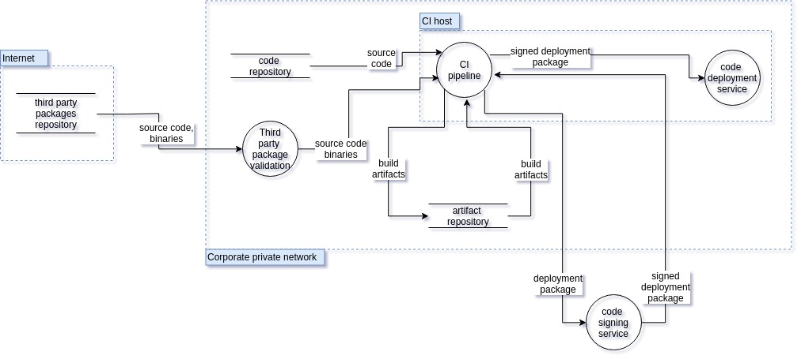

### 攻击树 

威胁可以按照以下攻击树进行组织。

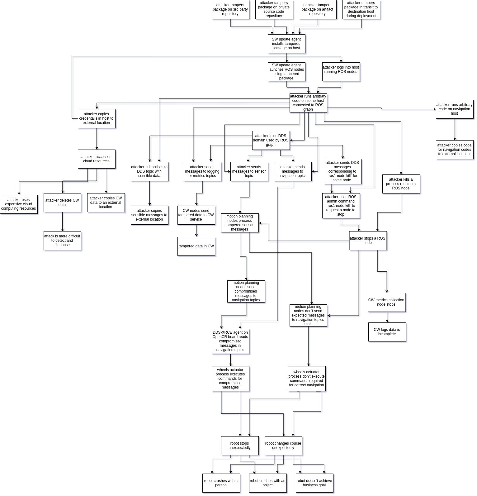

## 威胁模型验证策略

> 验证这个端到端的威胁模型是一个长期的努力，旨在分散在整个 ROS 2 社区中进行。威胁列表旨在随着这份文档的演变而发展，未来可能会引入额外的参考。

1. 设置一个与本文档中 TurtleBot3 部分描述的完全相同的软件的 TurtleBot。

2. 渗透测试应实施电子表格中描述的攻击。例如，可以实施一个恶意的 joy_node 来尝试破坏机器人操作。
   - 旦漏洞被利用，应该将漏洞利用发布到社区，以便可以重现结果。

   - 无论攻击是否成功，都应相应更新本文档。
   - 如果攻击成功，应实施缓解策略。这可以通过改进 ROS 2 核心包来完成，也可以是特定于平台的解决方案。在第二种情况下，缓解措施将作为发布安全机器人应用开发最佳实践的示例。

随着时间的推移，除了 TurtleBot 3 之外，可能会引入新的参考平台，以定义新的攻击并允许评估其他类型的缓解措施。

## 针对 MARA 机器人平台的威胁分析

### 系统描述

本节考虑的应用是在一个工业环境中操作的 MARA 模块化机器人，执行拣选和放置活动。MARA 是第一个原生运行 ROS 2 的机器人。它是一个工业级协作机械臂，每个关节、末端执行器、外部传感器甚至其工业控制器上都运行 ROS 2。通过 H-ROS 通信总线，MARA 在机器人专业领域获得了新的可能性。它为常规有效载荷提供了毫秒级的分布式有界延迟和跨 ROS 2 组件的亚微秒级同步能力。

MARA 由原生运行在 ROS 2 上的独立模块构建而成，可以无缝物理扩展。然而，这也使得机器人和生产环境更加网络化，带来了新的挑战，特别是在安全和安全方面。

考虑的机器人是 MARA，一个具有 6 自由度（6DoF）的模块化和协作机械臂，有效载荷为 3 公斤，重复性低于 0.1 毫米。机器人可以达到每秒 90º 的角速度，并且可以达到 656 毫米的伸展范围。机器人的每个关节都装有各种传感器，并且可以通过任何支持 ROS 2 并使用 HRIM 信息模型的工业控制器进行控制。每个模块都包含 H-ROS 通信总线，由 H-ROS SoM 启用，为模块级别的 ROS 2 提供实时、安全和安全能力。

没有提供关于如何在每个模块上分布 ROS 2 节点的信息。每个关节都提供了以下 ROS 2 API 功能，如他们的文档（MARA 关节）中所述：

#### 主题

- `GoalRotaryServo.msg` 模型允许控制位置、速度和/或努力（从 models/actuator/servo/topics/goal.xml 生成，有关详细信息，请参见 HRIM）。
- `StateRotaryServo.msg` 发布电机的状态。
- `Power.msg` 发布功耗。
- `Status.msg` 通知由 H-ROS SoM 消耗的资源。
- `StateCommunication.msg` 用于通知设备网络的状态。

#### 服务

- `ID.srv` 发布组件的一般身份。
- `Simulation3D.srv` 和 `SimulationURDF.srv` 发送模块组件的 URDF 和 3D 模型。
- `SpecsCommunication.srv` 是一个 HRIM 服务，报告设备网络的规格。
- `SpecsRotaryServo.srv` 是一个 HRIM 消息，报告设备的主要特性。
- `EnableDisable.srv` 禁用或启用伺服电机。
- `ClearFault.srv` 发送请求以清除伺服电机中的任何故障。
- `Stop.srv` 请求停止任何正在进行的运动。
- `OpenCloseBrake.srv` 打开或关闭伺服电机制动器。

#### 动作

- `GoalJointTrajectory` 允许使用轨迹消息移动关节。

这些 API 被翻译成以下
### 主题

|类型|名称|
|---|---|
|goal|/hrim_actuation_servomotor_XXXXXXXXXXXX/goal_axis1|
|goal|/hrim_actuation_servomotor_XXXXXXXXXXXX/goal_axis2|
|state|/hrim_actuation_servomotor_XXXXXXXXXXXX/state_axis1|
|state|/hrim_actuation_servomotor_XXXXXXXXXXXX/state_axis2|

### 服务

|类型|名称|
|---|---|
|specs|/hrim_actuation_servomotor_XXXXXXXXXXXX/specs|
|enable servo|/hrim_actuation_servomotor_XXXXXXXXXXXX/enable|
|disable servo|/hrim_actuation_servomotor_XXXXXXXXXXXX/disable|
|clear fault|/hrim_actuation_servomotor_XXXXXXXXXXXX/clear_fault|
|stop|/hrim_actuation_servomotor_XXXXXXXXXXXX/stop_axis1|
|stop|/hrim_actuation_servomotor_XXXXXXXXXXXX/stop_axis2|
|close brake|/hrim_actuation_servomotor_XXXXXXXXXXXX/close_brake_axis1|
|close brake|/hrim_actuation_servomotor_XXXXXXXXXXXX/close_brake_axis2|
|open brake|/hrim_actuation_servomotor_XXXXXXXXXXXX/open_brake_axis1|
|open brake|/hrim_actuation_servomotor_XXXXXXXXXXXX/open_brake_axis2|

### 动作

|类型|名称|
|---|---|
|goal joint trajectory|/hrim_actuation_servomotor_XXXXXXXXXXXX/trajectory_axis1|
|goal joint trajectory|/hrim_actuation_servomotor_XXXXXXXXXXXX/trajectory_axis2|

### 参数

|名称|描述|
|---|---|
|ecat_interface|Ethercat 接口|
|reduction_ratio|计算电机位置的减速比|
|position_factor|计算电机位置的因子|
|torque_factor|计算电机扭矩的因子|
|count_zeros_axis1|编码器的轴1绝对零位值|
|count_zeros_axis2|编码器的轴2绝对零位值|
|enable_logging|开启/关闭日志记录|
|axis1_min_position|轴1的最小位置（弧度）|
|axis1_max_position|轴1的最大位置（弧度）|
|axis1_max_velocity|轴1的最大速度（弧度/秒）|
|axis1_max_acceleration|轴1的最大加速度（弧度/秒^2）|
|axis2_min_position|轴2的最小位置（弧度）|
|axis2_max_position|轴2的最大位置（弧度）|
|axis2_max_velocity|轴2的最大速度（弧度/秒）|
|axis2_max_acceleration|轴2的最大加速度（弧度/秒^2）|
应用中的控制器是一台支持 ROS 2 的工业 PC，具体为 ORC。这台 PC 还具有用于机器人的 H-ROS 通信总线，以确定性方式指挥 MARA。该控制器直接使用前述的通信抽象（主题、服务和动作）
## 架构数据流图

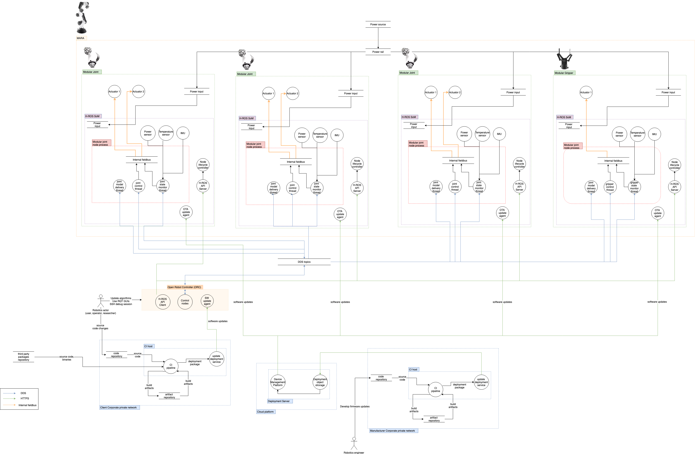

## 资产

本节旨在描述 MARA 机器人环境中的组件和规格。下面列出并详细说明了机器人的不同方面，包括硬件、软件和网络。外部参与者和数据资产分别进行描述。

### 硬件

1x MARA 模块化机器人是用于工业自动化目的的模块化操纵器，支持 ROS 2。

#### 机器人模块

- 3 x Han’s Robot 模块化关节：具有 2 自由度的电动机，包括精确编码器和用于安全目的的电机械制动系统。提供不同扭矩和尺寸组合，重量从 2.8 公斤到 17 公斤，额定扭矩从 9.4 Nm 到 156 Nm 不等。
    
    - 机械连接器：H-ROS 连接器 A
    - 电源输入：48 Vdc
    - 通信：H-ROS 机器人通信总线
    - 链路层：2 x 千兆位（1 Gbps）TSN 以太网网络接口
    - 中间件：数据分发服务（DDS）
    - 板载计算：双核心 ARM® Cortex-A9
    - 操作系统：实时 Linux
    - ROS 2 版本：Crystal Clemmys
    - 信息模型：HRI Coliza
    - 安全性：
        - DDS 加密、认证和访问控制插件
- 1 x Robotiq 模块化夹爪：支持 ROS 2 的工业末端执行器工具。
    
    - 机械连接器：H-ROS 连接器 A
    - 电源输入：48 Vdc
    - 通信：H-ROS 机器人通信总线
    - 链路层：2 x 千兆位（1 Gbps）TSN 以太网网络接口
    - 中间件：数据分发服务（DDS）
    - 板载计算：双核心 ARM® Cortex-A9
    - 操作系统：实时 Linux
    - ROS 2 版本：Crystal Clemmys
    - 信息模型：HRI Coliza
    - 安全性：
        - DDS 加密、认证和访问控制插件
- 1 x 工业 PC：ORC 包括：
    
    - CPU：Intel i7 @ 3.70GHz（6 核心）
    - 内存：物理 16 GB DDR4 2133 MHz
    - 存储：256 GB M.2 SSD 接口 PCIExpress 3.0
    - 通信：H-ROS 机器人通信总线
    - 链路层：2 x 千兆位（1 Gbps）TSN 以太网网络接口
    - 中间件：数据分发服务（DDS）
    - 操作系统：实时 Linux
    - ROS 2 版本：Crystal Clemmys
    - 信息模型：HRI Coliza
    - 安全性：
        - DDS 加密、认证和访问控制插件
- 1 x 更新服务器：OTA
    
    - 在 AWS EC2 上运行的虚拟机
    - 操作系统：Ubuntu 18.04.2 LTS
    - 软件：Mender OTA 服务器

### 网络

- 以太网时间敏感（TSN）内部网络：MARA 机器人的模块化关节通过菊花链以太网 TSN 通道进行互连。每个模块充当交换机，形成机器人的内部网络。
- 制造商（Acutronic Robotics）公司私有网络：一个安全的公司广域网，覆盖多个城市。只有经过身份验证并拥有适当凭证的用户才能连接到网络，并且实施了良好的安全实践，如密码轮换。此网络用于开发和部署机器人系统中的更新。由原始制造商管理。
- 最终用户公司私有网络：一个安全的公司广域网，覆盖多个城市。只有经过身份验证并拥有适当凭证的用户才能连接到网络，并且实施了良好的安全实践，如密码轮换。
- 云网络：位于公共云平台中的 VPC 网络，包含多个服务器。网络遵循良好的安全实践，如实施安全设备、用户密码轮换和多因素认证。只有允许的用户才能访问网络。OTA 服务对互联网开放。云网络的用途：
    - 制造商（Acutronic Robotics）从他们的制造商公司私有网络上传 OTA 工件到云网络。
    - 最终用户公司私有网络上的机器人系统从云网络获取这些工件。
    - 最终用户公司私有网络上的机器人系统向云网络发送预测性维护的遥测数据。

### 软件进程

本节详细说明了在范围内的机器人系统上运行的所有进程。

#### 板载模块化关节

- hros_servomotor_hans_lifecyle_node 这个节点负责控制 H-ROS SoM 内的电机。此节点公开了一些服务、动作和主题，如下所述。此节点发布关节状态、关节速度和关节力。它提供了一个用于伺服模块化关节的主题，以及一个将等待轨迹的动作。
- hros_servomotor_hans_generic_node 一个包含有关模块化关节的多个通用服务和主题的节点，例如功率测量读数：电压和电流，有关 H-ROS SoM 的状态，如 CPU 负载或网络统计信息，有关通信和 CPU 的规格，URDF 甚至模块化关节的网格文件。
- Mender（OTA 客户端）在 H-ROS SoM 内运行。当启动更新时，客户端下载此版本，并在设备重启时安装并可用。
- 板载模块化夹爪：未公开。
- 板载工业 PC：
    - MoveIt! 运动规划框架。
    - 制造过程控制应用程序。
    - 机器人远程操作工具。
    - ROS 1 / ROS 2 桥接：这些桥接是必要的，以便能够运行尚未移植到 ROS 2 的 MoveIT!。目前社区正在努力将此工具移植到 ROS 2。

### 软件依赖

本节列出了在威胁模型范围内的不同组件中使用的有关第三方软件依赖。

- Linux OS / Kernel
- ROS 2 核心库
- H-ROS 核心库和包
- 由 rosdep 定义的 ROS 2 系统依赖：
    - RMW 实现：在 H-ROS API 中，可以选择 DDS 实现。
- 威胁模型描述了启用和禁用安全时的攻击。如果启用了安全，假设安全插件已配置并启用。
- 有关软件依赖的更多详细信息，请参阅 Mara ROS 2 教程。

### 外部参与者

此处汇集了与机器人系统交互的所有参与者。

- 最终用户
    - 机器人用户：与机器人交互以执行工作劳动任务。
    - 机器人操作员：对机器人执行维护任务并将其集成到工业网络中。
    - 机器人研究员：为机器人开发新应用程序和算法。
- 制造商
    - 机器人工程师：为机器人本身开发新更新和功能。执行现场机器人设置和维护任务。

### 机器人数据资产

本节显示了系统中存储信息的所有资产。

- ROS 2 网络（主题、动作、服务信息）
    - 私有数据
        - 日志消息
    - 受限数据
        - 机器人速度和方向。从这些消息中可以重建对当前机器人任务的一些理解。
- H-ROS API
    - 硬件的配置和状态数据。
- 模块（关节和夹爪）
    - 每个模块上的 ROS 日志。私有数据、指标和配置信息，可能导致 GDPR 问题或泄露当前机器人任务。
    - 模块嵌入式软件（驱动程序、操作系统、配置等）
        - 机密数据。知识产权（IP）盗窃是这里的一个关键问题。
        - 凭据。CI/CD、企业资产、SROS 证书。
- ORC 工业 PC
    - 公开信息。驱动机器人的运动规划算法（MoveIt! 运动规划框架）。
    - 配置数据。具有安全影响的私有信息。包括管理机器人的配置。
    - 编程例程。具有安全影响的私有信息。
    - 凭据。CI/CD、企业资产、SROS 证书。
- CI/CD 和 OTA 子系统
    - 配置数据。
    - 凭据
    - 固件文件和源代码。最终用户和制造商的知识产权。
- 机器人数据
    - 系统和 ROS 日志存储在每个关节模块的文件系统上。
    - 机器人系统容易受到物理攻击（物理移除机器人上的磁盘以读取其数据）。
- 云数据
    - OTA 服务器上存储了软件的不同版本。
- 秘密管理
    - DDS / ROS 主题
        - 如果启用了 SROS，则私钥存储在每个模块的本地文件系统上。
    - Mender OTA
        - Mender OTA 客户端证书存储在机器人文件系统上。

### 使用案例场景
如上所述，考虑的应用是 MARA 模块化机器人在执行拣选和放置活动时在工业环境中运行。对于此用例，已包括所有可能的外部参与者。他们可以在机器人系统上执行的操作已限制为以下几项：

- 最终用户：从最终用户的角度来看，考虑的功能是工厂生产线工作所需的功能。在这些功能中，包括保持机器人工作和生产力的功能。在工业环境中，这群外部参与者是在其设施中使用机器人的人。
- 机器人研究员：开发、测试和验证
    - 研究工程师与机器人一起开发拣选和放置任务。他们可能会：
        - 重启机器人
        - 重启 ROS 图
        - 与机器人物理交互
        - 从 OTA 接收软件更新
        - 检查更新
        - 配置 ORC 控制功能
- 机器人用户：协作任务
    - 启动机器人
    - 控制机器人
    - 与机器人一起工作
- 机器人操作员：工业任务自动化
    - 工业操作员在工厂中使用机器人。他们可能会：
        - 启动机器人
        - 控制机器人
        - 配置机器人
        - 将机器人纳入工业网络
        - 检查更新
        - 配置和与 ORC 交互
- 制造商：从制造商的角度来看，考虑的应用是 MARA 机器人平台的开发，使用自动化系统部署更新，遵循 CI/CD 系统。这些是创建和维护机器人系统本身的参与者。
- 机器人工程师：开发、测试和验证
    - 为 MARA 机器人开发新功能和改进。
    - 为 H-ROS SoM 开发新软件
    - 更新操作系统和系统库
    - 更新 ROS 2 子系统和控制节点
    - 部署新更新到机器人和管理车队
    - 现场机器人维护

### 入口点

以下部分概述了攻击者可能使用作为攻击向量的潜在入口点，使 MARA 变得脆弱。

#### 物理通道

- 暴露的调试端口。
- 内部现场总线。
- 隐藏的开发测试点。

#### 通信通道

- DDS / ROS 2 主题
    - 主题可以被任何参与者监听或写入：
        - 连接到 DDS 数据包被路由的网络。
        - 如果启用了 SROS，则具有必要的权限（读/写）。
        - 当启用 SROS 时，攻击者可能会尝试破坏 CA 权威或私钥，以生成或拦截私钥以及发出恶意证书，允许欺骗。
- H-ROS API
    - H-ROS API 访问对于同一局域网或广域网（如果启用了端口转发）上的任何人都是可能的。
    - 当启用了身份验证（在 H-ROS API 中），攻击者可能会尝试使其脆弱。
- Mender OTA
    - 从服务器推送更新。
    - 更新在到达机器人之前可能会被拦截和修改。

#### 部署软件

- 硬件上运行的 ROS 节点由制造商编译并直接部署。攻击者可能通过破坏 OTA 服务来篡改硬件上运行的软件。
- 攻击者破坏开发工作站可能会引入二进制漏洞，然后将其部署到机器人。
- MoveIt! 运动规划库可能包含可利用的漏洞。

### MARA 在拣选 & 放置应用中的信任边界

以下内容将威胁模型应用于其环境中的工业机器人。此次威胁分析的目标是识别 MARA 机器人平台的攻击向量。这些攻击向量将根据涉及的风险和服务进行识别和分类。在接下来的部分中，将使用上述基于 STRIDE 和 DREAD 的威胁模型，详细说明 MARA 的组件和风险。

下图展示了具有不同信任区域（虚线绿线显示的信任边界）的 MARA 应用。信任区域的数量和范围取决于背后的基础设施。

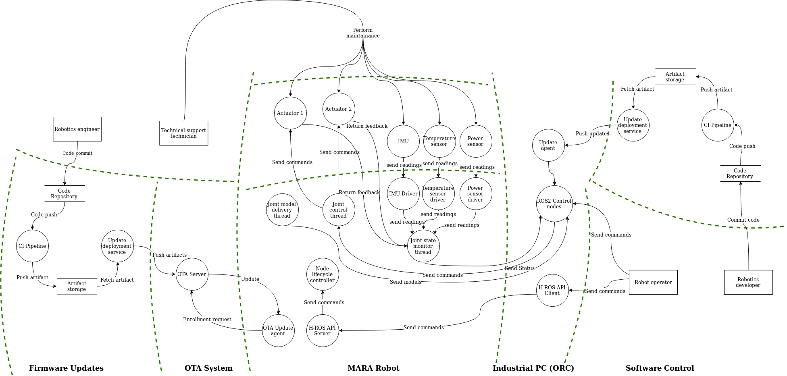

上图所示的信任区域如下：

- 固件更新：这个区域是制造商为每个机器人开发不同固件版本的地方。
- OTA 系统：这个区域是固件存储供机器人下载的地方。
- MARA 机器人：所有机器人的组件和内部通信都集中在这个区域。
- 工业 PC（ORC）：工业 PC 本身被认为是一个区域，因为它管理最终用户开发的软件并将其发送给机器人。
- 软件控制：这个区域是最终用户为机器人开发软件的地方，定义了要执行的任务。
## 威胁模型

主威胁表中描述的每种通用威胁都可以在 MARA 上具体化。

这张表指出了 MARA 的特定资产和入口点受到每种威胁的影响。勾选符号（✓）表示受影响，而叉号符号（✘）表示未受影响。“SROS 启用？”列明确指出使用 SROS 是否会减轻威胁。勾选符号（✓）意味着即使在启用 SROS 的情况下也可能被利用，而叉号符号（✘）意味着该威胁需要 SROS 被禁用才适用。

<table class="table">
  <tr>
    <th rowspan="2" style="width: 20em">Threat</th>
    <th colspan="2" style="width: 6em">MARA Assets</th>
    <th colspan="6" style="width: 15em">Entry Points</th>
    <th rowspan="2" style="width: 3.25em; transform: rotate(-90deg) translateX(-2.5em) translateY(5.5em)">SROS Enabled?</th>
    <th rowspan="2" style="width: 30em">Attack</th>
    <th rowspan="2" style="width: 30em">Mitigation</th>
    <th rowspan="2" style="width: 30em">Mitigation Result (redesign / transfer / avoid / accept)</th>
    <th rowspan="2" style="width: 30em">Additional Notes / Open Questions</th>
  </tr>

  <tr style="height: 10em; white-space: nowrap;">
    <th style="transform: rotate(-90deg) translateX(-3.5em)
translateY(3em)">Human Assets</th>
    <th style="transform: rotate(-90deg) translateX(-3.5em)
translateY(3em)">Robot App.</th>
    <th style="transform: rotate(-90deg) translateX(-4em) translateY(4em)">ROS 2 API (DDS)</th>
    <th style="transform: rotate(-90deg) translateX(-4em) translateY(4em)">Manufacturer CI/CD</th>
    <th style="transform: rotate(-90deg) translateX(-4em) translateY(4em)">End-user CI/CD</th>
    <th style="transform: rotate(-90deg) translateX(-4em)translateY(4em)">H-ROS API</th>
    <th style="transform: rotate(-90deg) translateX(-4em)translateY(4em)">OTA</th>
    <th style="transform: rotate(-90deg) translateX(-4em)translateY(4em)">Physical</th>
  </tr>

  <tr><th colspan="13">Embedded / Software / Communication / Inter-Component
  Communication</th></tr>

  <tr>
    <td rowspan="3">An attacker spoofs a software component identity.</td>
    <td class="danger">✓</td>
    <td class="danger">✓</td>
    <td class="danger">✓</td>
    <td class="success">✘</td>
    <td class="success">✘</td>
    <td class="success">✘</td>
    <td class="success">✘</td>
    <td class="success">✘</td>
    <td class="success">✘</td>
    <td>Without SROS any node may have any name so spoofing is trivial.</td>
    <td class="success">
      <ul>
        <li>Enable SROS / DDS Security Extension to authenticate and encrypt DDS communications.</li>
      </ul>
    </td>
    <td>Mitigating risk requires implementation of SROS on MARA.</td>
    <td>No verification of components.
        An attacker could connect a fake joint directly.
        Direct access to the system is granted (No NAC).</td>
  </tr>

  <tr>
    <td class="danger">✓</td>
    <td class="danger">✓</td>
    <td class="danger">✓</td>
    <td class="success">✘</td>
    <td class="success">✘</td>
    <td class="success">✘</td>
    <td class="danger">✓</td>
    <td class="success">✘</td>
    <td class="warning">✘/✓</td>
    <td>An attacker deploys a malicious node which is not enabling DDS Security Extension and spoofs the `joy_node` forcing the robot to stop.</td>
    <td>
      <ul>
        <li>DDS Security Governance document must set `allow_unauthenticated_participants` to
            False to avoid non-authenticated participants to be allowed to communicate with
            authenticated nodes.</li>
        <li>DDS Security Governance document must set `enable_join_access_control` to True to
            explicitly whitelist node-to-node-communication.
            permissions.xml should be as restricted as possible.</li>
      </ul>
    </td>
    <td class="success">Risk is mitigated</td>
    <td></td>
  </tr>

  <tr>
    <td class="danger">✓</td>
    <td class="danger">✓</td>
    <td class="danger">✓</td>
    <td class="success">✘</td>
    <td class="success">✘</td>
    <td class="success">✘</td>
    <td class="danger">✓</td>
    <td class="success">✘</td>
    <td class="danger">✓</td>
    <td>An attacker steals node credentials and spoofs the joint node forcing the robot to stop.
    </td>
    <td>
      <ul>
        <li>Store node credentials in a secure location (secure enclave, RoT) to reduce the
            probability of having a private key leaked.</li>
        <li>Run nodes in isolated sandboxes to ensure one node cannot access another node
            data (including credentials)</li>
        <li>Permissions CA should digitally sign nodes binaries to prevent running tampered
            binaries.</li>
        <li>Permissions CA should be able to revoke certificates in case credentials get
            stolen.</li>
      </ul>
    </td>
    <td class="danger">Mitigation risk requires additional work.</td>
    <td>
      <ul>
        <li>AWS Robotics and Automation is currently evaluating the feasibility of storing
            DDS-Security credentials in a TPM.</li>
        <li>Complete mitigation would require isolation using e.g. Snap or Docker.</li>
        <li>Deploying an application with proper isolation would require us to
            revive discussions around [ROS 2 launch system][ros2_launch_design_pr]</li>
        <li>Yocto / OpenEmbedded / Snap support should be considered</li>
      </ul>
    </td>
  </tr>

  <tr>
    <td>An attacker intercepts and alters a message.</td>
    <td class="danger">✓</td>
    <td class="danger">✓</td>
    <td class="danger">✓</td>
    <td class="success">✘</td>
    <td class="success">✘</td>
    <td class="success">✘</td>
    <td class="success">✘</td>
    <td class="success">✘</td>
    <td class="success">✘</td>
    <td>Without SROS an attacker can modify `/goal_axis` or `trajectory_axis` messages sent
        through a network connection to e.g. stop the robot.
</td>
    <td>
    <ul>
        <li>Enable SROS / DDS Security Extension to authenticate and encrypt DDS communications.
            Message tampering is mitigated by DDS security as message authenticity is verified by
            default (with preshared HMACs / digital signatures)</li>
      </ul>
    </td>
    <td class="success">Risk is reduced if SROS is used.</td>
    <td></td>
  </tr>

  <tr>
    <td>An attacker writes to a communication channel without authorization.</td>
    <td class="danger">✓</td>
    <td class="danger">✓</td>
    <td class="danger">✓</td>
    <td class="success">✘</td>
    <td class="success">✘</td>
    <td class="success">✘</td>
    <td class="success">✘</td>
    <td class="success">✘</td>
    <td class="success">✘</td>
    <td>Without SROS, any node can publish to any topic.</td>
    <td>
      <ul>
        <li>Enable SROS / DDS Security Extension to authenticate and encrypt DDS communications.
        </li>
      </ul>
    </td>
    <td class="success"></td>
    <td> </td>
  </tr>

  <tr>
    <td rowspan="2">An attacker listens to a communication channel without authorization.</td>
    <td class="danger">✓</td>
    <td class="danger">✓</td>
    <td class="danger">✓</td>
    <td class="success">✘</td>
    <td class="success">✘</td>
    <td class="success">✘</td>
    <td class="success">✘</td>
    <td class="success">✘</td>
    <td class="success">✘</td>
    <td>Without SROS: any node can listen to any topic.</td>
    <td>
    <ul>
        <li>Enable SROS / DDS Security Extension to authenticate and encrypt DDS communications.
        </li>
      </ul>
    </td>
    <td class="success">Risk is reduced if SROS is used.</td>
    <td></td>
  </tr>

<tr>
    <td class="danger">✓</td>
    <td class="danger">✓</td>
    <td class="danger">✓</td>
    <td class="success">✘</td>
    <td class="success">✘</td>
    <td class="success">✘</td>
    <td class="success">✘</td>
    <td class="success">✘</td>
    <td class="warning">✘/✓</td>
    <td>DDS participants are enumerated and [fingerprinted][aztarna] to look
        for potential vulnerabilities.</td>
    <td>
      <ul>
        <li>DDS Security Governance document must set `metadata_protection_kind` to ENCRYPT to
            prevent malicious actors from observing communications.</li>
        <li>DDS Security Governance document must set `enable_discovery_protection` to True to
            prevent malicious actors from enumerating and fingerprinting DDS participants.</li>
        <li>DDS Security Governance document must set `enable_liveliness_protection` to True</li>
      </ul>
    </td>
    <td class="danger">Risk is mitigated if DDS-Security is configured appropriately.</td>
    <td>
    </td>
  </tr>

  <tr>
    <td rowspan="2">An attacker prevents a communication channel from being usable.</td>
    <td class="danger">✓</td>
    <td class="danger">✓</td>
    <td class="danger">✓</td>
    <td class="success">✘</td>
    <td class="success">✘</td>
    <td class="success">✘</td>
    <td class="success">✘</td>
    <td class="success">✘</td>
    <td class="success">✘</td>
    <td>Without SROS: any node can ""spam"" any other component.</td>
    <td>
      <ul>
        <li>Enable SROS to use the DDS Security Extension.
            This does not prevent nodes from being flooded but it ensures that only communication
            from allowed participants are processed.</li>
      </ul>
    </td>
    <td class="warning">Risk may be reduced when using SROS.</td>
    <td> </td>
  </tr>

  <tr>
    <td class="danger">✓</td>
    <td class="danger">✓</td>
    <td class="danger">✓</td>
    <td class="success">✘</td>
    <td class="success">✘</td>
    <td class="success">✘</td>
    <td class="success">✘</td>
    <td class="success">✘</td>
    <td class="success">✘</td>
    <td>A node can ""spam"" another node it is allowed to communicate with.</td>
    <td>
      <ul>
        <li>Implement rate limitation on topics</li>
        <li>Define a method for topics to declare their required bandwidth / rate.</li>
      </ul>
    </td>
    <td class="danger">Mitigating risk requires additional work.</td>
    <td>How to enforce when nodes are malicious? Observe and kill?</td>
  </tr>
  <tr><th colspan="13">Embedded / Software / Communication / Remote Application Interface</th></tr>
    <tr>
    <td>An attacker gains unauthenticated access to the remote application interface.</td>
    <td class="danger">✓</td>
    <td class="danger">✓</td>
    <td class="success">✘</td>
    <td class="success">✘</td>
    <td class="success">✘</td>
    <td class="danger">✓</td>
    <td class="success">✘</td>
    <td class="success">✘</td>
    <td class="warning">✘/✓</td>
    <td>An attacker connects to the H-ROS API in an unauthenticated way.
        Reads robot configuration and alters configuration values.</td>
    <td>
      <ul>
        <li>Add authentication mechanisms to the H-ROS API.</li>
        <li>Enable RBAC to limit user interaction with the API.</li>
      </ul>
    </td>
    <td class="success">Risk is mitigated.</td>
    <td></td>
  </tr>
  <tr>
    <td>An attacker could eavesdrop communications to the Robot’s remote application interface.</td>
    <td class="danger">✓</td>
    <td class="danger">✓</td>
    <td class="success">✘</td>
    <td class="success">✘</td>
    <td class="success">✘</td>
    <td class="danger">✓</td>
    <td class="success">✘</td>
    <td class="success">✘</td>
    <td class="warning">✘/✓</td>
    <td>An attacker executes a MitM attack, eavesdropping all unencrypted communications and commands sent to the API.</td>
    <td>
        Encrypt the communications through the usage of HTTPS.
    </td>
    <td class="success">Risk is mitigated.</td>
    <td></td>
  </tr>
  <tr>
    <td>An attacker could alter data sent to the Robot’s remote application interface.</td>
    <td class="danger">✓</td>
    <td class="danger">✓</td>
    <td class="success">✘</td>
    <td class="success">✘</td>
    <td class="success">✘</td>
    <td class="danger">✓</td>
    <td class="success">✘</td>
    <td class="success">✘</td>
    <td class="warning">✘/✓</td>
    <td>An attacker could execute a MitM attack and alter commands being sent to the API.</td>
    <td>
      Encrypt the communications through the usage of HTTPS.
    </td>
    <td class="success">Risk is mitigated.</td>
    <td></td>
  </tr>
  <tr><th colspan="13">Embedded / Software / OS & Kernel</th></tr>

  <tr>
    <td>An attacker compromises the real-time clock to disrupt the kernel RT scheduling guarantees.</td>
    <td class="danger">✓</td>
    <td class="danger">✓</td>
    <td class="success">✘</td>
    <td class="danger">✓</td>
    <td class="success">✘</td>
    <td class="success">✘</td>
    <td class="danger">✓</td>
    <td class="danger">✓</td>
    <td class="warning">✘/✓</td>
    <td>A malicious actor attempts to write a compromised kernel to /boot</td>
    <td>
      <ul>
        <li>Enable verified boot on Uboot to prevent booting altered kernels.</li>
        <li>Use built in TPM to store firmware public keys and define an RoT.</li>
      </ul>
    </td>
    <td class="success">Risk is mitigated.</td>
    <td></td>
  </tr>

  <tr>
    <td>An attacker compromises the OS or kernel to alter robot data.</td>
    <td class="danger">✓</td>
    <td class="danger">✓</td>
    <td class="success">✘</td>
    <td class="danger">✓</td>
    <td class="success">✘</td>
    <td class="success">✘</td>
    <td class="danger">✓</td>
    <td class="danger">✓</td>
    <td class="warning">✘/✓</td>
    <td>A malicious actor attempts to write a compromised kernel to /boot</td>
    <td>
      <ul>
        <li>Enable verified boot on Uboot to prevent booting altered kernels.</li>
        <li>Use built in TPM to store firmware public keys and define an RoT.</li>
      </ul>
    </td>
    <td class="success">Risk is mitigated.</td>
    <td></td>
  </tr>

  <tr>
    <td>An attacker compromises the OS or kernel to eavesdrop on robot
data.</td>
    <td class="danger">✓</td>
    <td class="danger">✓</td>
    <td class="success">✘</td>
    <td class="danger">✓</td>
    <td class="success">✘</td>
    <td class="success">✘</td>
    <td class="danger">✓</td>
    <td class="danger">✓</td>
    <td class="warning">✘/✓</td>
    <td>A malicious actor attempts to write a compromised kernel to /boot</td>
    <td>
      <ul>
        <li>Enable verified boot on Uboot to prevent booting altered kernels.</li>
        <li>Use built in TPM to store firmware public keys and define an RoT.</li>
      </ul>
    </td>
    <td class="success">Risk is mitigated.</td>
    <td></td>
  </tr>
<tr><th colspan="13">Embedded / Software / Component-Oriented
Architecture</th></tr>

  <tr>
    <td rowspan="2">A node accidentally writes incorrect data to a communication
channel.</td>
    <td class="danger">✓</td>
    <td class="danger">✓</td>
    <td class="danger">✓</td>
    <td class="success">✘</td>
    <td class="success">✘</td>
    <td class="success">✘</td>
    <td class="success">✘</td>
    <td class="success">✘</td>
    <td class="warning">✘/✓</td>
    <td>A node writes random or invalid values to the /goal_axis topics.</td>
    <td>
      <ul>
        <li>Expand DDS IDL to allow users to embed validity criteria to automate input
            sanitization (i.e. validate ranges, etc.)</li>
        <li>Expand RMW to define per-topic strategies for invalid messages (drop, throw, abort,
            etc.).</li>
      </ul>
    </td>
    <td class="danger">Need to expand DDS IDL or RMW for mitigating the risk.</td>
    <td></td>
  </tr>
  <tr>
    <td class="danger">✓</td>
    <td class="danger">✓</td>
    <td class="danger">✓</td>
    <td class="success">✘</td>
    <td class="success">✘</td>
    <td class="success">✘</td>
    <td class="success">✘</td>
    <td class="success">✘</td>
    <td class="warning">✘/✓</td>
    <td>A node could to write out of physical bounds values to the `/goal_axis` or
        `/trajectory_axis` topics, causing damage to the robot.</td>
    <td><ul>
        <li>Define physical limitations of the different joints on the motor driver, limiting the
            possible movement to a safe range.</li><li>Enable signature verification of
            executables to reduce the risks of inserting a malicious node.</li>
        <li>Limit control of actuators to only the required nodes.
            Enable AppArmor policies to isolate nodes.</li>
      </ul>
    </td>
    <td class="success">Risk is mitigated when applying limits on actuator drivers.</td>
    <td></td>
  </tr>

  <tr>
    <td>An attacker deploys a malicious node on the robot.</td>
    <td class="danger">✓</td>
    <td class="danger">✓</td>
    <td class="danger">✓</td>
    <td class="danger">✓</td>
    <td class="danger">✓</td>
    <td class="success">✘</td>
    <td class="danger">✓</td>
    <td class="danger">✓</td>
    <td class="warning">✘/✓</td>
    <td>An attacker deploys a malicious node to the robot.
        This node performs dangerous movements that compromise safety.
        The node attempts to perform physical or logical damage to the modules.</td>
    <td>
      <ul>
        <li>Run each node in an isolated environment with limited privileges(sandboxing).</li>
        <li>Enable signing and verification of executables.</li>
      </ul>
    </td>
    <td class="warning"><ul>
        <li>Running the component in a Ubuntu Core sandbox environment could limit the
            consequences of the attack.</li>
        <li>Enabling signature verification of executables would reduce the risks of inserting
            a malicious node.</li>
        <li>Limiting control of actuators to only the required nodes would reduce risk in case
            of a node compromise.
            Enable AppArmor policies to isolate nodes.</li>
      </ul></td>
    <td></td>
  </tr>

  <tr>
    <td>An attacker can prevent a component running on the robot from executing
normally.</td>
    <td class="danger">✓</td>
    <td class="danger">✓</td>
    <td class="danger">✓</td>
    <td class="success">✘</td>
    <td class="success">✘</td>
    <td class="success">✘</td>
    <td class="success">✘</td>
    <td class="danger">✓</td>
    <td class="warning">✘/✓</td>
    <td>A malicious node running on the robot starts sending kill requests to other nodes in the
        system, disrupting the normal behaviour of the robot.
</td>
    <td>Having the abiliy to shutdown/kill nodes through API request supposes a problem on the
        ROS implementation.
        Deprecation of the function should be considered.
        Node restarting policie should be applied.
    </td>
    <td class="danger">Deprecation of the shutdown API call needs to be considered.</td>

  </tr>
  <tr><th colspan="13">Embedded / Software / Configuration Management</th></tr>

  <tr>
    <td>An attacker modifies configuration values without authorization.</td>
    <td class="danger">✓</td>
    <td class="danger">✓</td>
    <td class="danger">✓</td>
    <td class="success">✘</td>
    <td class="success">✘</td>
    <td class="success">✘</td>
    <td class="success">✘</td>
    <td class="success">✘</td>
    <td class="success">✘</td>
    <td>Node parameters are freely modifiable by any DDS domain participant.</td>
    <td></td>
    <td></td>
    <td></td>
    <td></td>
  </tr>

  <tr>
    <td>An attacker accesses configuration values without authorization.</td>
    <td class="danger">✓</td>
    <td class="danger">✓</td>
    <td class="danger">✓</td>
    <td class="success">✘</td>
    <td class="success">✘</td>
    <td class="success">✘</td>
    <td class="success">✘</td>
    <td class="success">✘</td>
    <td class="success">✘</td>
    <td>Node parameters values can be read by any DDS domain participant.</td>
    <td></td>
    <td></td>
    <td></td>
    <td> </td>
  </tr>

  <tr>
    <td>A user accidentally misconfigures the robot.</td>
    <td class="danger">✓</td>
    <td class="danger">✓</td>
    <td class="danger">✓</td>
    <td class="success">✘</td>
    <td class="success">✘</td>
    <td class="success">✘</td>
    <td class="success">✘</td>
    <td class="success">✘</td>
    <td class="warning">✘/✓</td>
    <td>Node parameters values can be modified by anyone to any value.</td>
    <td></td>
    <td></td>
    <td></td>
    <td> </td>
  </tr>

  <tr><th colspan="13">Embedded / Software / Data Storage (File System)</th></tr>

  <tr>
    <td>An attacker modifies the robot file system by physically accessing it.</td>
    <td class="danger">✓</td>
    <td class="danger">✓</td>
    <td class="success">✘</td>
    <td class="success">✘</td>
    <td class="success">✘</td>
    <td class="success">✘</td>
    <td class="success">✘</td>
    <td class="danger">✓</td>
    <td class="warning">✘/✓</td>
    <td>An attacker modifies the filesystem data within the robot</td>
    <td>Enable filesystem encryption with LUKS or dm-crypt, storing keys on TPM device.</td>
    <td class="success">Risk is mitigated.</td>
    <td> </td>
  </tr>

  <tr>
    <td>An attacker eavesdrops on the robot file system by physically accessing it.</td>
    <td class="danger">✓</td>
    <td class="danger">✓</td>
    <td class="success">✘</td>
    <td class="success">✘</td>
    <td class="success">✘</td>
    <td class="success">✘</td>
    <td class="success">✘</td>
    <td class="danger">✓</td>
    <td class="warning">✘/✓</td>
    <td>An attacker physically accesses the memory chip to eavesdrop credentials, logs or
        sensitive data.</td>
    <td>Enable filesystem encryption with LUKS or dm-crypt, storing keys on TPM device.</td>
    <td class="success">Risk is mitigated.</td>
    <td> </td>
  </tr>

  <tr>
    <td>An attacker saturates the robot disk with data.</td>
    <td class="danger">✓</td>
    <td class="danger">✓</td>
    <td class="danger">✓</td>
    <td class="danger">✓</td>
    <td class="danger">✓</td>
    <td class="success">✘</td>
    <td class="danger">✓</td>
    <td class="danger">✓</td>
    <td class="danger">✓</td>
    <td>A malicious node writes random data that fills the robot disk.
</td>
    <td>Enable disk quotas on the system.
        Enable sandboxing of the processes.
        Separate disk into multiple partitions, sending non trivial data to temporary directories.
    </td>
    <td class="warning">Risk is partially mitigated.
                        Disk cleanup routines and log rotation should also be implemented.</td>
    <td></td>
  </tr>

  <tr><th colspan="13">Embedded / Software / Logs</th></tr>

  <tr>
    <td>An attacker exfiltrates log data to a remote server.</td>
    <td class="success">✘</td>
    <td class="success">✘</td>
    <td class="success">✘</td>
    <td class="success">✘</td>
    <td class="success">✘</td>
    <td class="success">✘</td>
    <td class="danger">✓</td>
    <td class="success">✘</td>
    <td class="warning">✘/✓</td>
    <td>An attacker compromising the OTA server could request device log data and eavesdrop
        sensitive information.</td>
    <td>Enable RBAC on the OTA server, limit access to sensitive functions.
    </td>
    <td class="success">Risk is mitigated.</td>
    <td></td>
  </tr>

  <tr><th colspan="13">Embedded / Hardware / Sensors</th></tr>

  <tr>
    <td>An attacker spoofs a robot sensor (by e.g. replacing the sensor itself or manipulating
        the bus).</td>
    <td class="danger">✓</td>
    <td class="danger">✓</td>
    <td class="success">✘</td>
    <td class="success">✘</td>
    <td class="success">✘</td>
    <td class="success">✘</td>
    <td class="success">✘</td>
    <td class="danger">✓</td>
    <td class="warning">✘/✓</td>
    <td>An attacker could physically tamper the readings from the sensors.</td>
    <td>Add noise or out-of-bounds reading detection mechanism on the robot, causing to discard
        the readings or raise an alert to the user.
        Add detection of sensor disconnections.</td>
    <td class="success">Risk is mitigated.</td>
    <td></td>
  </tr>

  <tr><th colspan="13">Embedded / Hardware / Actuators</th></tr>

  <tr>
    <td>An attacker spoofs a robot actuator.</td>
    <td class="danger">✓</td>
    <td class="danger">✓</td>
    <td class="success">✘</td>
    <td class="success">✘</td>
    <td class="success">✘</td>
    <td class="success">✘</td>
    <td class="success">✘</td>
    <td class="success">✘</td>
    <td class="warning">✘/✓</td>
    <td>An attacker could insert a counterfeit modular joint in the robot, compromising the
        whole system (e.g. a modified gripper).</td>
    <td><ul>
        <li>Implement network access control systems, performing a verification of the part
            before granting access to the system.</li>
        <li>Implement certificate based, 802.1x authentication for the communication with the
            nodes, discarding any new modules that do not authenticate on the system.</li></ul>
  </td>
    <td class="success">Risk is mitigated.</td>
    <td>Additional evaluation should be performed.
        Authenticating nodes via certificates would require shipping the nodes with client
        certificates, and the validated manufacturers would require a subordinate CA to sign
        their modules (Kinda DRM-ish).</td>
  </tr>

  <tr>
    <td>An attacker modifies the command sent to the robot actuators (intercept & retransmit).</td>
    <td class="danger">✓</td>
    <td class="danger">✓</td>
    <td class="success">✘</td>
    <td class="success">✘</td>
    <td class="success">✘</td>
    <td class="success">✘</td>
    <td class="success">✘</td>
    <td class="success">✘</td>
    <td class="warning">✘/✓</td>
    <td>An attacker intercepts the communication channel traffic.
        The command is altered an retransmitted to the target joint.</td>
    <td><ul>
        <li>Implement network access control systems, performing a verification of the part
            before granting access to the system.</li>
        <li>Implement certificate based, 802.1x authentication for the communication with the
            nodes, discarding any new modules that do not authenticate on the system.</li></ul>
    </td>
    <td class="success">Risk is mitigated.</td>
    <td> </td>
  </tr>
<tr><th colspan="13">Embedded / Hardware / Communications</th></tr>

  <tr>
    <td>An attacker connects to an exposed debug port.</td>
    <td class="danger">✓</td>
    <td class="danger">✓</td>
    <td class="success">✘</td>
    <td class="success">✘</td>
    <td class="success">✘</td>
    <td class="success">✘</td>
    <td class="success">✘</td>
    <td class="success">✘</td>
    <td class="warning">✘/✓</td>
    <td>An attacker could connect to an exposed debug port and gain control over the robot through the execution of arbitrary commands.</td>
    <td>
      <ul>
      <li>Limit access or remove exposed debug ports.</li>
      <li>Disable local debug terminals and functionality from the ports.</li>
      <li>Add authentication mechanisms to limit access to the ports only to authenticated devices and users.</li>
    </ul>
  </td>
    <td class="success">Risk is mitigated.</td>
    <td></td>
  </tr>

  <tr>
    <td>An attacker connects to an internal communication bus.</td>
    <td class="danger">✓</td>
    <td class="danger">✓</td>
    <td class="success">✘</td>
    <td class="success">✘</td>
    <td class="success">✘</td>
    <td class="success">✘</td>
    <td class="success">✘</td>
    <td class="success">✘</td>
    <td class="warning">✘/✓</td>
    <td>An attacker could connect to an internal communication bus to send arbitrary data or eavesdrop communication between different components of the robot.</td>
    <td>
      <ul>
      <li>Limit access or remove unused communication ports.</li>
      <li>Physically limit access to the internal robot components and communication buses.</li>
      <li>Add physical tamper detection sensors to detect physical intrussions to the robot.</li>
    </ul>
  </td>
    <td class="success">Risk is mitigated.</td>
    <td></td>
  </tr>

  <tr><th colspan="13">Remote / Software Deployment</th></tr>

  <tr>
    <td>An attacker spoofs the deployment service.</td>
    <td class="danger">✓</td>
    <td class="danger">✓</td>
    <td class="success">✘</td>
    <td class="danger">✓</td>
    <td class="danger">✓</td>
    <td class="success">✘</td>
    <td class="danger">✓</td>
    <td class="success">✘</td>
    <td class="warning">✘/✓</td>
    <td>An attacker spoofs the update deployment server and serves malicious content to the devices.</td>
    <td><ul><li>Validate the deployment server through Public Key Infrastructure.</li> <li>Prevent insecure connections to the server from the devices through HTTPS and HSTS policies.</li><li>Certificate pinning on devices.</li></ul>
</td>
    <td class="success">Risk is mitigated.</td>
    <td></td>
  </tr>

  <tr>
    <td>An attacker modifies the binaries sent by the deployment service.</td>
    <td class="danger">✓</td>
    <td class="danger">✓</td>
    <td class="success">✘</td>
    <td class="success">✘</td>
    <td class="success">✘</td>
    <td class="success">✘</td>
    <td class="danger">✓</td>
    <td class="success">✘</td>
    <td class="warning">✘/✓</td>
    <td>An attacker intercepts the communication to the deployment server and serves malicious content to the devices.
</td>
    <td><ul><li>Validate the deployment server through Public Key Infrastructure.</li> <li>Prevent insecure connections to the server from the devices through HTTPS and HSTS policies.</li>
<li>Digitally sign the binaries sent to the devices.</li></ul>
</td>
    <td class="success">Risk is mitigated.</td>
    <td></td>
  </tr>

  <tr>
    <td>An attacker intercepts the binaries sent by the depoyment service.</td>
    <td class="danger">✓</td>
    <td class="danger">✓</td>
    <td class="success">✘</td>
    <td class="success">✘</td>
    <td class="success">✘</td>
    <td class="success">✘</td>
    <td class="danger">✓</td>
    <td class="success">✘</td>
    <td class="warning">✘/✓</td>
    <td>An attacker intercepts the update communication and stores the binary sent to the devices, gaining access to intellectual property.
</td>
    <td><ul><li>Make use of secure, encrypted communication channels.</li> <li>Verify client devices through client certificates.</li>
<li>Sign and Encrypt update files.</li></ul>
</td>
    <td class="success">Risk is mitigated.</td>
    <td></td>
  </tr>

  <tr>
    <td>An attacker prevents the robot  and the deployment service from communicating.</td>
    <td class="danger">✓</td>
    <td class="danger">✓</td>
    <td class="success">✘</td>
    <td class="success">✘</td>
    <td class="success">✘</td>
    <td class="success">✘</td>
    <td class="danger">✓</td>
    <td class="success">✘</td>
    <td class="warning">✘/✓</td>
    <td>An attacker blocks the robots update process.</td>
    <td>
      <ul>
        <li>Deploy multiple update server endpoints.</li>
        <li>Deploy a distributed update system.</li>
      </ul>
    </td>
    <td class="warning">Risk is partially mitigated.</td>
    <td></td>
  </tr>

</table>

## 攻击树

为了在不同可能的攻击发生之前进行分析，创建了攻击树。这些图表推测对系统的可能攻击，以便能够反击。威胁可以按照以下攻击树进行组织。攻击按照从物理攻击向量开始，继续进行基于网络的攻击，最后以机器人的支持基础设施结束的顺序进行排序。

### 物理向量攻击树

以下攻击树描述了攻击者可能遵循的路径，以破坏系统。
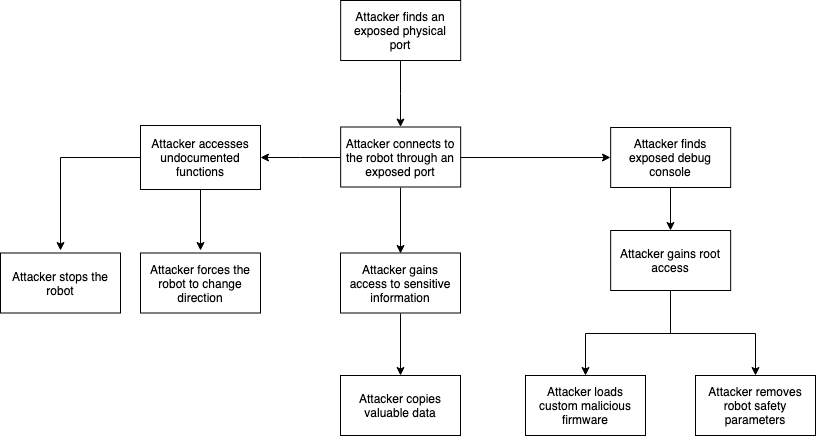
  
下一个图表显示了在基于物理通信端口被泄露的情况下可能的攻击所影响的基础设施。
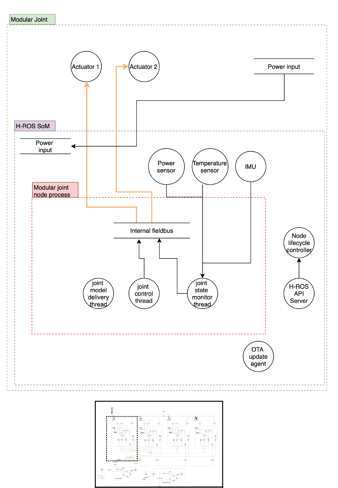

### ROS 2 API 向量攻击树

以下攻击树描述了攻击者可能遵循的路径，以通过 ROS 2 API 在物理层面上破坏系统。
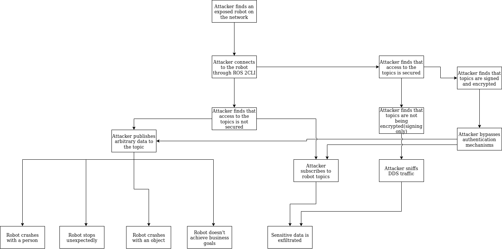

以下图表展示了基于对 ROS 2 API 的利用可能发生的攻击所影响的基础设施。
![[Pasted image 20240915145434.png]]

#### H-ROS API 向量攻击树 
以下攻击树描述了攻击者可能采取的路径，以破坏系统
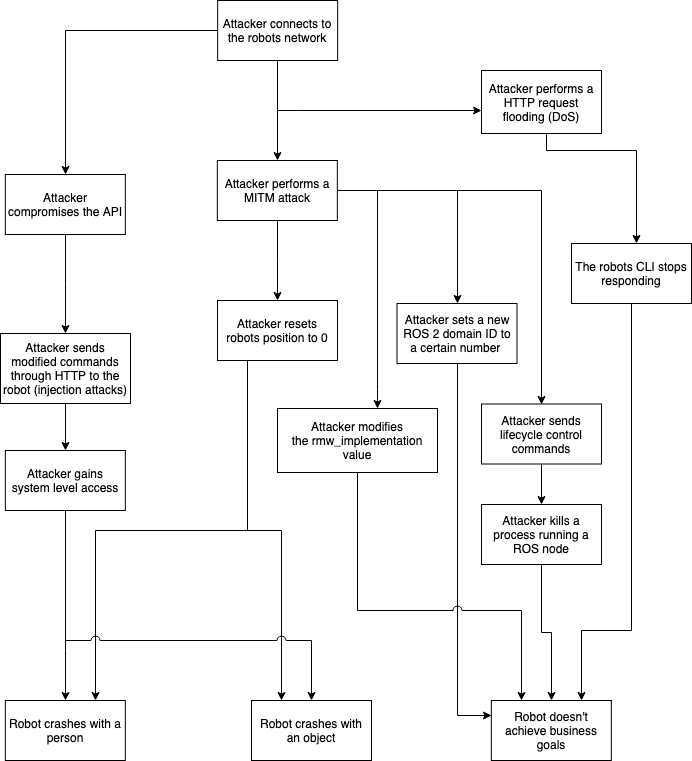

以下图表展示了基于对 MARA 的 H-ROS API 进行利用的可能攻击所影响的基础设施。

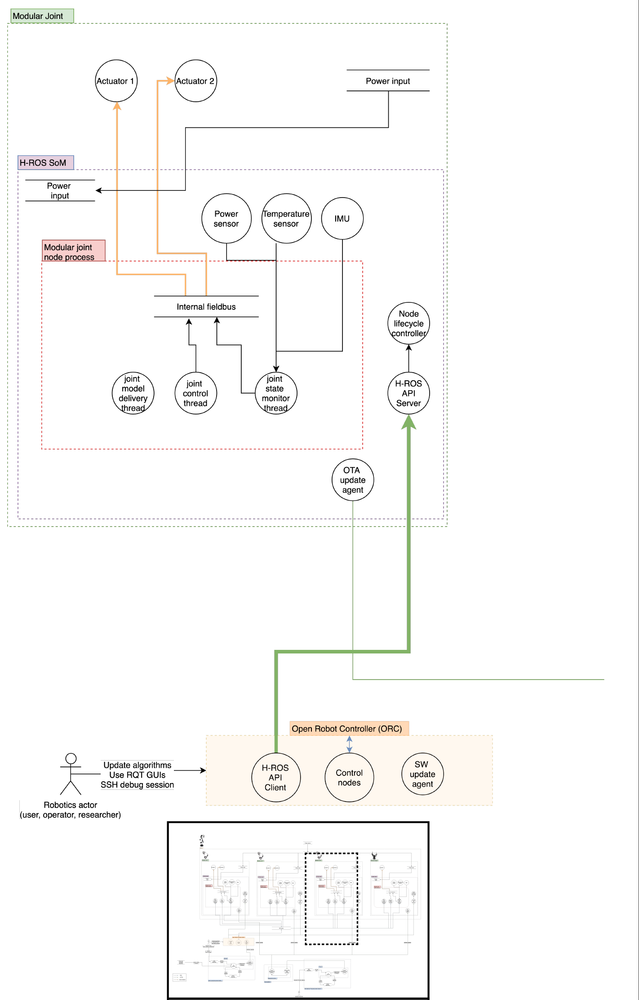

以下图表展示了基于对 MARA 的 H-ROS API 进行利用的可能攻击所影响的基础设施。![[Pasted image 20240915145651.png]]

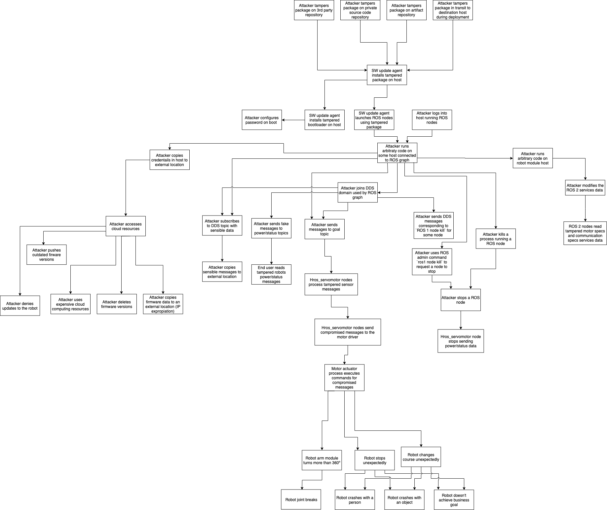

以下图表展示了可能对制造商代码仓库进行攻击的基础设施，以及其潜在的影响和后果。

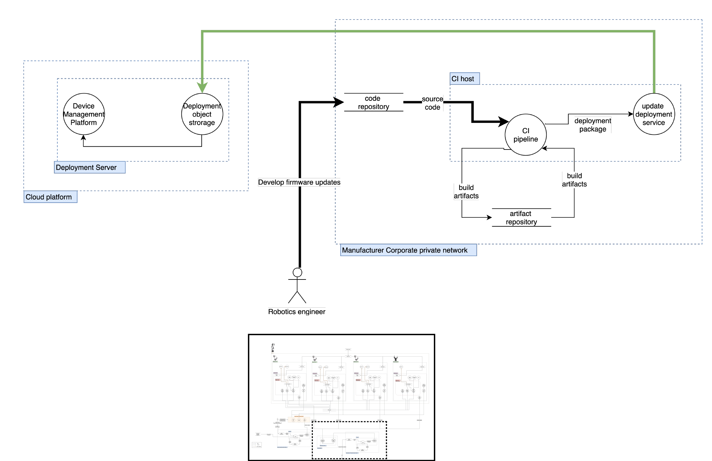

## 威胁模型验证策略

验证这个端到端的威胁模型是一个长期的努力，旨在分散在整个 ROS 2 社区中进行。威胁列表旨在随着这份文档的演变而发展，未来可能会引入额外的参考。

### 设置
设置一个 MARA，其软件与本文档中“组件 MARA”部分描述的完全相同。

### 渗透测试
应实施电子表格中描述的攻击。例如，可以实施一个恶意的 `hros_actuator_servomotor_XXXXXXXXXXXX` 来尝试破坏机器人操作。
一旦漏洞被利用，应该将漏洞利用发布到社区，以便可以重现结果。
无论攻击是否成功，都应相应更新本文档。
如果攻击成功，应实施缓解策略。这可以通过改进 ROS 2 核心包来完成，也可以是特定于平台的解决方案。在第二种情况下，缓解措施将作为发布安全机器人应用开发最佳实践的示例。
为了培训目的，存在一个在线游乐场（RCTF），挑战机器人专家学习并发现机器人漏洞。
为了全面评估机器人的安全措施，将使用机器人安全框架（RSF）。在完成评估后必须进行此验证，以便获得真实的结果。

## 安全评估初步结果
由于此过程的迭代性质，本节显示的结果可能因威胁模型的版本而异。

这里展示的结果是 Acutronic Robotics’ MARA 评估期间发现的摘要。在评估之前，为了时间效率，对系统进行了威胁分析，并确定了最可能的攻击向量。

## 介绍
基于对 MARA 执行的威胁模型，已进行了评估，以发现其中的漏洞。下面的内容直接与使用所有被识别的攻击向量作为起点的威胁模型相关。

这份针对 Acutronic Robotics’ MARA 组件的安全评估报告由 Alias Robotics S.L. 执行。评估的目标系统是 H-ROS 驱动的 MARA。H-ROS，硬件机器人操作系统，是一系列硬件和软件规格和实现的集合，允许创建模块化和分布式机器人部件。H-ROS 在很大程度上依赖于使用 ROS 2 作为机器人开发框架。

本文档概述了评估中获得的结果。在其中，我们介绍了一份专注于识别在练习期间检测到的安全问题或漏洞的报告。

## 结果
这次评估评估了 H-ROS SoM 组件中存在的安全措施。评估是通过漏洞和风险评估完成的，以下各节是发现的摘要。

漏洞根据机器人漏洞评分系统（RVSS）中规定的指南进行评级，得分在 0 到 10 之间，根据漏洞的严重程度。RVSS 遵循与通用漏洞评分系统（CVSS）相同的原则，但添加了与机器人系统相关的方面，这些方面是必要的，以捕捉机器人漏洞的复杂性。每个评估的方面都定义在一个向量中，对最终得分有其权重。

所有来自 MARA 的评估结果都按技术严重程度分类。以下列表解释了 Alias Robotics 如何根据严重程度对漏洞进行评级。

- 严重：得分在 9 到 10 之间
- 高：得分在 7 到 8.9 之间
- 中等：得分在 4 到 6.9 之间
- 低：得分在 0.1 到 3.9 之间
- 信息性：得分为 0.0

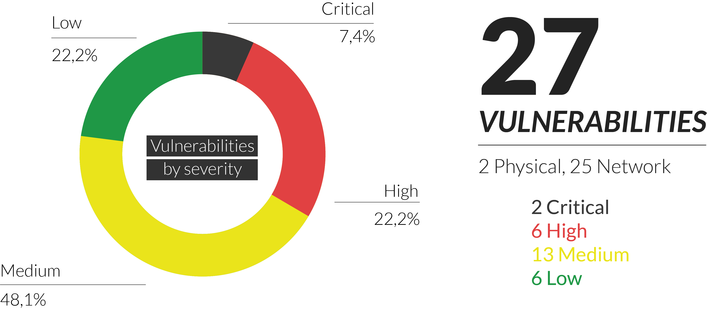

以下是在首次资助的漏洞评估中发现的漏洞的翻译和总结，使用 Markdown 表格格式：

| 名称                 | 漏洞名称                     |
|---------------------|--------------------------|
| ID                  | 漏洞标识符                   |
| RVSS 分数           | 根据机器人漏洞评分系统（RVSS）评定的分数，基于漏洞的严重程度 |
| 评分向量           | 显示定义最终分数的不同方面的向量         |
| 描述                 | 关于漏洞性质的信息                |
| 补救状态             | 补救的状态，附带证据和日期（活跃，已修复） |

---

| 发现                 |                           | 分数 | 向量 | 描述                                                                                         | 状态 |
|----------------------|---------------------------|------|------|--------------------------------------------------------------------------------------------|------|
| H-ROS API 易受 DoS 攻击 | H-ROS API vulnerable to DoS attacks | 7.5  | RVSS:1.0/AV:RN/AC:L/PR:N/UI:N/Y:Z/S:U/C:N/I:N/A:H/H:N | H-ROS API 没有使用任何机制来限制用户在一定时间内能够执行的请求数量。这可能导致 DoS 攻击或设备过早磨损。 | ✓    |
| 硬件边界限制不足      | Insufficient limitation of hardware boundaries. | 6.8  | RVSS:1.0/AV:IN/AC:L/PR:L/UI:N/Y:Z/S:U/C:N/I:L/A:H/H:E | 执行器驱动程序没有正确限制运动边界，能够执行超出执行器物理能力的命令。 | ✓    |
| ROS 2 Goal 主题易受 DoS 攻击 | ROS 2 Goal topic vulnerable to DoS attacks. | 5.5  | RVSS:1.0/AV:IN/AC:L/PR:N/UI:N/Y:Z/S:U/C:N/I:N/A:H/H:U | 当在短时间内发送大量消息时，控制电机的 ROS 2 节点会失败。应用程序崩溃并且无法从故障中恢复，导致 DoS。这可能是由内存泄漏、错误或日志存储引起的。 | ✓    |
| ROS 2 Trajectory 主题易受 DoS 攻击 | ROS 2 Trajectory topic vulnerable to DoS | 5.5  | RVSS:1.0/AV:IN/AC:L/PR:N/UI:N/Y:Z/S:U/C:N/I:N/A:H/H:N | 发送到 H-ROS SoM 的 `/trajectory` 主题的轨迹消息会导致 ROS 节点出现无法恢复的故障，只能通过系统重启来修复。 | ✓    |
| OTA OpenSSH Linux 发行版版本泄露 | OTA OpenSSH Linux distribution version disclosure | 5.3  | RVSS:1.0/AV:RN/AC:L/PR:N/UI:N/Y:Z/S:U/C:L/I:N/A:N/H:N | OpenSSH 服务器在连接头部披露了服务器使用的发行版名称（Ubuntu），为攻击者提供了额外的信息。 | ✓    |
| OTA OpenSSH 版本易受用户枚举攻击 | OTA OpenSSH version vulnerable to user enumeration attacks | 5.3  | RVSS:1.0/AV:RN/AC:L/PR:N/UI:N/Y:Z/S:U/C:L/I:N/A:N/H:N | OpenSSH 服务器版本 7.6p1 易受通过时间的用户枚举攻击。 | ✓    |

## 参考文献
1. Abera, Tigist, N. Asokan, Lucas Davi, Jan-Erik Ekberg, Thomas Nyman, Andrew Paverd, Ahmad-Reza Sadeghi, and Gene Tsudik. “C-FLAT: Control-FLow ATtestation for Embedded Systems Software.” ArXiv:1605.07763 [Cs], May 25, 2016. [http://arxiv.org/abs/1605.07763](http://arxiv.org/abs/1605.07763).
2. Ahmad Yousef, Khalil, Anas AlMajali, Salah Ghalyon, Waleed Dweik, and Bassam Mohd. “Analyzing Cyber-Physical Threats on Robotic Platforms.” Sensors 18, no. 5 (May 21, 2018): 1643. [https://doi.org/10.3390/s18051643](https://doi.org/10.3390/s18051643).
3. Bonaci, Tamara, Jeffrey Herron, Tariq Yusuf, Junjie Yan, Tadayoshi Kohno, and Howard Jay Chizeck. “To Make a Robot Secure: An Experimental Analysis of Cyber Security Threats Against Teleoperated Surgical Robots.” ArXiv:1504.04339 [Cs], April 16, 2015. [http://arxiv.org/abs/1504.04339](http://arxiv.org/abs/1504.04339).
4. Checkoway, Stephen, Damon McCoy, Brian Kantor, Danny Anderson, Hovav Shacham, Stefan Savage, Karl Koscher, Alexei Czeskis, Franziska Roesner, and Tadayoshi Kohno. “Comprehensive Experimental Analyses of Automotive Attack Surfaces.” In Proceedings of the 20th USENIX Conference on Security, 6–6. SEC’11. Berkeley, CA, USA: USENIX Association, 2011. [http://dl.acm.org/citation.cfm?id=2028067.2028073](http://dl.acm.org/citation.cfm?id=2028067.2028073).
5. Clark, George W., Michael V. Doran, and Todd R. Andel. “Cybersecurity Issues in Robotics.” In 2017 IEEE Conference on Cognitive and Computational Aspects of Situation Management (CogSIMA), 1–5. Savannah, GA, USA: IEEE, 2017. [https://doi.org/10.1109/COGSIMA.2017.7929597](https://doi.org/10.1109/COGSIMA.2017.7929597).
6. Denning, Tamara, Cynthia Matuszek, Karl Koscher, Joshua R. Smith, and Tadayoshi Kohno. “A Spotlight on Security and Privacy Risks with Future Household Robots: Attacks and Lessons.” In Proceedings of the 11th International Conference on Ubiquitous Computing - Ubicomp ’09, 105. Orlando, Florida, USA: ACM Press, 2009. [https://doi.org/10.1145/1620545.1620564](https://doi.org/10.1145/1620545.1620564).
7. Dessiatnikoff, Anthony, Yves Deswarte, Eric Alata, and Vincent Nicomette. “Potential Attacks on Onboard Aerospace Systems.” IEEE Security & Privacy 10, no. 4 (July 2012): 71–74. [https://doi.org/10.1109/MSP.2012.104](https://doi.org/10.1109/MSP.2012.104).
8. Dzung, D., M. Naedele, T.P. Von Hoff, and M. Crevatin. “Security for Industrial Communication Systems.” Proceedings of the IEEE 93, no. 6 (June 2005): 1152–77. [https://doi.org/10.1109/JPROC.2005.849714](https://doi.org/10.1109/JPROC.2005.849714).
9. Elmiligi, Haytham, Fayez Gebali, and M. Watheq El-Kharashi. “Multi-Dimensional Analysis of Embedded Systems Security.” Microprocessors and Microsystems 41 (March 2016): 29–36. [https://doi.org/10.1016/j.micpro.2015.12.005](https://doi.org/10.1016/j.micpro.2015.12.005).
10. Groza, Bogdan, and Toma-Leonida Dragomir. “Using a Cryptographic Authentication Protocol for the Secure Control of a Robot over TCP/IP.” In 2008 IEEE International Conference on Automation, Quality and Testing, Robotics, 184–89. Cluj-Napoca, Romania: IEEE, 2008.[https://doi.org/10.1109/AQTR.2008.4588731](https://doi.org/10.1109/AQTR.2008.4588731).
11. Javaid, Ahmad Y., Weiqing Sun, Vijay K. Devabhaktuni, and Mansoor Alam. “Cyber Security Threat Analysis and Modeling of an Unmanned Aerial Vehicle System.” In 2012 IEEE Conference on Technologies for Homeland Security (HST), 585–90. Waltham, MA, USA: IEEE, 2012.[https://doi.org/10.1109/THS.2012.6459914](https://doi.org/10.1109/THS.2012.6459914).
12. Kleidermacher, David, and Mike Kleidermacher. Embedded Systems Security: Practical Methods for Safe and Secure Software and Systems Development. Amsterdam: Elsevier/Newnes, 2012.
13. Klein, Gerwin, June Andronick, Matthew Fernandez, Ihor Kuz, Toby Murray, and Gernot Heiser. “Formally Verified Software in the Real World.” Communications of the ACM 61, no. 10 (September 26, 2018): 68–77.[https://doi.org/10.1145/3230627](https://doi.org/10.1145/3230627).
14. Lee, Gregory S., and Bhavani Thuraisingham. “Cyberphysical Systems Security Applied to Telesurgical Robotics.” Computer Standards & Interfaces 34, no. 1 (January 2012): 225–29. [https://doi.org/10.1016/j.csi.2011.09.001](https://doi.org/10.1016/j.csi.2011.09.001).
15. Lera, Francisco J. Rodríguez, Camino Fernández Llamas, Ángel Manuel Guerrero, and Vicente Matellán Olivera. “Cybersecurity of Robotics and Autonomous Systems: Privacy and Safety.” In Robotics - Legal, Ethical and Socioeconomic Impacts, edited by George Dekoulis. InTech, 2017.[https://doi.org/10.5772/intechopen.69796](https://doi.org/10.5772/intechopen.69796).
16. McClean, Jarrod, Christopher Stull, Charles Farrar, and David Mascareñas. “A Preliminary Cyber-Physical Security Assessment of the Robot Operating System (ROS).” edited by Robert E. Karlsen, Douglas W. Gage, Charles M. Shoemaker, and Grant R. Gerhart, 874110. Baltimore, Maryland, USA, 2013.[https://doi.org/10.1117/12.2016189](https://doi.org/10.1117/12.2016189).
17. Morante, Santiago, Juan G. Victores, and Carlos Balaguer. “Cryptobotics: Why Robots Need Cyber Safety.” Frontiers in Robotics and AI 2 (September 29, 2015). [https://doi.org/10.3389/frobt.2015.00023](https://doi.org/10.3389/frobt.2015.00023).
18. Papp, Dorottya, Zhendong Ma, and Levente Buttyan. “Embedded Systems Security: Threats, Vulnerabilities, and Attack Taxonomy.” In 2015 13th Annual Conference on Privacy, Security and Trust (PST), 145–52. Izmir, Turkey: IEEE, 2015. [https://doi.org/10.1109/PST.2015.7232966](https://doi.org/10.1109/PST.2015.7232966).
19. Pike, Lee, Pat Hickey, Trevor Elliott, Eric Mertens, and Aaron Tomb. “TrackOS: A Security-Aware Real-Time Operating System.” In Runtime Verification, edited by Yliès Falcone and César Sánchez, 10012:302–17. Cham: Springer International Publishing, 2016.[https://doi.org/10.1007/978-3-319-46982-9_19](https://doi.org/10.1007/978-3-319-46982-9_19).
20. Ravi, Srivaths, Paul Kocher, Ruby Lee, Gary McGraw, and Anand Raghunathan. “Security as a New Dimension in Embedded System Design.” In Proceedings of the 41st Annual Conference on Design Automation  - DAC ’04, 753. San Diego, CA, USA: ACM Press, 2004. [https://doi.org/10.1145/996566.996771](https://doi.org/10.1145/996566.996771).
21. Serpanos, Dimitrios N., and Artemios G. Voyiatzis. “Security Challenges in Embedded Systems.” ACM Transactions on Embedded Computing Systems 12, no. 1s (March 29, 2013): 1–10. [https://doi.org/10.1145/2435227.2435262](https://doi.org/10.1145/2435227.2435262).
22. Vilches, Víctor Mayoral, Laura Alzola Kirschgens, Asier Bilbao Calvo, Alejandro Hernández Cordero, Rodrigo Izquierdo Pisón, David Mayoral Vilches, Aday Muñiz Rosas, et al. “Introducing the Robot Security Framework (RSF), a Standardized Methodology to Perform Security Assessments in Robotics.” ArXiv:1806.04042 [Cs], June 11, 2018. [http://arxiv.org/abs/1806.04042](http://arxiv.org/abs/1806.04042).
23. Zubairi, Junaid Ahmed, and Athar Mahboob, eds. Cyber Security Standards, Practices and Industrial Applications: Systems and Methodologies. IGI Global, 2012. [https://doi.org/10.4018/978-1-60960-851-4](https://doi.org/10.4018/978-1-60960-851-4).
24. Akhtar, Naveed, and Ajmal Mian. “Threat of Adversarial Attacks on Deep Learning in Computer Vision: A Survey.” ArXiv:1801.00553 [Cs], January 2, 2018. [http://arxiv.org/abs/1801.00553](http://arxiv.org/abs/1801.00553).
25. V. Mayoral Vilches, E. Gil-Uriarte, I. Zamalloa Ugarte, G. Olalde Mendia, R. Izquierdo Pisón, L. Alzola Kirschgens, A. Bilbao Calvo, A. Hernández Cordero, L. Apa, and C. Cerrudo, “Towards an open standard for assessing the severity of robot security vulnerabilities, the Robot Vulnerability Scoring System (RVSS),” ArXiv:807.10357 [Cs], Jul. 2018. [https://arxiv.org/abs/1807.10357](https://arxiv.org/abs/1807.10357)
26. G. Olalde Mendia, L. Usategui San Juan, X. Perez Bascaran, A. Bilbao Calvo, A. Hernández Cordero, I. Zamalloa Ugarte, A. Muñiz Rosas, D. Mayoral Vilches, U. Ayucar Carbajo, L. Alzola Kirschgens, V. Mayoral Vilches, and E. Gil-Uriarte, “Robotics CTF (RCTF), a playground for robot hacking,” ArXiv:810.02690 [Cs], Oct. 2018. [https://arxiv.org/abs/1810.02690](https://arxiv.org/abs/1810.02690)
27. L. Alzola Kirschgens, I. Zamalloa Ugarte, E. Gil Uriarte, A. Muñiz Rosas, and V. Mayoral Vilches, “Robot hazards: from safety to security,” ArXiv:1806.06681 [Cs], Jun. 2018. [https://arxiv.org/abs/1806.06681](https://arxiv.org/abs/1806.06681)
28. Víctor Mayoral Vilches, Gorka Olalde Mendia, Xabier Perez Baskaran, Alejandro Hernández Cordero, Lander Usategui San Juan, Endika Gil-Uriarte, Odei Olalde Saez de Urabain, Laura Alzola Kirschgens, “Aztarna, a footprinting tool for robots,” ArXiv:1806.06681 [Cs], December 22, 2018. [https://arxiv.org/abs/1812.09490](https://arxiv.org/abs/1812.09490)