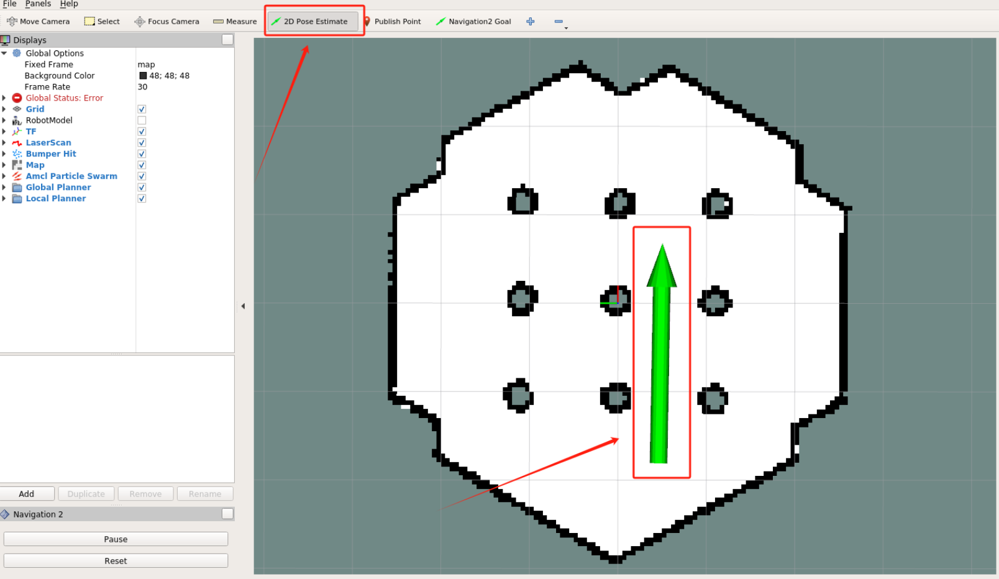

# navigtion2
## 安装
参考[官方文档](https://docs.nav2.org/getting_started/index.html#installation)

### ubuntu下
1. 安装ros(这里用的humble)
2. 安装Nav2包
```
sudo apt install ros-humble-navigation2
sudo apt install ros-humble-nav2-bringup
```
3. 安装 Turtlebot3包
```
sudo apt install ros-humble-turtlebot3-gazebo
```
## 运行demo
1. 设置环境变量
```
source /opt/ros/humble/setup.bash
export TURTLEBOT3_MODEL=waffle
export GAZEBO_MODEL_PATH=$GAZEBO_MODEL_PATH:/opt/ros/humble/share/turtlebot3_gazebo/models
```
2. 运行节点
```
ros2 launch nav2_bringup tb3_simulation_launch.py headless:=False
```
如果一切正常可以看到**gazebo**和**rviz**启动显示如下：


3. 导航
点击"2D Pose Estimate"的按钮，设置一个初始方向



设置完初始方向，便可看到点云图像如下所示：


4. 运动

点击"Navigation2 Goal"设置目的地，接着机器人便会自主的移动到终点


  

最终结果如下图所示：

