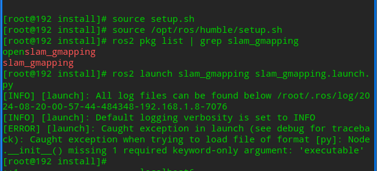
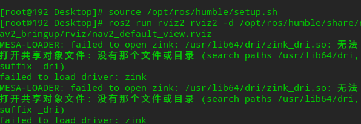

# 从源码编译 slam_gmapping

相关仓库:[github仓库](https://github.com/Project-MANAS/slam_gmapping)

## 克隆仓库并编译
```bash
mkdir slam_gmapping
cd slam_gmapping
mkdir src
mkdir build
cd src
git clone https://github.com/Project-MANAS/slam_gmapping.git
cd ../
colcon build
source install/setup.bash
ros2 pkg list | grep slam
```
###第一个报错解决
```angular2html
[ERROR] [launch]: Caught exception in launch (see debug for traceback): __init__() missing 1 required keyword-only argument: 'node_executable'

```

修改launch文件中
讲`node_executable=....`改成`executable`


