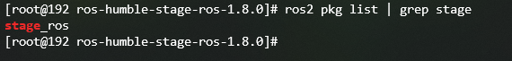

# 从源码编译 stage_ros
仓库地址：

[Gitee:stage](https://gitee.com/src-openeuler/stage/tree/master)


[Gitee:stage_ros](https://gitee.com/src-openeuler/stage_ros/tree/humble/)


由于stage_ros需要用到stage，同时编译两个有时候会报错，故而先编译stage，再编译stage_ros
## 创建工作空间并clone项目
```angular2html
mkdir stage_ws
cd stage_ws/
mkdir build
mkdir src
cd src
git clone https://gitee.com/src-openeuler/stage_ros.git
git clone https://gitee.com/src-openeuler/stage.git
```
## 安装依赖
```angular2html
dnf install fltk-devel
dnf install mlocate
dnf install libtool-ltdl-devel
```

## 分别解压编译
```angular2html
cd stage
tar -xzf stage-4.3.0.tar.gz
cd Stage-4.3.0/
colcon build
source install/setup.bash
cd ../stage_ros/
tar -xzf ros-humble-stage-ros_1.8.0.orig.tar.gz
cd ros-humble-stage-ros-1.8.0/
colcon build
source install/setup.bash
ros2 pkg list | grep stage
```
此时编译成功应该显示如下：

